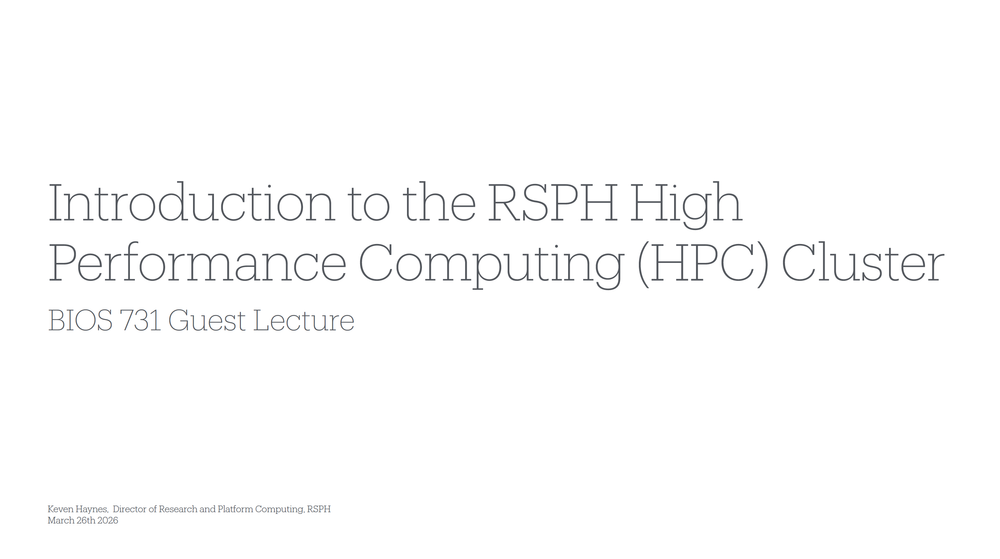
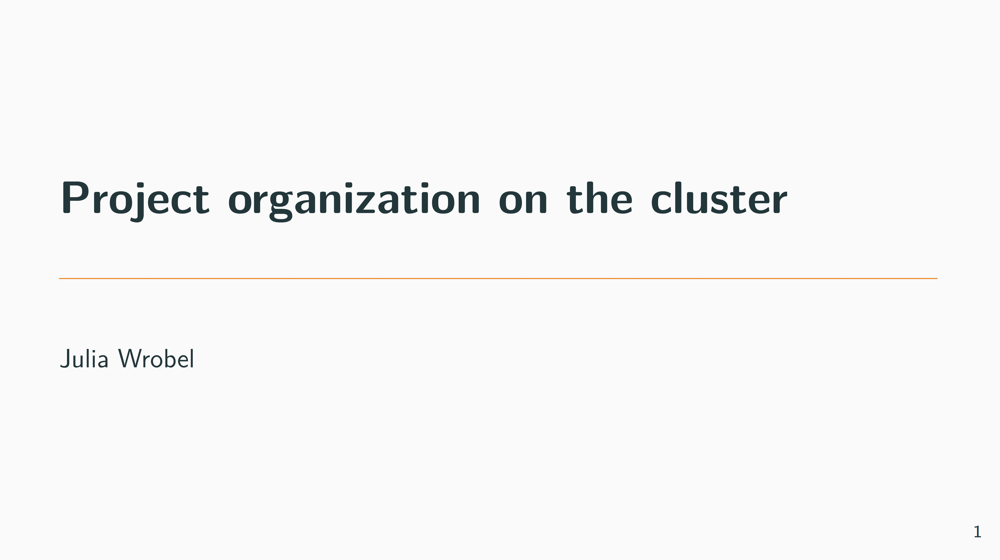

## Overview

In this, we will introduce methods for Cluster Computing.

```{r, message = FALSE, warning = FALSE}
library(tidyverse)

```

::: {.panel-tabset .panel-pills}

### Slide Deck: Using the HPC

[{width=70%}](./slides/topic_cluster/s_intro.pdf)

**Guest lecture, Keven Haynes**  
[Download slides (PDF)](./slides/topic_cluster/s_intro.pdf)


***

### Slide Deck: Project organization on the cluster

[{width=70%}](./slides/topic_cluster/s_cluster_org.pdf)

**Project organization**  
[Download slides (PDF)](./slides/topic_cluster/s_cluster_org.pdf)


***


***


:::
