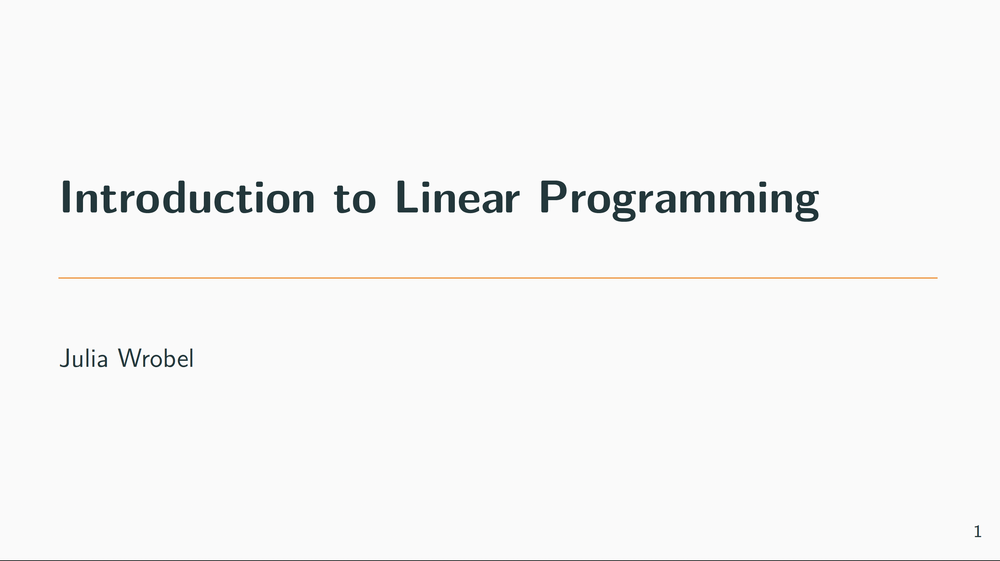
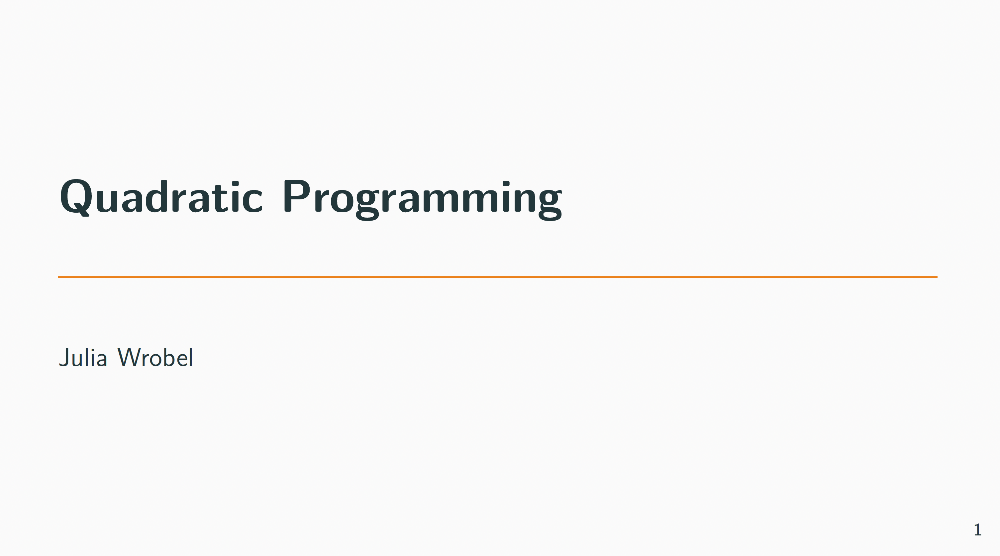

## Overview

In this, we will introduce more methods for optimization, focusing on constrained optimization through linear and quadratic programming.

```{r, message = FALSE, warning = FALSE}
library(tidyverse)

```

::: {.panel-tabset .panel-pills}

### Slide Deck: Introduction to Linear Programming

[{width=70%}](./slides/topic_optimization_II/s_lp.pdf)

**Linear Programming**  
[Download slides (PDF)](./slides/topic_optimization_II/s_lp.pdf)


***

### Slide Deck: Quadratic Programming

[{width=70%}](./slides/topic_optimization_II/s_qp.pdf)

**Quadratic Programming**  
[Download slides (PDF)](./slides/topic_optimization_II/s_qp.pdf)


***

:::
