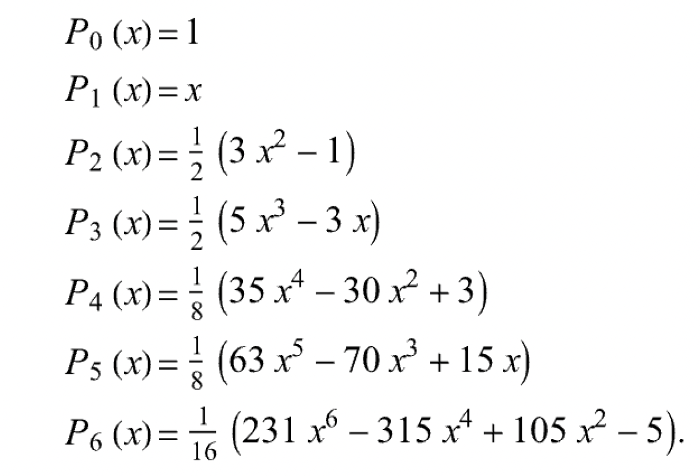
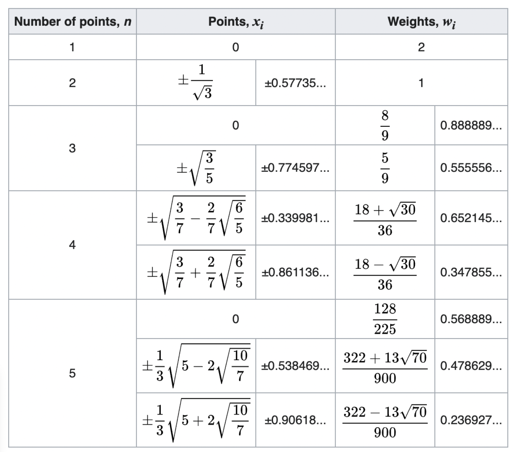

## Overview

```{r, echo = FALSE, eval = TRUE}
library(tidyverse)
library(patchwork)
library(rstanarm)
library(broom.mixed)
```


Today, we cover:

- Revisiting Gaussian Quadrature 
- Bayesian data analysis crash course
- Motivation for MCMC

Tomorrow:

- MCMC


---


## Gaussian quadrature

\fontsize{10pt}{11pt}\selectfont
Gaussian quadrature allows subintervals to be more freely chosen.

- Weights and subintervals are node-specific 
- Provides the **exact solution** if $f$ is a polynomial with degree at most $2n-1$


$$\int_a^b \omega(x)f(x)dx \approx \sum_{j = 1}^n w_j  f(x_j)$$

- $\omega(x)$ is some weight function
- $w_j, j = 1,\ldots,n:$ are specific weights; $x_j$ are nodes

- If $f$ can be approximated well by a degree $2n-1$ polynomial on $[a,b]$, then Gaussian quadrature provides a good approximation to the integral of interest.

::: notes
This means it is great for approximating smooth functions
:::

---


## Gaussian quadrature


**Question**: How to choose the weights and placement of the nodes? 


- Gauss-Legendre quadrature: $\int_{-1}^1 f(x)dx$


- Gauss-Chebyshev: $\int_{-1}^1 \frac{1}{\sqrt{1-x^2}}f(x)dx$


- Gauss-Laguerre: $\int_0^{\infty}e^{-x}f(x)dx$


- Gauss-Hermite: $\int_{-\infty}^{\infty}e^{-x^2}f(x)dx$

---

## Two-point Gauss-Legendre example


---

## Two-point Gauss-Legendre example


---

## General Gauss-Legendre

\fontsize{11pt}{12pt}\selectfont
The weights for Gauss-Legendre quadrature are given by:

$$w_i = \frac{2}{(1-x_i^2)[P'_n(x_i)]^2}$$

Where the first few Legendre polynomials are:

```{r echo=FALSE, eval = TRUE, fig.align='center', out.width='60%'}

```


---


## Gauss-Legendre nodes and weights


```{r echo=FALSE, eval = TRUE, fig.align='center', out.width='50%'}

```

::: notes
Orthogonal polynomial basis functions come from applying Gram-Schmidt orthogonalization on [-1,1] to monomials 1,x,x^2.x^3
- orthogonal polynomial means each basis function supplies different information
:::
---


## Bayesisan data analysis: a simple motivating example

Imagine we are interested in the daily number of steps taken by Rollins students. We use accelerometers to collect a random sample of step counts from $n = 10$ students.


- Let $y_i$ represent the step count for the $i$th student
- Assume $y_i \sim N(\mu, \sigma^2_y)$


We want to learn about $\mu$, the average daily number of steps taken by Rollins students.


---


## The frequentist approach

We want to learn about $\mu$, the average daily number of steps taken by Rollins students.


- Parameter $\mu$ is fixed and unknown
- The data $y$ is random
- The sample mean $\hat{\mu} = \bar{y}$ is a statistic, and a frequentist estimator of the population mean $\mu$.
- Base inference on p-values and confidence intervals

---

## Frequentist inference about $\mu$

\fontsize{10pt}{11pt}\selectfont
```{r, echo = FALSE, eval = TRUE, warning = FALSE}
set.seed(232324)
sigma_y = (500)^2 # treat population variance as known
mu = 10000
n = 10 # number of students in the random sample
steps = round(rnorm(n, mu, sd = sqrt(sigma_y)))


# frequentist estimate of mu
ybar = mean(steps)
ci_minus = ybar - 1.96 * sd(steps) / sqrt(n)
ci_plus = ybar + 1.96 * sd(steps) / sqrt(n)

sample_hist = data.frame(steps = steps) %>%
  ggplot(aes(steps)) + geom_histogram(bins = 5, fill = "grey66") +
  geom_vline(xintercept = mean(steps), color = "blue", linewidth = 2, linetype = 3) +
  geom_vline(xintercept = ci_minus, color = "indianred", linewidth = 2) +
  geom_vline(xintercept = ci_plus, color = "indianred", linewidth = 2)

```


```{r}
head(steps)
mean(steps)

```

---

## Frequentist inference about $\mu$

```{r, echo = FALSE, eval = TRUE, fig.align="center", fig.height = 3, fig.width = 7}
sample_hist
```


::: notes
Frequentist inference would say we are 95% confidence that the true number of steps taken by Rollins students lies between 9722 and 10,276 steps.
:::

---


## The Bayesian approach

- Bayesians treat the parameter $\mu$ as random
- Express uncertainty about $\mu$ using probability distributions


- The distribution before observing the data is called the **prior distribution**
  - Allows incorporation of previous knowledge
  

- Distribution after observing the data is the **posterior distribution**
- Inference is conditional on the data we observe

---


## The Bayesian approach

What do I think I know?

- $y_i|\mu \sim N(\mu, \sigma^2_y)$
- $\mu \sim N(\mu_0, \sigma^2_{\mu})$


What do I want to learn?

- $\mu|y_i \sim \mbox{ ???}$


This is a **one sample Normal-Normal** model

::: notes
What is a one sample Normal-normal model?
:::

---

## The Bayesian approach

\fontsize{10pt}{11pt}\selectfont
Relate prior, likelihood, and posterior through Bayes’ formula:


\begin{align}
p(\mu \mid y_i)
&= \frac{p(y_i \mid \mu)\, p(\mu)}{p(y_i)} \\[3mm]
&= \frac{p(y_i \mid \mu)\, p(\mu)}{\int_\mu p(y_i \mid \mu)\, p(\mu)\, d\mu}\\[3mm]
&\propto p(y_i \mid \mu)\, p(\mu)
\end{align}

For the Normal likelihood with a Normal prior for $\mu$, the posterior is also Normal:

$$\mu|y_i \sim N\left(\frac{\sigma^2_{\mu}}{\sigma^2_y/n+ \sigma^2_{\mu}}\bar{y} + \frac{\sigma^2_y/n}{\sigma^2_y/n+ \sigma^2_{\mu}}\mu_0, \frac{\sigma^2_y\sigma^2_{\mu}/n}{\sigma^2_y/n+ \sigma^2_{\mu}} \right)$$

::: notes
Worth convincing yourself that the last statement is true
- Next year might want to actually go through the math for this
:::

---


## Choosing the prior distribution

A study in *Medicine & Science in Sports & Exercise* reports that Americans take an average $4000$ steps per day with a standard deviation of $200$ steps. We come up with three different priors:


- **Informative prior**: Maybe we really believe the previous study
  - $\mu \sim N(4000, 200^2)$
- **Weakly informative prior**: Or maybe we believe it a little bit
  - $\mu \sim N(4000, 800^2)$
- **Uninformative or diffuse prior**: Maybe we don't have any scientific information at all
  - $\mu \sim N(0, 5000^2)$

---

## Effect of informative prior

```{r, echo = FALSE, eval = TRUE, fig.align="center", fig.height = 4.5, fig.width = 9}
# informative prior
mu_prior = 4000
sigma2_prior = (200)^2
mu_post = sigma2_prior / (sigma_y/n + sigma2_prior) * ybar + sigma_y/n / (sigma_y/n + sigma2_prior) * mu_prior
#mu_post

sigma2_post = sigma_y/n * sigma2_prior / (sigma_y/n + sigma2_prior)
#sqrt(sigma2_post)

# plot the results
densities_df = tibble(
  steps = seq(2000, 13000, length.out = 1000),
  prior = dnorm(steps, mu_prior, sd = sqrt(sigma2_prior)),
  likelihood = dnorm(steps, ybar, sd = sqrt(sigma_y)),
  posterior = dnorm(steps, mu_post, sd = sqrt(sigma2_post))
) %>%
  pivot_longer(prior:posterior, names_to = "distribution", values_to = "value")

densities_df %>%
  ggplot(aes(steps, value, group = distribution, color = distribution, linetype = distribution)) +
  geom_line(linewidth = 2) +
  theme_minimal() +
  theme(legend.position = c(0.2, 0.8))
```

  
---


## Effect of weakly informative prior

```{r, echo = FALSE, eval = TRUE, fig.align="center",  fig.height = 4.5, fig.width = 9}
# weakly informative prior
mu_prior = 4000
sigma2_prior = (800)^2
mu_post = sigma2_prior / (sigma_y/n + sigma2_prior) * ybar + sigma_y/n / (sigma_y/n + sigma2_prior) * mu_prior
#mu_post

sigma2_post = sigma_y/n * sigma2_prior / (sigma_y/n + sigma2_prior)
#sqrt(sigma2_post)

densities_df = tibble(
  steps = seq(2000, 13000, length.out = 1000),
  prior = dnorm(steps, mu_prior, sd = sqrt(sigma2_prior)),
  likelihood = dnorm(steps, ybar, sd = sqrt(sigma_y)),
  posterior = dnorm(steps, mu_post, sd = sqrt(sigma2_post))
) %>%
  pivot_longer(prior:posterior, names_to = "distribution", values_to = "value")

densities_df %>%
  ggplot(aes(steps, value, group = distribution, color = distribution, linetype = distribution)) +
  geom_line(linewidth = 2) +
  theme_minimal() +
  theme(legend.position = c(0.2, 0.6))

```

---

## Effect of uninformative prior

```{r, echo = FALSE, eval = TRUE, fig.align="center",  fig.height = 4.5, fig.width = 9}
# diffuse prior
mu_prior = 0
sigma2_prior = (4000)^2
mu_post = sigma2_prior / (sigma_y/n + sigma2_prior) * ybar + sigma_y/n / (sigma_y/n + sigma2_prior) * mu_prior
#mu_post

sigma2_post = sigma_y/n * sigma2_prior / (sigma_y/n + sigma2_prior)
sigma_post = sqrt(sigma2_post)

densities_df = tibble(
  steps = seq(-5000, 12000, length.out = 1000),
  prior = dnorm(steps, mu_prior, sd = sqrt(sigma2_prior)),
  likelihood = dnorm(steps, ybar, sd = sqrt(sigma_y)),
  posterior = dnorm(steps, mu_post, sd = sqrt(sigma2_post))
)  %>%
  pivot_longer(prior:posterior, names_to = "distribution", values_to = "value")

densities_df %>%
  ggplot(aes(steps, value, group = distribution, color = distribution, linetype = distribution)) +
  geom_line(linewidth = 2) +
  theme_minimal() +
  theme(legend.position = c(0.2, 0.6))


```

---


## Bayesian inference about $\mu$

\fontsize{10pt}{11pt}\selectfont
We decide to go with the uninformative prior.

- Posterior mean: $\mu|y = 9984$ steps
- Posterior 95% **credible interval** is the (2.5%, 97.5%) quantile of the posterior distribution

```{r, eval = TRUE}
qnorm(c(0.025, 0.927), mu_post, sigma_post)
```


 A **Bayesian credible interval** for a parameter $\theta$ is an interval $[a,b]$ s.t. 
 
$$P(\theta \in [a,b]|y) = 1-\alpha$$

- Given the data, there is a 95% probability that the true number of steps for Rollins students lies within $[9673, 10213]$

---

## Bayesian inference about $\mu$

- Posterior probability that $\mu < 10000$ given $y$

```{r}
pnorm(10000, mu_post, sigma_post)
```


Bayesian inference allows us to make probability statements about $\mu$ given the data.

---

## Linear regression- frequentist

Frequentist approach: estimate $\beta$ and $\sigma^2$


- $\hat{\beta} = (X^TX)^{-1}X^Ty$
- Compute residuals using $\hat{\beta}$, then from residuals estimate $\sigma^2$ 

::: notes
As a simple motivating example we are going to do Bayesian linear regression 
Write out frequentist regression assumptions
Induces normal likelihood $y \sim N(X\beta, \sigma^2I)$
:::

---

## Steps for a Bayesian linear regression

- Assign priors to the parameters of interest 
  - Normal prior for $\beta$
  - Inverse gamma for $\sigma^2$
- Choose hyper-parameters
  - Prior mean and variance for $\beta$
  - Shape and scale for $\sigma^2$
- Obtain joint posterior distribution, and base inference on this  

::: notes
Bayesian approach is slightly different
:::

---

## Bayesian linear regression (known variance)

\fontsize{10pt}{11pt}\selectfont
We want a Bayesian framework for the regression model

$$y = X\beta + \epsilon; \epsilon \sim N(0, \sigma^2_yI_n)$$


- Need to make distributional assumptions about $\beta$
  - $\beta \sim N(0, \sigma^2_bI_p)$

::: notes
Here $p$ includes the intercept
:::

---


## Bayesian regression (known variance)

We want to obtain the posterior 

$$p(\beta|y, X) \propto p(y|\beta, X)p(\beta)$$

---

## Bayesian regression (known variance)

$$\beta \mid y \sim \mathcal{N}(\beta_{\text{post}}, \Sigma_{\text{post}})$$

$$\Sigma_{\text{post}} = \left( \frac{1}{\sigma_y^2} X^\top X + \frac{1}{\sigma_\beta^2} I_p \right)^{-1}$$


\begin{align}
\beta_{\text{post}} &= \Sigma_{\text{post}} \left( \frac{1}{\sigma_y^2} X^\top y + \frac{1}{\sigma_\beta^2} \beta_0 \right)\\[3mm]
&= \left( X^\top X + \frac{\sigma_y^2}{\sigma_\beta^2} I_p \right)^{-1} \left( X^\top y \right)
\end{align}

::: notes
Closed form solution when variance is assumed known... not usually the case otherwise
- when is this going to look like regular linear regression?
:::

---

## About the variances

Throughout all of this we have implicitly conditioned on the variances $\sigma^2_y$ and $\sigma^2_{\beta}$


How do we "choose" the variance terms?
---

## Prior variance

The prior variance $\sigma^2_{\beta}$ is often pre-selected to indicate the amount of prior knowledge 

- Typically this is chosen very large to indicate a lack of knowledge
- This is considered a hyperparameter


- Basically this means that your prior will be dominated by the
data and likelihood


::: notes
As this goes to infinity beta estimates go to OLS
:::

---

## Outcome variance

The outcome variance $\sigma^2_y$ is a quantity of interest.

- Ideally, we'd like to estimate this using the observed data
- Since we're already being Bayesians, why not assign a prior distribution and try to find a posterior?


The inverse-gamma distribution works pretty well

$$p(\sigma^2_y |A, B) = \frac{B^A}{\Gamma(A)}(\sigma^2_y)^{-A-1}\exp(-\frac{B}{\sigma^2_y})$$

- Support of $\sigma^2_y$:


::: notes
Why do we typically choose inverse Gamma?
- Conjugate prior, meaning the posterior will be inverse Gamma (computationlly easier)
- Same support as the parameter of interest
- Can sometimes be too informative if A, B < 1
:::

---

## Outcome variance posterior

We want to find

$$p(\sigma_y^2|y,X,\beta) \propto p(y|\beta, \sigma^2_y, X)p(\sigma^2_y)$$


It turns out that the posterior outcome variance is also inverse Gamma... this is an example of a **conjugate prior**.

---

## Some Bayesian language

- Parameters of interest are $\beta$, $\sigma^2_y$
- The priors we've used are called **conjugate priors**
- The hyperparameters we've chosen are $\sigma^2_b, A, B$
- The distributions we've calculated are $p(\sigma^2_y|y,X, \beta)$ and $p(\beta|y, X, \sigma^2_y)$
  - These are called **full conditionals**
- The posterior distribution of interest is $p(\beta, \sigma^2_y|y, X)$, which is called the **joint posterior**

::: notes
Why do we care about full conditionals?
:::

---

## Conjugate priors 

\fontsize{11pt}{12pt}\selectfont
A prior is **conjugate** if the posterior is a member of the
same parametric family. Some examples are:

- **beta-binomial** model: if the response is binomial and we use a beta prior, the posterior is beta
- **gamma-Poisson**: Poisson reponse + gamma prior = gamma posterior
- **normal-normal** model: normal response + normal prior = normal posterior


Advantage of a conjugate prior is that the posterior is available in closed form

::: notes
Mention other advantages of conjugate priors. Which posterior is available in closed form?
:::

---

## Back to the joint posterior distribution

\fontsize{11pt}{12pt}\selectfont
Our goal is to learn about the joint posterior distribution

$$p(\beta, \sigma^2_y|y, X, hyperparameters)$$


We can calculate this from the full conditionals using the law of conditional probability:

\begin{align}
p(\beta, \sigma^2_y|y, X, h) &= p(\beta| \sigma^2_y,y,X,h)p(\sigma_y^2, X, h)\\[3mm]
&= p(\beta| \sigma^2_y,y,X,h)\int_{\beta}p(\sigma^2_y|\beta,y,X,h)d\beta
\end{align}

 

::: notes
Why do we need to learn about the joint posterior distribution?
- often people are lazy and just leave out hyperparameters when they write this down. This both bothers me and I'm gonna do it sometimes.
:::

---

## Joint posterior distribution

Our goal is to learn about the joint posterior distribution

$$p(\beta, \sigma^2_y|y, X, hyperparameters)$$

This can be hard!

- Often the joint posterior is analytically intractable
- For the conjugate priors we use, though, the full conditionals were "easy"
- If we can't write down the joint posterior, maybe we can sample from it


::: notes
This is the main motivation for MCMC
:::

---

## MCMC

\fontsize{11pt}{12pt}\selectfont
Basic idea:  How do I get a string of values from the posterior when I cannot write the posterior down?

- Markov chain Monte Carlo (MCMC) methods let you sample from complicated [posterior] distributions
  - a collection of tools used to sample from a target distribution


- Once you have a sample from the posterior distribution you
can use summary statistics (mean, variance, quantiles) to
do posterior inference


There are lots of MCMC methods-

- We're going to talk about a couple of the simpler ones. 
  - Metropolis-Hastings
  - Gibbs sampler

::: notes
Gibbs sampler is a special case of M-H sampler
You can think about this analogously to bootstrap in some ways- once you have a sample from a distribution, you can learn about that distribution
:::

---

## Steps for a Bayesian regression

- Assign priors to the parameters of interest $\beta, \sigma^2_y$


- Choose hyper-parameters
  - Prior mean and variance for $\beta$
  - Distributional parameters for $\sigma^2_y$


- Obtain joint posterior distribution, and base inference on this  


We're going to do this using the cannabis data


---


## Cannabis data

\fontsize{9pt}{10pt}\selectfont
```{r}
cannabis = readRDS(file = here::here("data", "cannabis.rds"))
cannabis = cannabis %>% select(id, use_group, t_mmr1, t_thc, p_fpc1, p_change = p_PMC_pctChg, 
                               i_memory_time34, i_time_outside_reticle) %>%
  mutate(log_mmr = log1p(t_mmr1))
  

head(cannabis)
```


---


## Cannabis data

```{r, echo = FALSE, fig.align='center', message = FALSE, fig.width = 9, fig.height = 4}
thc = cannabis %>%
  filter(t_thc < 1000) %>%
  ggplot(aes(t_thc)) +
  geom_histogram() +
  facet_wrap(~use_group, ncol = 1)

mmr1 = cannabis %>%
  filter(t_thc < 1000) %>%
  ggplot(aes(t_mmr1)) +
  geom_histogram() +
  facet_wrap(~use_group, ncol = 1)

thc + mmr1
```


---


## Cannabis data

```{r, echo = FALSE, fig.align='center', message = FALSE, fig.width = 9, fig.height = 4}
thc = cannabis %>%
  filter(t_thc < 1000) %>%
  ggplot(aes(p_change, t_thc)) +
  geom_point(aes(color = use_group))

mmr1 = cannabis %>%
  filter(t_thc < 1000) %>%
  ggplot(aes(p_change, t_mmr1)) +
  geom_point(aes(color = use_group))


thc + mmr1
```


---


## Cannabis data


```{r, echo = FALSE, fig.align='center', message = FALSE, fig.width = 8, fig.height = 4}
cannabis %>%
  pivot_longer(p_fpc1:i_time_outside_reticle, names_to = "variable", values_to = "value") %>%
  ggplot(aes(value, log_mmr)) +
  geom_point(aes(color = use_group)) +
  geom_smooth(method = "lm", se = FALSE) +
  facet_wrap(~variable, scales = "free", nrow = 1) +
    theme(legend.position = "bottom")
```


---

## Cannabis data


```{r,  echo = FALSE, fig.align='center', message = FALSE, fig.width = 8, fig.height = 5}
cannabis %>%
  filter(t_mmr1 > 0) %>%
  pivot_longer(p_fpc1:i_time_outside_reticle, names_to = "variable", values_to = "value") %>%
  ggplot(aes(value, log_mmr)) +
  geom_point(aes(color = use_group)) +
  geom_smooth(aes(group = use_group, color = use_group),method = "lm", se = FALSE) +
  facet_wrap(~variable, scales = "free", nrow = 1) +
  theme(legend.position = "bottom")
```

---


## Cannabis data


```{r, echo = FALSE, fig.align='center',  message = FALSE, fig.width = 9, fig.height = 4}
cannabis = cannabis %>%
  filter(use_group != "no use")

cannabis %>%
  ggplot(aes(log_mmr)) + geom_histogram(bins = 10) 
```

::: notes
Going to filter out the no-use people for this analysis.
:::

---


## Model specification

\fontsize{10pt}{11pt}\selectfont
$$log(mmr_i) = \beta_0 + \beta_1 \mbox{pupil}_i + \beta_2 \mbox{iPad}_i + \epsilon_i$$

Define the likelihood:

- $\epsilon \sim N(0, \sigma^2_yI_n) \implies y\sim N(X\beta, \sigma^2_yI_n)$

Define the priors:

- $\beta \sim N(0, \sigma^2_{\beta}I_{\beta})$
- $\sigma^2_y \sim Exp(\lambda)$

Define the hyperparameters

- Let $\sigma^2_{\beta} = 100$
- Let $\lambda = 1$

---

## Fitting the model

\fontsize{10pt}{11pt}\selectfont
We will use the `R` package `rstanarm`

```{r}
blr_mod = stan_glm(log_mmr ~ p_fpc1 + i_time_outside_reticle + use_group, 
               data = cannabis,
               prior_intercept = normal(0, 10),
               prior = normal(0, 10),
               prior_aux = exponential(rate = 1))
```

---

## Model summary

\fontsize{9pt}{10pt}\selectfont
```{r}
summary(blr_mod)
```

---


## Fitting the model- diffuse-r priors

\fontsize{10pt}{11pt}\selectfont
This fitting was substantially slower than the previous model.

```{r}
blr_mod2 = stan_glm(log_mmr ~ p_fpc1 + i_time_outside_reticle + use_group, 
               data = cannabis,
               prior_intercept = normal(0, 1000),
               prior = normal(0, 1000),
               prior_aux = exponential(rate = 1))
```

---

## Model summary

\fontsize{9pt}{10pt}\selectfont
```{r}
summary(blr_mod2)
```

---

## OLS

\fontsize{9pt}{10pt}\selectfont
```{r}
##### compare with least squares
mod_lm = lm(log_mmr ~ p_fpc1 + i_time_outside_reticle + use_group, data = cannabis)
summary(mod_lm)
```

---

## Regression coefficients

\fontsize{10pt}{11pt}\selectfont
```{r, echo = FALSE}
coefs_blr = broom.mixed::tidy(blr_mod, conf.int = TRUE) %>% 
  mutate(model = "blr")

coefs_blr2 = broom.mixed::tidy(blr_mod2, conf.int = TRUE) %>% 
  mutate(model = "blr_diffuse")
  


# extract regression coefficients from least squares
coefs_lm = broom::tidy(mod_lm, conf.int = TRUE) %>% 
  mutate(model = "lm") %>%
  select(-statistic, -p.value)

bind_rows(coefs_blr, coefs_lm, coefs_blr2) %>%
  arrange(term) %>%
  knitr::kable(digits = 4)
```

---

## Bayesian regression diagnostics

The package `rstanarm` uses MCMC to draw samples from the
posterior distribution. There are standard checks to ensure that
your results come from independent draws of the posterior
distribution.

- We will come back to these after we talk more about MCMC
- `stan_glm` has [lots of nice tutorials](https://mc-stan.org/rstanarm/articles/)


