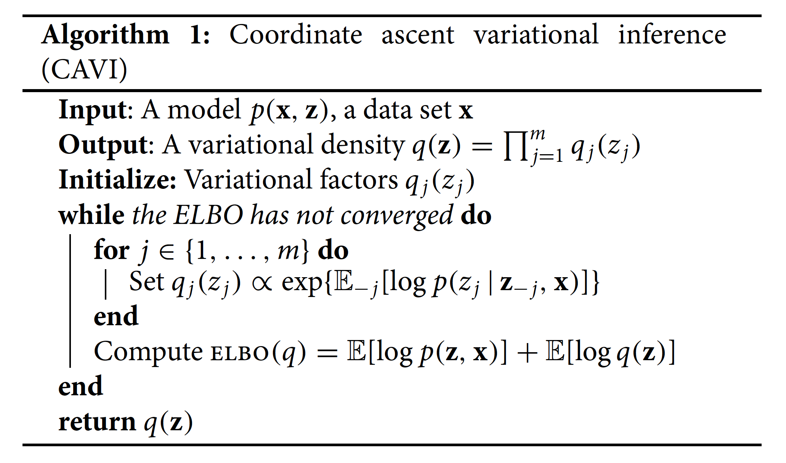
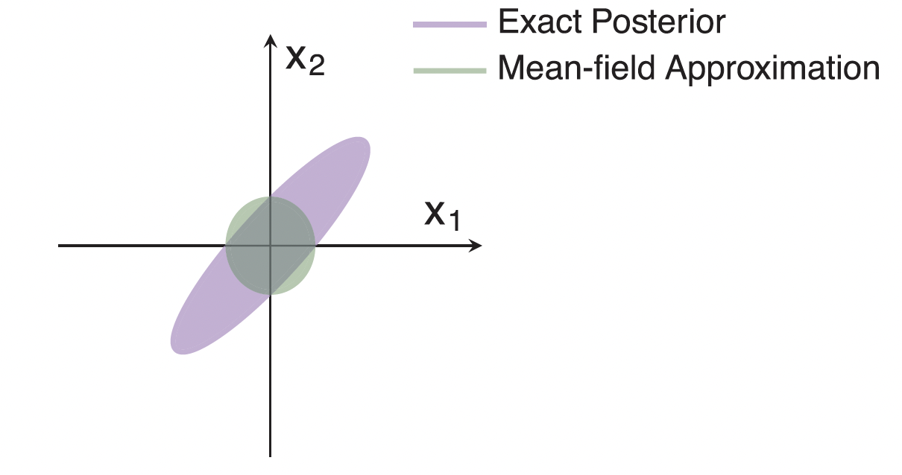

## Overview

```{r, echo = FALSE, eval = TRUE}
library(tidyverse)
```


Today, we cover:


- Variational inference
- Example with linear regression, mixture modeling

Resources:

- [Variational Inference: A Review for Statisticians by David Blei](https://www.tandfonline.com/doi/full/10.1080/01621459.2017.1285773)

Announcements:

- Final Project proposal due 4/1 at 10AM
- Homework 4 and 5 will be combined, posted by Friday

---


## For class tomorrow

- Install VPN and try logging into the cluster
- Try getting into my partition

---

## Final project proposal

\fontsize{10pt}{11pt}\selectfont
Due **April 1**!

Your final project proposal should be one page or less and clearly outline your plans for your final project. This document will help ensure your project is well-defined and feasible.

Your proposal should include the following elements:

1. **Project Title**
2. **Objective**:  Clearly state the main goal of your project. What problem are you addressing, or what question are you trying to answer?
3. **Background & Motivation**: Provide brief context on why this project is important or interesting. Why did you choose this topic?
4. **Approach**: Explain how you plan to complete the project, specifically highlighting concepts, techniques, or tools from class that you will use.


---


## Joint posterior distribution

\fontsize{10pt}{11pt}\selectfont
In Bayesian settings our goal is to learn about the joint posterior distribution, i.e.

$$p(\beta, \sigma^2_y|y, X, hyperparameters)$$

\vspace{5mm}
      
This can be hard!

- Often the joint posterior is analytically intractable
- MCMC: sample from it by constructing a Markov chain whose stationary distribution is the posterior
  - Can be very slow to converge
  - High computational cost


::: notes
This is the main motivation for MCMC. Also motivation for variational inference
:::

---

## Variational inference motivation

Our goal is still to learn about the joint posterior distribution

$$p(\beta, \sigma^2_y|y, X, hyperparameters)$$

\vspace{5mm}

- Variational inference turns this from a sampling problem into an **optimization** problem

- Uses a surrogate distribution to approximate the joint density of interest and maximizes the surrogate instead
- Scales much better to large datasets

---


## Two-part Gaussian mixture model


\fontsize{10pt}{11pt}\selectfont
- $Y_1,\ldots,Y_n$ are sampled independently from a mixture of two Normal distributions with density

$$p(y|\theta) = \lambda \mathcal{N}(y|\mu_1,\sigma_1^2) + (1-\lambda)\mathcal{N}(y|\mu_2, \sigma^2_2)$$

- $\theta = (\mu_1, \mu_2, \sigma_1^2, \sigma_2^2, \lambda)$
- $c_1, \ldots, c_n$: labels identifying which observation came from which population
  - $c_i = 1$ if $Y_i$ from $\mathcal{N}(y|\mu_1,\sigma_1^2)$; $c_i = 0$ otherwise

$$c_i \sim Bernoulli(\lambda)$$


::: notes
lambda is mixing component, probability of being density one or density two

Art of EM is coming up with a useful complete data model
:::

---

## Two-part Gaussian mixture model

Joint density of observed and missing data (i.e. complete data density) is then

$$p(y,c|\theta) = \left[\lambda \mathcal{N}(y|\mu_1,\sigma_1^2)\right]^c\left[(1-\lambda)\mathcal{N}(y|\mu_2, \sigma^2_2)\right]^{1-c}$$


---


## Bayesian Gaussian K-mixture model


Data generating model is

$$\mu \sim N(0, \sigma^2)$$
$$c_i \sim Cat(\lambda); \sum_{k=1}^K\lambda_k = 1$$

$$y_i|c_i, \mu \sim N(\mu_{c_i}, 1)$$


---


## Bayesian Gaussian mixture model

Posterior PDF (ignoring hyperparameters) is

$$p(\mu, \textbf{c}|\mathbf{y}) = \frac{\prod_k p(\mu_k)\prod_i p(c_i)p(y_i|c_i, \mu)}{\int_\mu \sum_c\prod_k p(\mu_k)\prod_i p(c_i)p(y_i|c_i, \mu)}$$

- Because of denominator integral cannot be computed easily analytically

::: notes
see slide 10 of variational slides 3
:::

---

## Bayesian linear regression

\fontsize{10pt}{11pt}\selectfont
$$y = X\beta + \epsilon$$

\begin{align*}
\epsilon &\sim N(0, \sigma^2_y)\\
\beta &\sim N(0, \sigma^2_b)\\
\sigma_y^2 &\sim IG(A, B)
\end{align*}
 
Joint posterior we want to estimate is 

$$p(\beta, \sigma^2_y|y, X, h) = \frac{p(\beta)p(\sigma^2)\prod_ip(y|\beta, \sigma^2_y)}{\int_{\beta}\int_{\sigma^2_y}p(\beta)p(\sigma^2)\prod_ip(y|\beta, \sigma^2_y)d\beta d\sigma^2_y}$$


::: notes
Mention which things are priors and what likelihood is induced
:::
---

## General setup for variational inference

We have a posterior distribution / other probability distribution with an intractiable integral that makes it challen ging to evaluate.

- **MCMC**: sample from it
- **VI**: turn it into a tractable optimization problem

---

## General setup for variational inference

Consider a joint density of latent variables $\textbf{z} = z_{1:m}$ and observations $\textbf{y} = y_{1:n}$:

$$p(\textbf{z}, \textbf{y}) = p(\textbf{z})p(\textbf{y}|\textbf{z})$$

Latent variables here could mean latent in the E-M algorithm sense, or just parameters we want to estimate.

- Bayesian mixture models:
- Bayesian linear regression:

::: notes
This notation is mostly borrowed from the Blei tutorial with some modifications.
:::

---

## Main idea behind variational Bayes

\fontsize{11pt}{12pt}\selectfont
Choose a family of approximate densities, $\mathcal{Q}$ over the latent variables $z$. Then, find a specific member of that family $q(z|\nu) \in \mathcal{Q}$ that minimizes the **Kullback-Leibler (KL) divergence** to the exact posterior, $p(z|y)$. Here, $\nu$ is a variational factor we find the optimal value of.


$$KL(q \parallel p) = \int_z q(z)\log\frac{q(z)}{p(z|y)}dz = E_q\left[\log\frac{q(z)}{p(z|y)}\right]$$

- Goal is to minimize $KL(q \parallel p)$
- Then, we approximate the posterior with the optimized member of the family $q^*(\cdot)$

::: notes
- explain what we mean by family of distributions
KL divergence of q from p where q is the distribution being evaluated and p is the target distribution

- value is nonnegative
- If q is high and p is high, then we are happy (i.e. low KL divergence).
- If q is high and p is low then we pay a price (i.e. high KL divergence).
- If q is low then we don’t care (i.e. also low KL divergence, regardless of p).  
:::

---

## The evidence lower bound

- Can't actually minimize $KL(q \parallel p)$ directly, but can optimize a function that is equal to it up to a constant.
- Called **evidence lower bound (ELBO)**

- In this setting, "evidence" is a term for the marginal likelihood of observed data, $p(y)$.


::: notes
Show why you can't minimize KL directly later
:::

---


## The evidence lower bound

\begin{align*}
KL(q \parallel p) &=  E_q\left[\log\frac{q(z)}{p(z|y)}\right]\\
&= E[\log q(z)] - E[\log p(z, y)] + \log p(y)
\end{align*}

ELBO is 

$$ELBO(q) = E[\log p(z, y)] - E[\log q(z)]$$

- Maximizing $ELBO(q)$ is equivalent to minimizing $KL(q \parallel p)$.


::: notes
More precisely, finding an approximation $q$ that maximizes the
ELBO is equivalent to finding the $q$ that minimizes the KL
divergence to the posterior!
:::

---


## The evidence lower bound

\fontsize{10pt}{11pt}\selectfont
Why is it called the evidence lower bound? Serves as a lower bound for $p(y)$ by Jensen's Inequality:

\vspace{25mm}

::: notes
ELBO is less than or equal to the evidence 
- optimize this over densities q(z) to find optimal approximation
:::

---


## The evidence lower bound

\fontsize{10pt}{11pt}\selectfont
Why is it called the evidence lower bound? Serves as a lower bound for $p(y)$ by Jensen's Inequality:

\begin{align*}
\log p(y) &= \log \int_z p(y, z)dz\\
&= \log \int_z p(y,z)\frac{q(z)}{q(z)}\\
&= \log \left( E_q\left[\frac{p(y,z)}{q(z)}\right]\right)\\
&\ge E[\log p(y,z)] - E[\log q(z)]
\end{align*}

::: notes
ELBO is less than or equal to the evidence 
- optimize this over densities q(z) to find optimal approximation
:::

---

## The evidence lower bound

- Optimize this over densities $q(z)$ to find optimal approximation
- In variational inference, we find settings of the variational
density that maximize the ELBO, which is equivalent to
minimizing the KL divergence.
- We choose a family of variational distributions such that these two expectations can be
  computed

\vspace{5mm}

- How to choose the family of densities?

---

## Mean field variational inference

Mean field makes the strong simplifying assumption that the latent variables are independent in the approximation:

$$q(\textbf{z}) = \prod_{j = 1}^mq_j(z_j)$$

- The variational family is not a model of the observed data!  Instead, it is the ELBO and the corresponding KL minimization problem which connects the fitted variational density to the data.

::: notes
Assumes latent variables are mutually independent
- easier to optimize over a simple family
- data doesn't appear in this equation
:::
---

## Mean field variational inference

In principle, $q_j$ can take on any parametric form appropriate to the corresponding variable $z_j$.

- For example, continuous variable might have a Gaussian factor
- Categorical variable might have a categorical factor

\vspace{5mm}

- Allows for optimization of each $z_j$ independently

---


## Coordinate Ascent Variational Inference (CAVI)

- Iterative algorithm for solving this optimization problem 
- CAVI iteratively optimizes each factor of the mean-field variational density while holding the others fixed
- Climbs ELBO to a **local** optimum
- *Complete conditional* of jth latent variable $z_j$ is $p(z_j|\mathbf{z}_{-j}, \mathbf{y})$.
 
 
Optimal $q_j(z_j)$ is 

$$q_j^*(z_j) = \exp\left\{E_{-j }\left[\log p(z_j|\textbf{z}_{-j}, \mathbf{y}) \right]\right\}$$
where expectation is taken W.R.T. $q_{-j}(\textbf{z}_{-j}) = \prod_{l \ne j}q_l(z_l)$.

::: notes
What is the optimization problem we are trying to solve?
- Maximize ELBO, which finds q closest to our posterior of interest
- ELBO isn't guaranteed to be convex
:::

---


## Coordinate Ascent Variational Inference (CAVI)

```{r echo=FALSE, eval = TRUE, fig.align='center', out.width='80%'}

```


::: notes
Algorithm 1 from Blei tutorial
:::
---

## Derivation of CAVI updates

Goal is to find $q(z)$ that maximizes ELBO. First, some useful results.

- by probability chain rule:

$$p(\textbf{y}, z) = p(\textbf{y}) \prod_{j = 1}^m p(z_j | \textbf{z}_{-j}, \textbf{y})$$

- using mean field approximation $q(\textbf{z}) = \prod_{j = 1}^mq_j(z_j)$:

$$E_q[\log q(\textbf{z})] = \sum_{j = 1}^m E_{q_j}[\log q_j(z_j)]$$

---

## Bayesian linear regression

\fontsize{10pt}{11pt}\selectfont
$$y = X\beta + \epsilon$$

\begin{align*}
\epsilon &\sim N(0, \sigma^2_y)\\
\beta &\sim N(0, \sigma^2_b)\\
\sigma_y^2 &\sim IG(A, B)
\end{align*}
 
- Posterior is $p(\beta, \sigma^2_y | y, x)$
- Approximate with $q$


---


## Bayesian linear regression

\fontsize{10pt}{11pt}\selectfont
From mean field assumption, 

$$q(\beta, \sigma^2_y) = q(\beta)q(\sigma^2_y)$$ 


$$ELBO(q) = E_q[\log p (y, \beta, \sigma^2_y)] - E_q[\log q(\beta)] - E_q[\log q(\sigma^2_y)]$$


\begin{align*}
\log q^*(\beta) &\propto E_{q(\sigma^2_y)}[\log p(y, \beta, \sigma^2_y)]\\
\log q^*(\sigma^2) &\propto E_{q(\beta)}[\log p(y, \beta, \sigma^2_y)]
\end{align*}

Solve these expectations to get updates for $\beta$, $\sigma^2$

---


## Bayesian linear regression

\fontsize{10pt}{11pt}\selectfont
Update for $q^*(\beta) = N(m, S)$

\vspace{3mm}

Since $\sigma^2_y$ is unknown, we plug in its **expected precision** under $q(\sigma^2_y)$:

$$E_{q(\sigma^2_y)}\!\left[\frac{1}{\sigma^2_y}\right] = \frac{A_{post}}{B_{post}}$$

\vspace{3mm}

$$S = \left(\frac{A_{post}}{B_{post}} X^TX + \frac{1}{\sigma^2_b}I\right)^{-1}$$

$$m = S\,\frac{A_{post}}{B_{post}} X^Ty$$

::: notes
This is the key coupling in CAVI: each update uses the current expected value of the other parameter's variational distribution, not a point estimate.
:::

---


## Bayesian linear regression

\fontsize{10pt}{11pt}\selectfont
Update for $q^*(\sigma^2_y) = IG(A_{post}, B_{post})$

$$A_{post} = A_0 + \frac{n}{2}$$

$$B_{post} = B_0 + \frac{1}{2}E_{q(\beta)}\!\left[\|y - X\beta\|^2\right]$$

\vspace{3mm}

The expectation expands as:

$$E_{q(\beta)}\!\left[\|y - X\beta\|^2\right] = \|y - Xm\|^2 + \text{tr}(X^TX S)$$

so $B_{post} = B_0 + \dfrac{1}{2}\left(\|y - Xm\|^2 + \text{tr}(X^TX S)\right)$

::: notes
tr(X^T X S) is the contribution from posterior uncertainty in beta — this is what distinguishes the Bayesian update from a plug-in estimate.
:::

---

## BLR CAVI Algorithm

\fontsize{11pt}{12pt}\selectfont

1. **Initialize**: set $A_{post} = A_0$, $B_{post} = B_0$ (use prior as starting point)
2. **Repeat** until ELBO converges:
   - Update $q(\beta)$: compute $S$ and $m$ using $E[1/\sigma^2_y] = A_{post}/B_{post}$
   - Update $q(\sigma^2_y)$: compute $A_{post}$ and $B_{post}$ using current $m$ and $S$
   - Compute ELBO and check for convergence
3. **Return** $m$, $S$, $A_{post}$, $B_{post}$

::: notes
Initializing with the prior means E[1/sigma^2_y] = A_0/B_0, the prior expected precision. This is more principled than initializing sigma^2_y = 1 or similar.
:::

---

## BLR CAVI in R: setup

\fontsize{9pt}{10pt}\selectfont
```{r}
cavi_blr <- function(y, X, sigma2_b = 10, A0 = 1, B0 = 1,
                     max_iter = 200, tol = 1e-6) {
  n <- nrow(X); p <- ncol(X)
  XtX <- crossprod(X)    # X^T X
  Xty <- crossprod(X, y) # X^T y

  # initialize using the prior expected precision
  A_post <- A0
  B_post <- B0

  elbo_vec <- numeric(max_iter)

  # ... (update loop on next slide)
}
```

::: notes
crossprod(X) is faster than t(X) %*% X.
We precompute XtX and Xty outside the loop since they don't change.
:::

---

## BLR CAVI in R: update loop

\fontsize{9pt}{10pt}\selectfont
```{r}
  for (iter in seq_len(max_iter)) {
    E_prec <- A_post / B_post   # E[1/sigma^2_y]

    # update q(beta)
    S <- solve(E_prec * XtX + (1 / sigma2_b) * diag(p))
    m <- S %*% (E_prec * Xty)

    # update q(sigma^2_y)
    resid2  <- sum((y - X %*% m)^2)
    penalty <- sum(diag(XtX %*% S))  # tr(X^T X S)
    A_post  <- A0 + n / 2
    B_post  <- B0 + 0.5 * (resid2 + penalty)

    elbo_vec[iter] <- compute_elbo_blr(y, X, m, S,
                                        A_post, B_post, sigma2_b)
    if (iter > 1 && abs(elbo_vec[iter] - elbo_vec[iter-1]) < tol) break
  }
  list(m = m, S = S, A_post = A_post, B_post = B_post,
       elbo = elbo_vec[seq_len(iter)])
```

::: notes
Note that A_post doesn't change between iterations — only B_post does.
The penalty term tr(X^T X S) accounts for uncertainty in beta when updating sigma^2. Without it, we'd be underestimating B_post.
:::

---

## Bayesian Gaussian mixture model

For homework.

::: notes
slides 2 page 50 has good slides on this
:::
---


## Variational inference with exponential families

In the example above we used exponential families for priors- this allows for easier derivation of CAVI updates that have a closed form.

There are a wide range of models that can use this approach:

- Matrix factorization, regression, stochastic block models of networks, and more
- For this class of models, generic updates for the exponential family distributions have been derived (see 4.1, Blei)

---


## Drawbacks 


```{r echo=FALSE, eval = TRUE, fig.align='center', out.width='80%'}

```


::: notes

exact posterior has positive correlation between x1 and x2. In other words, the posterior covariance matrix has non-zero off-diagonal entries.
- mean field cannot capture correlation between variables
- also underestimates marginal variances
- means look good though
:::

---

## Drawbacks

Exact posterior has positive correlation between x1 and x2. In other words, the posterior covariance matrix has non-zero off-diagonal entries.

- Mean field cannot capture correlation between variables
- Also underestimates marginal variances
- Means look good though

This is fine if all you want is point estimates! But if you care about uncertainty quantification, it's not that great.

---

## Variational inference outside of mean field assumption

In principal, you can choose any $q$ explicitly rather than have it fall out of the math:

- Pick a parametric family and optimize it's parameters (maximize the ELBO with respect to it's parameters using gradient ascent)
- Variational autoencoders
- Structured variational inference

::: notes
These are beyond the scope of what i'm going to cover 
:::
---

## Connection to the EM Algorithm

Let's say we have latent variables $z$, parameters $\theta$, and data $y$.  Fundamental problem is that the marginal likelihood of the data, $p(y|\theta) = \int_zp(y,z|\theta)dz$, is intractable.


- EM goal: maximize $p(y|\theta)$, the marginal likelihood
- VI goal: compute posterior $p(z, \theta|y)$

::: notes
EM can be viewed as a special case of VI
- EM treats parameters theta as fixed 
:::
---

## INLA

Performs approximate Bayesian inference in latent Gaussian models

- Also underestimate posterior variance
- Used often in spatial statistics

::: notes
Have emily guest lecture on this next year 
:::
---


## Lab

Implement Bayesian regression


