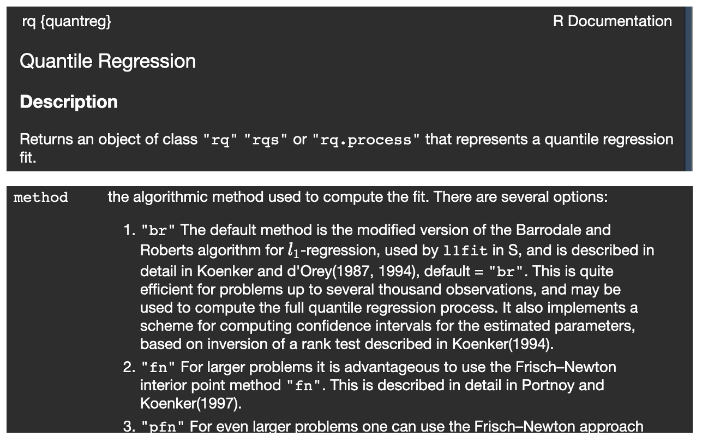
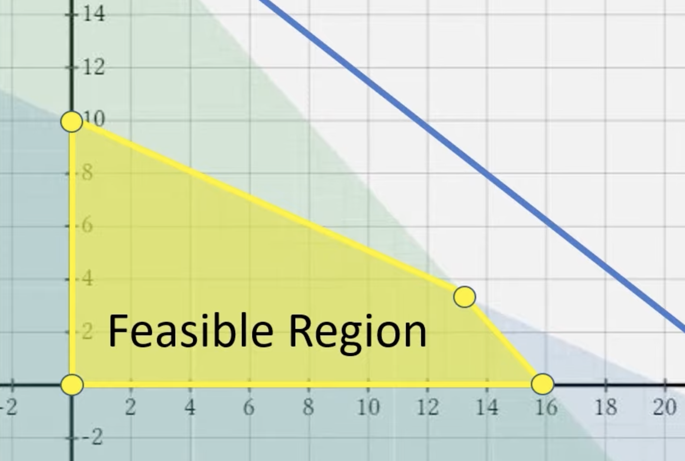
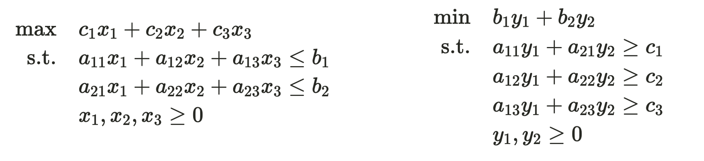

```{r, echo = FALSE, eval = TRUE}
library(tidyverse)
library(microbenchmark)
```

## Overview

Today, we cover:

- Talk about final project proposals 
- Linear programming

Announcements

- Sign up for final project proposals slot


---

## Final project presentations

Sign up for final project presentation slot!

- On Canvas, go to calendar
- Do this now. 

---

## Final project presentations

Presentation is designed to be in the style of a JSM or ENAR contributed talk

- Presentation should be 15 minutes or less
- Aim for 12-13 minutes to leave time for questions
- Practice! You will be deducted for not finishing in the alloted time 

---

## Final project presentations

Students are required to provide brief but meaningful feedback on all presentations. There will be online forms provided.

- You will receive feedback from your peers anonymously

---

## Introduction to LP

**Linear programming** (LP) or **linear optimization** is a set of (constrained) optimization
algorithms.

- began in 1947 when George Dantzig devised the simplex method
- LP and **quadratic programming** are two special cases of convex optimization with linear constraints


Widely used across industries!


---

## Linear programming

\fontsize{10pt}{11pt}\selectfont
An optimization problem with a linear objective function and linear constraint functions is called a linear program (LP):

\begin{align*}
\mbox{minimize } &c^Tx + d\\
\mbox{subject to } &Ax \preceq b\\
\end{align*}


- **Recall**: you can always convert a minimization problem to a maximization problem by multiplying the objective function by $-1$
- In statistics, applications include LASSO, quantile regression, support vector machine


::: notes
less than equal sign here is a partial order relation.  Just means that some constraints may be less than and some may be greater than, and this allows for both
:::

---


## Linear programming techniques

Methods for solving LP problems:

- Graphical method
- Simplex algorithm
- Interior point methods


::: notes
We're gonna get pretty in the weeds here with estimation techniques because I think it helps to see how these things work.  But just keep in mind that the bigger picture is sometimes you might have constraints you need to take into account
:::

---

## Linear programming techniques


```{r, echo = FALSE, fig.align = 'center', out.width = '90%'}

```


::: notes
This is the motivation for why we are doing this
:::

---

## Carpenter problem

A carpenter can make tables or she can make bookshelves.

- **Table**: costs 10 units of lumber and 5 hours of labor
  - Provides $180 in profit
- **Bookcase**: costs 20 units of lumber, 4 hours of labor
  - $200 in profit
  

- Only 200 units of lumber available
- 80 hours of labor available

**What number of tables and bookcases provide the optimal profit?**

::: notes
This is a simple motivating example
:::

---


## Carpenter problem

\fontsize{10pt}{11pt}\selectfont
- **Table**: costs 10 units of lumber and 5 hours of labor, $180 in profit
- **Bookcase**: costs 20 units of lumber, 4 hours of labor, $200 in profit
- 200 units of lumber available; 80 hours of labor available


Let $x_1$ and $x_2$ denote number of tables, bookshelves respectively
- $10x_1 + 20x_2 \le 200$
- $5x_1 + 4x_2 \le 80$
- $x_1, x_2 \ge 0$
- maximize $f(x_1, x_2) = 180x_1 + 200x_2$

::: notes
Set up constraints and objective function
Since we only have two variables here we can plot this and observe the solution graphically
:::

---


## Carpenter problem


```{r, echo = FALSE, eval = FALSE,  fig.align = 'center', out.width = '60%'}
tibble(x = seq(-5, 20, by = 1),
       y = x) %>%
  ggplot() +
  xlim(-2, 20) +
  ylim(-2, 20) +
  labs(x = "x1", y = "x2") +
  geom_hline(yintercept = 0) +
  geom_vline(xintercept = 0) +
  geom_abline(intercept = 20, slope = -5/4) +
  geom_abline(intercept = 10, slope = -1/2)

```

::: notes
shade and put in vertices. Shaded region
number of vertices should equal the number of constraints
calculate f(x, y) at each vertex
:::

---

## Solving LP graphically

The small 2-variable problem can be represented in a 2D graph.
The isoprofit line (any point on the line generate the same profit) is perpendicular to
the gradient of objective function. The problem can be solved by sliding the isoprofit
line.


---

## Feasible region

Shaded region that satisfies constraints is called feasible region

```{r, echo = FALSE, fig.align = 'center', out.width = '60%'}

```


---


## Properties of the optimal solution

\fontsize{10pt}{11pt}\selectfont
Optimal solution might not exist 

- the objective function is unbounded in the solution space (can be improved indefinitely without violating any constraints)
- the feasible region is empty (no solution satisfies all constraints)

But if the optimal solutions exists:

- Interior point: No.
- Corner point: Yes. The corner points are often referred to as “extreme points” or vertices.
- Edge point: Yes, only when the edge is parallel to the isoprofit line. In this case, every point on that edge has the same objective function value, including the corner point of that edge.
- **Key result**: If an LP has an optimal solution, it must have a extreme point optimal solution. This greatly reduces our search of optimal solutions: only need to check a finite number of extreme points.

---

## Big ideas of LP

- Number of vertices in feasible regions corresponds to number of constraints
- inequalities make a bounded, concave feasible region
- Extreme values (min and max) occur at the vertices of this region
- Solution: compute vertices, choose which one gives largest value of $f(x_1, x_2)$

You can solve this algorithmically (rather than graphically) using the **simplex method**.
---


## Simplex method

Linear programming involves optimizing (maximizing or minimizing) a linear objective function, subject to a set of linear constraints. The Simplex method helps to find the optimal solution to such problems, provided one exists.

For simplex method:

- the LP problem needs to be in **standard** form
  - objective function set up as a maximization problem
  - constraints set up as linear inequalities of the form $Ax \le b$
  - need all variables $x$ to be nonnegative

---


## LP Standard form

\fontsize{10pt}{11pt}\selectfont
An LP can be expressed using only equality and nonnegativity
constraints. This is called **standard form**:


\begin{align*}
\mbox{minimize } &c^Tx\\
\mbox{subject to } &Ax = b\\
&x \ge  0
\end{align*}


An LP can also be expressed using only inequality constraints. This is
called **inequality form**:


\begin{align*}
\mbox{minimize } &c^Tx\\
\mbox{subject to } &Ax \le b
\end{align*}

---

## Slack variables

Are added to less than or equal to inequality constraints to transform them into equality constraints 

- represent the "unused" capacity within a constraint
- non-negative variables
- Say you have inequality $2x + 3y \le 10$.  
  - Convert to to equality constraint  $2x + 3y + s = 10$
  - If $s \ne 0$, then there the combination of $x$ and $y$ could be increased further without violating the constraint

---

## Simplex: convert to standard form using slack variables

\fontsize{10pt}{11pt}\selectfont
Go back to Carpenter example.

- maximize $z = f(x_1, x_2) = 180x_1 + 200x_2$
- $x_1, x_2 \ge 0$

Constraints: 

- $10x_1 + 20x_2 \le 200$ $\to 10x_1 + 20x_2 + s_1 = 200$
- $5x_1 + 4x_2 \le 80$ $\to 5x_1 + 4x_2 + s_2 = 80$

Slack variables pick up any "slack" in the system based on current values of $x_1$ and $x_2$

- $s_1, s_2 \ge 0$
- $s_1, s_2 = 0$ when $z$ is maximized


::: notes
Each constraint will have a slack variable
:::

---


## Steps of Simplex algorithm

1. Convert problem to standard form
2. Set up "tableau": basically amounts to writing out problem as a matrix
3. Start at a vertex of the feasible region, then pivot
  
- Essentially, you are iteratively moving from one vertex (or "corner point") of the feasible region to another, with the goal of improving the objective function at each step.

---

## Initial tableau

First 
$z =  180x_1 + 200x_2 \to z -180x_1 - 200x_2 = 0$

- $10x_1 + 20x_2 \le 200$ $\to 10x_1 + 20x_2 + s_1 = 200$
- $5x_1 + 4x_2 \le 80$ $\to 5x_1 + 4x_2 + s_2 = 80$

Start at $x_1, x_2 = 0$


::: notes
when x1 and x2 are zeros slack variables have all the extra stuff in the inequality
:::

---


## Pivot step


---

## Pivot step

---

## Pivot step

---

## Solution


```{r, echo = FALSE, eval = FALSE, fig.align = 'center', out.width = '90%'}
knitr::include_graphics("carpenter_solution.png")
```


---

## Summary of the Simplex method

Basic variables define current corner point/vertex!

- Those are the variables that are literally a unit basis of the matrix
- Walks along the edge of the feasible space to improve the objective function
  - "Basic" variables are the current solution
- Only considers vertices
- Moves as far as it can in optimal direction until movement is blocked by another constraint

---


## Standard form as a matrix

\begin{align*}
\max z &= c^T\boldsymbol{x}\\
s.t. A\boldsymbol{x} &= b\\
\boldsymbol{x} &\ge 0
\end{align*}

$$\boldsymbol{x} = [x_1, x_2, s_1, s_2]^T$$


## Linear programming

An optimization problem with a linear objective function and linear constraint functions is called a linear program (LP):

\begin{align*}
\mbox{minimize } &c^Tx + d\\
\mbox{subject to } &Ax \preceq b\\
\end{align*}


::: notes
less than equal sign here is a partial order relation.  Just means that some constraints may be less than and some may be greater than, and this allows for both
:::

---


## Linear programming techniques


- Graphical method
  - Only works for 2 variables
- Simplex algorithm
  - Moves from one basic feasible solution to the next
  - Standard version works for $\le$ constraints
- Two phase, big M methods 
  - Variations on Simplex method
  - Handle $=$ and $\ge$ constraints
- Interior point methods
  - Better for large-scale LP problems
  - Instead of moving along boundary, moves through interior of feasible region


---

## Interior point methods

Effectively, the idea is to set up the problem such that we can solve it using something like Newton's method.


- Need to set up some background and theory first
- Allows us to handle the constraints

::: notes
Simplex methods work well for small sample sizes or lower dimensional parameter spaces but for larger problems interior point methods will outperform.
:::

---

## Carpenter problem

A carpenter can make tables or she can make bookshelves.

- **Table**: costs 10 units of lumber and 5 hours of labor
  - Provides $180 in profit
- **Bookcase**: costs 20 units of lumber, 4 hours of labor
  - $200 in profit
  

- Only 200 units of lumber available
- 80 hours of labor available

**What number of tables and bookcases provide the optimal profit?**

::: notes
This is a reminder of what type of problem we are solving. We will generalize this next.
:::

---


## LP problem for resource allocation


Take a typical maximizing LP problem (3 variables and 2 constraints).


\begin{align*}
        \max \quad & c_1x_1 + c_2x_2 + c_3x_3 \\
        \text{s.t.} \quad & a_{11}x_1 + a_{12}x_2  + a_{13}x_3 \le b_1\\
        & a_{21}x_1 + a_{22}x_2  + a_{23}x_3 \le b_2\\
        & x_1, x_2, x_3 \geq 0
    \end{align*}
    
Economic interpretation of the problem:    
- We produce three products using two materials
- $x_j$: unit of production of product $j \in \{1,2,3\}$. Unknown to obtain.
- $c_j$: profit per unit of product
- $a_{ij}$: unit of material ($i\in\{1,2\}$) to produce 1 unit of product $j$
- $b_i$: units of available material $i$.

Goal is to maximize the profit, subject to the material constraints.

::: notes
X's are variables/products. These were bookcases and tables.
:::

---


## Resource valuation problem

Now, suppose a buyer is considering purchasing our entire inventory of materials but is unsure how to price them. The buyer knows we will only agree to the sale if it yields a higher return than using the materials for production.

**Buyer's business strategy**: producing one fewer unit of product $j$ will save us:

- $a_{1j}$ units of material $1$ and $a_{2j}$ units of material $2$

The buyer seeks to determine the unit prices of materials to minimize costs while ensuring we still agree to the sale (i.e., we do not earn less). Let $y_1$ and $y_2$ be the unknown unit prices of the materials. The buyer's optimization problem, known as the **Resource Valuation Problem**, is then:

---


## Resource valuation problem

```{r, echo = FALSE, fig.align = 'center', out.width = '90%'}

```


::: notes
Walk through this in detail to make sure they know how we got here. Use Carpenter problem as an example.
:::

---


## Duality

The buyer’s LP problem is called the "**dual**" problem of the original problem, which is called the "**primal** problem.

In matrix notation, if the **primal** LP problem is:

\begin{align*}
        \max \quad & cx\\
        \text{s.t.} \quad &Ax \le b, x\ge0
    \end{align*}

The corresponding **dual** problem is:

\begin{align*}
        \min \quad & b^Ty\\
        \text{s.t.} \quad &A^Ty \ge c^T, y\ge0
    \end{align*}


---


## Duality

We can also express the dual problem in canonical form (a maximization problem with $\le$ constraints):

\begin{align*}
        \max \quad & -b^Ty\\
        \text{s.t.} \quad &-A^Ty \le -c^T, y\ge0
    \end{align*}

The **dual is the negative transpose of the primal**. 
- This means that the dual of the dual problem is the primal problem 


**Why do we care about duality?**


::: notes
Why do we care about duality? This has come up in papers I reviewed and I had no idea what they were talking about.  "We solve the dual problem" with no explanation of what that means, like it is obvious to everyone.
:::

---

## Duality

We can also express the dual problem in canonical form (a maximization problem with $\le$ constraints):

\begin{align*}
        \max \quad & -b^Ty\\
        \text{s.t.} \quad &-A^Ty \le -c^T, y\ge0
    \end{align*}


**Why do we care about duality?**
- Sometimes the dual problem is easier to solve than the primal one
- If a constraint is slightly relaxed or tightened, the dual variables indicate how much the objective function will change
- Solution to primal is **always** $\le$ solution to dual (weak duality theorem)!

**Need to understand conditions in which the dual and primal solutions are equal!**

::: notes
Why do we care about duality?
:::

---

## Duality in non-canonical form

What if the primal problem doesn’t fit into the canonical form (e.g., has $\ge$ or $=$ constraints, unrestricted variables)?

The **variable types in the dual problem** are determined by the **constraint types in the primal problem** as follows:


- Equality constraints in the primal  $\to$ Unrestricted dual variables
- $\le$ in the primal $\to$ **nonnegative** dual variables
- $\ge$ in the primal $\to$ **nonpositive** dual variables

i.e.

$$\begin{array}{|c|c|}
\hline
\textbf{Primal (max) constraints} & \textbf{Dual (min) variable} \\
\hline
\leq & \geq 0 \\
\hline
\geq & \leq 0 \\
\hline
= & \text{unrestricted} \\
\hline
\end{array}$$


::: notes
First, let's talk about noncanonical form
:::

---


## Duality in non-canonical form

Conversely, **constraint types of the dual** problem are determined by **variable types of the primal**:

$$\begin{array}{|c|c|}
\hline
\textbf{Primal (max) variable} & \textbf{Dual (min) constraints} \\
\hline
\geq 0 & \geq \\
\hline
\leq 0 & \leq \\
\hline
\textit{unrestricted} & = \\
\hline
\end{array}$$

::: notes
IS DIRECTION OF THIS CORRECT? CHECK ON THIS TOMORROW. CHATGPT SAYS NO.
:::

---


## Non-canonical duality example


If the primal problem is:

\begin{align*}
    max \quad & 20x_1 + 10x_2 + 50x_3 \\
    s.t. \quad & 3x_1 + x_2 + 9x_3 \leq 10 \\
    & 7x_1 + 2x_2 + 3x_3 = 8 \\
    & 6x_1 + x_2 + 10x_3 \geq 1 \\
    & x_1 \geq 0, \quad x_2 \textit{ unrestricted}, \quad x_3 \leq 0
\end{align*}

The dual problem is:


---


## Non-canonical duality example


If the primal problem is:

\begin{align*}
    max \quad & 20x_1 + 10x_2 + 50x_3 \\
    s.t. \quad & 3x_1 + x_2 + 9x_3 \leq 10 \\
    & 7x_1 + 2x_2 + 3x_3 = 8 \\
    & 6x_1 + x_2 + 10x_3 \geq 1 \\
    & x_1 \geq 0, \quad x_2 \textit{ unrestricted}, \quad x_3 \leq 0
\end{align*}

The dual problem is:

\begin{align*}
    min \quad & 10y_1 + 8y_2 + y_3 \\
    s.t. \quad & 3y_1 + 7y_2 + 6y_3 \geq 20 \\
    & y_1 + 2y_2 + y_3 = 10 \\
    & 9y_1 + 3y_2 + 10y_3 \leq 50 \\
    & y_1 \geq 0, \quad y_2 \textit{ unrestricted}, \quad y_3 \leq 0
\end{align*}

---

## Weak duality

**Weak duality theorem:**

- For any feasible solution $x$ to the **primal** (maximization) problem and any feasible solution $y$ to the **dual** (minimization) problem:

$$\mbox{objective of dual }\ge \mbox{ objective of primal}.$$

- Implications:
  - The dual provides a bound on the primal’s optimal value.
  - Useful for proving infeasibility or bounds in optimization problems.
- **Weak Duality Guarantee**: the optimal value of the primal cannot exceed the optimal value of the dual.


In other words, we will only do business if selling the material makes us more money. 

::: notes
the objective function value of the primal problem (max) at
any feasible solution is always less than or equal to the objective function value of
the dual problem (min) at any feasible solution.

Solution to primal is always less than or equal to solution to dual
:::

---

## Weak duality proof

**Weak duality**: If $(x_1, \dots, x_n)$ is a feasible solution for the primal, and $(y_1, \dots, y_m)$ is a feasible solution for the dual, then $\sum_j c_j x_j \leq \sum_i b_i y_i.$.

---


## Weak duality proof

**Weak duality**: If $(x_1, \dots, x_n)$ is a feasible solution for the primal, and $(y_1, \dots, y_m)$ is a feasible solution for the dual, then $\sum_j c_j x_j \leq \sum_i b_i y_i.$.

\begin{align}
\sum_j c_j x_j &\leq \sum_j \left( \sum_i y_i a_{ij} \right) x_j \\
&= \sum_{i,j} y_i a_{ij} x_j \\
&= \sum_i \left( \sum_j a_{ij} x_j \right) y_i \\
&\leq \sum_i b_i y_i.
\end{align}
---


## Strong duality 

- We know that at feasible solutions for both dual and primal, the solution to the dual is always greater or equal
- If there is a difference between the largest primal value and
the smallest dual value it is called the "**Duality gap**".
  - When are these values equal?

**Strong Duality Theorem:** If the primal has an optimal solution, then the dual also has an optimal solution and there is no duality gap, i.e.:

$$\mbox{objective of dual } = \mbox{ objective of primal}.$$
- Condition for strong duality: the feasible region must be nonempty and bounded.
- The **duality gap** is zero when strong duality holds.

::: notes
**Economic interpretation**: at optimality, the resource allocation and resource
valuation problems give the same objective function values. In other words, in the
ideal economic situation, using the materials or selling the materials give the same
profit.
:::

---


## Complementary slackness theorem

The **complementary slackness theorem** provides a necessary condition for optimality in linear programming. It states that:

*If* $x^*$ *and* $y^*$ *are feasible solutions of primal and dual problems, then* $x^*$ *and* $y^*$ *are both optimal if and only if*

1. $y^{*T}(b-Ax^*)=0$
2. $(y^{*T}A-c)x^* = 0$


This theorem is the foundation of the **interior point method** class of LP solvers.

::: notes
Can be used to check if a candidate solution (i.e. a feasible solution) is optimal
:::

---

## Complementary slackness theorem

Consider a simple LP problem:

\begin{align*}
    \textit{max} \quad &z = x_1 + x_2, \\
    \textit{s.t.} \quad &x_1 + 2x_2 \leq 100, \\
    &2x_1 + x_2 \leq 100, \\
    &x_1, x_2 \geq 0.
\end{align*}

Its dual problem is:


::: notes
Write out the dual problem here
:::

---


## Complementary slackness theorem

Consider a simple LP problem:

\begin{align*}
    \textit{max} \quad &z = x_1 + x_2, \\
    \textit{s.t.} \quad &x_1 + 2x_2 \leq 100, \\
    &2x_1 + x_2 \leq 100, \\
    &x_1, x_2 \geq 0.
\end{align*}

Its dual problem is:

\begin{align*}
    \textit{min} \quad &z = 100y_1 + 100y_2, \\
    \textit{s.t.} \quad &y_1 + 2y_2 \geq 1, \\
    &2y_1 + y_2 \geq 1, \\
    &y_1, y_2 \geq 0.
\end{align*}

---

## Complementary slackness theorem

The complementary slackness theorem states...

::: notes
Write out what this means in terms of the complementary slackness theorem
:::

---


## Complementary slackness theorem

The complementary slackness theorem states:

\begin{align*}
    y_1(100 - x_1 - 2x_2) &= 0, \\
    y_2(100 - 2x_1 - x_2) &= 0, \\
    x_1(y_1 + 2y_2 - 1) &= 0, \\
    x_2(2y_1 + y_2 - 1) &= 0.
\end{align*}


At the optimal point, we have $\bf{x} = (100/3, 100/3)$, $\bf{y = (1/3, 1/3)}$. The complementary slackness holds.

- All the constraints are bounded in both primal and dual
problems.

::: notes
This last piece is important and you should make sure you understand it.
:::

---

## Plot of constraints

```{r, echo = FALSE, eval = FALSE, fig.align = 'center', fig.width = 10, fig.height = 7, warning = FALSE, message = FALSE}
x_vals <- seq(0, 100, length.out = 100)
y1_vals <- (100 - x_vals) / 2  # From x1 + 2x2 = 100
y2_vals <- 100 - 2*x_vals      # From 2x1 + x2 = 100

# Create a data frame for ggplot
df <- data.frame(x1 = c(x_vals, x_vals),
                 x2 = c(y1_vals, y2_vals),
                 equation = rep(c("x1 + 2x2 = 100", "2x1 + x2 = 100"), each = length(x_vals)))

# Plot the lines
primal = ggplot(df, aes(x = x1, y = x2, color = equation)) +
  geom_line(size = 1) +
  xlim(0, 100) + ylim(0, 100) +
  ggtitle("Primal constraints") +
    geom_hline(yintercept = 0, linetype = 2, color = "gray") +
  geom_vline(xintercept = 0, linetype = 2, color = "gray") +
  theme_minimal() + theme(legend.position =  c(0.6,0.7))


#### dual
x_vals <- seq(-1, 2, length.out = 100)  # Define x range
y1_vals <- (1 - x_vals) / 2   # From x + 2y = 1
y2_vals <- 1 - 2*x_vals       # From 2x + y = 1

# Create a data frame for ggplot
df <- data.frame(x = c(x_vals, x_vals), 
                 y = c(y1_vals, y2_vals), 
                 equation = rep(c("y1 + 2y2 = 1", "2y1 + y2 = 1"), each = length(x_vals)))

# Create the plot
dual = ggplot(df, aes(x = x, y = y, color = equation)) +
  geom_line(size = 1) +
  xlim(-1, 2) + ylim(-1, 2) +
  ggtitle("Dual constraints") + 
  labs(x = "y1", y = "y2") +
    geom_hline(yintercept = 0, linetype = 2, color = "gray") +
  geom_vline(xintercept = 0, linetype = 2, color = "gray") +
  theme_minimal() + 
  theme(legend.position = c(0.6,0.7))

primal + dual
```

---

## Complementary slackness theorem

Modify the simple LP problem a bit:

\begin{align*}
    \textit{max} \quad &z = 3x_1 + x_2, \\
    \textit{s.t.} \quad &x_1 + 2x_2 \leq 100, \\
    &2x_1 + x_2 \leq 100, \\
    &x_1, x_2 \geq 0.
\end{align*}

and its dual problem is:

\begin{align*}
    \textit{min} \quad &z = 100y_1 + 100y_2, \\
    \textit{s.t.} \quad &y_1 + 2y_2 \geq 3, \\
    &2y_1 + y_2 \geq 1, \\
    &y_1, y_2 \geq 0.
\end{align*}
---

## Complementary slackness theorem


Now the complementary slackness theorem states:

\begin{align*}
    y_1(100 - x_1 - 2x_2) &= 0, \\
    y_2(100 - 2x_1 - x_2) &= 0, \\
    x_1(y_1 + 2y_2 - 3) &= 0, \\
    x_2(2y_1 + y_2 - 1) &= 0.
\end{align*}

For this LP problem, the optimal solutions are $\bf{x} = (50, 0)$, $\bf{y = (0, 1.5)}$. Complementary slackness still holds. We observe that:

- In the primal problem:
  - The first constraint is unbounded, so its corresponding variable in the dual problem ($y_1$) must be 0
  - Second constraint is bounded, so $y_2$ can be non-zero
  
::: notes
y_2 is the corresponding variable in the dual problem
:::

---

## Complementary slackness theorem

For this LP problem, the optimal solutions are $\bf{x} = (50, 0)$, $\bf{y = (0, 1.5)}$. Complementary slackness still holds. We observe that:

- In the primal problem:
  - The first constraint is unbounded, so its corresponding variable in the dual problem ($y_1$) must be 0.
  - Second constraint is bounded, so $y_2$ can be non-zero.
  
- In the dual problem:
  - The first constraint is bounded, so its corresponding variable in the primal problem ($x_1$) can be non-zero.
  - The second constraint is unbounded, so its corresponding variable in the primal problem ($x_2$) must be zero.
---

## Plot of constraints

```{r, echo = FALSE, eval = FALSE, fig.align = 'center', fig.width = 10, fig.height = 7, warning = FALSE, message = FALSE}
x_vals <- seq(0, 100, length.out = 100)
y1_vals <- (100 - x_vals) / 2  # From x1 + 2x2 = 100
y2_vals <- 100 - 2*x_vals      # From 2x1 + x2 = 100

# Create a data frame for ggplot
df <- data.frame(x1 = c(x_vals, x_vals),
                 x2 = c(y1_vals, y2_vals),
                 equation = rep(c("x1 + 2x2 = 100", "2x1 + x2 = 100"), each = length(x_vals)))

# Plot the lines
primal = ggplot(df, aes(x = x1, y = x2, color = equation)) +
  geom_line(size = 1) +
  xlim(0, 100) + ylim(0, 100) +
    geom_hline(yintercept = 0, linetype = 2, color = "gray") +
  geom_vline(xintercept = 0, linetype = 2, color = "gray") +
  ggtitle("Primal constraints") +
  theme_minimal() + theme(legend.position =  c(0.6,0.7))


#### dual
x_vals <- seq(-1, 2, length.out = 100)  # Define x range
y1_vals <- (3 - x_vals) / 2   # From x + 2y = 1
y2_vals <- 1 - 2*x_vals       # From 2x + y = 1

# Create a data frame for ggplot
df <- data.frame(x = c(x_vals, x_vals), 
                 y = c(y1_vals, y2_vals), 
                 equation = rep(c("y1 + 2y2 = 3", "2y1 + y2 = 1"), each = length(x_vals)))

# Create the plot
dual = ggplot(df, aes(x = x, y = y, color = equation)) +
  geom_line(size = 1) +
  #xlim(-1, 2) + ylim(-1, 2) +
  ggtitle("Dual constraints") + 
  labs(x = "y1", y = "y2") +
  geom_hline(yintercept = 0, linetype = 2, color = "gray") +
  geom_vline(xintercept = 0, linetype = 2, color = "gray") +
  theme_minimal() + 
  theme(legend.position = c(0.6,0.7))

primal + dual
```

---

## Economics interpretation

Dual variables can be called "**shadow prices**" of the primal constraint, how objective function would increase if constraint was relaxed.

- If a primal constraint is bounded, relaxing that constraint would result in a gain
(improve the objective function), shadow price is non-zero.
- If a primal constraint is unbounded, relaxing that constraint would not improve
the objective function, shadow price is zero.


::: notes
Think of shadow prices like the value of extra resources in a constrained system.
:::

---

## Economics interpretation

**Bakery example**: Imagine you're running a bakery, and can make a limited number of cakes because you have a limited amount of flour. Shadow price tells you how much more profit you’d gain if you had a little more flour.

- If you're tight on flour, getting more flour would let you bake more cakes and make more money.   - In this case, the shadow price is nonzero because the extra resource improves your outcome.
- If you have plenty of flour, adding more doesn’t help—you’re already making as many cakes as you can sell. In this case, the shadow price is zero because extra flour doesn’t change your profit.


So, the dual variable (shadow price) tells you how valuable it would be to relax a constraint—meaning allowing more of that constrained resource. If relaxing the constraint helps, the shadow price is positive. If it doesn’t make a difference, the shadow price is zero.

::: notes
Think of shadow prices like the value of extra resources in a constrained system.
:::

---


## Primal/dual optimality conditions 

Given the primal and dual problem with slack/surplus variables added:


\begin{align*}
    &\textbf{Primal:} &\quad &\textit{max} \quad c x \\
    & &\quad &\textit{s.t.} \quad A x + w = b, \quad x, w \geq 0.
\end{align*}

\begin{align*}
    &\textbf{Dual:} &\quad &\textit{min} \quad b^T y \\
    & &\quad &\textit{s.t.} \quad A^T y - z = c^T, \quad y, z \geq 0.
\end{align*}

The *complementary slackness theorem* states that at optimal solution, we should have $x_jz_j = 0 \forall j$, and $w_iy_i = 0 \forall i$.

In matrix notation, the complementary conditions can be rewritten as 
$$XZe=0, WYe = 0$$
- $X,Z,W,Y$ are diagonal matrices
- $e$ is a vector of $1$'s

---

## Primal/dual optimality conditions

We now have the optimality conditions for the primal/dual problems as:

\begin{align*}
    A x + w - b &= 0, \\
    A^T y - z - c^T &= 0, \\
    XZ e &= 0, \\
    WYe &= 0, \\
    x, y, w, z &\geq 0.
\end{align*}

- The first two conditions are simply the constraints for primal/dual problems
- The next two are complementary slackness
- The last one is the non-negativity constraint
---


## Primal/dual optimality conditions

We now have the optimality conditions for the primal/dual problems as:

\begin{align*}
    A x + w - b &= 0, \\
    A^T y - z - c^T &= 0, \\
    XZ e &= 0, \\
    WYe &= 0, \\
    x, y, w, z &\geq 0.
\end{align*}


Ignoring the non-negativity constraints, this is a set of $2n + 2m$ equations with
$2n + 2m$ unknowns ($n$ and $m$ are the number of unknowns and constraints in the
primal problem), which can be solved using Newton's method.

::: notes
Such approach is called "primal-dual interior point method".
:::

---

## Primal-dual interior point method

The primal-dual interior point method finds the primal-dual optimal solution $(x^*, y^*, w^*, z^*)$ by applying Newton’s method to the primal-dual optimality conditions.

- The direction and length of the steps are modified in each step so that the
non-negativity condition is strictly satisfied in each iteration.

To be specific, define the following function $F:R^{2n+2m}\to R^{2n + 2m}$:


$$\mathbf{F}(x, y, w, z) =
\begin{bmatrix}
    \mathbf{A}x + \mathbf{w} - \mathbf{b} \\
    \mathbf{A}^T y - \mathbf{z} - \mathbf{c}^T \\
    XZ e \\
    WYe
\end{bmatrix}$$

The goal is to find solution for $F = 0$.

---

## Primal-dual interior point method


Applying Newton’s method, if at iteration $k$ the variables are $(x^k, y^k, w^k, z^k)$,
we obtain a search direction  
$(\delta x, \delta y, \delta w, \delta z)$
by solving the linear equations:

$$
F'(x^k, y^k, w^k, z^k)
\begin{bmatrix}
    \delta x \\
    \delta y \\
    \delta w \\
    \delta z
\end{bmatrix}
=
-F(x^k, y^k, w^k, z^k).
$$
