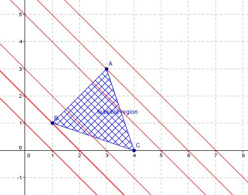

```{r, echo = FALSE, eval = TRUE}
library(tidyverse)
library(microbenchmark)
```

## Overview

Today, we cover:

- Talk about final project proposals
- Linear programming

Announcements

- Sign up for final project proposals slot

::: notes
Welcome. Today we start a new topic — linear programming. This is a two-lecture arc: today covers the theory and algorithms, and next lecture we'll see how LP and its cousin quadratic programming show up in statistical methods like LASSO and quantile regression. But first, some housekeeping about the final project.
:::

---

## Final project presentations

Sign up for final project presentation slot!

- On Canvas, go to calendar
- Do this now.

::: notes
Open Canvas on your laptop and sign up now. Don't leave it for later — slots fill up and you'll end up with an inconvenient time.
:::

---

## Final project presentations

Presentation is designed to be in the style of a JSM or ENAR contributed talk

- Presentation should be 15 minutes or less
- Aim for 12-13 minutes to leave time for questions
- Practice! You will be deducted for not finishing in the alloted time

::: notes
This format mirrors what you'd see at a professional statistics conference like JSM or ENAR. The 15-minute limit is firm — I've sat in sessions where speakers go over and it's awkward for everyone. Most people underestimate how long their talk is when they rehearse silently in their head. Practice out loud, ideally in front of someone, at least once.
:::

---

## Final project presentations

Students are required to provide brief but meaningful feedback on all presentations. There will be online forms provided.

- You will receive feedback from your peers anonymously

::: notes
You'll learn as much from watching your peers present as from any lecture. Take notes, engage with the content. The feedback forms ask about both content and presentation style. Be honest but constructive — you're practicing skills you'll use in your own careers when reviewing papers, evaluating job candidates, and participating in conferences.
:::

---

## Introduction to LP

**Linear programming** (LP) or **linear optimization** is a set of (constrained) optimization
algorithms.

- began in 1947 when George Dantzig devised the simplex method
- LP and **quadratic programming** are two special cases of convex optimization with linear constraints


Widely used across industries!

::: notes
"Linear programming" doesn't mean programming like coding — "programming" here is an old term meaning planning or scheduling. LP finds the best outcome subject to linear constraints. George Dantzig invented the simplex method in 1947 while working for the US Air Force to solve military logistics and supply chain problems. It was immediately recognized as transformative and is still in use today. The term "linear" means both the objective function and the constraints are linear in the decision variables — no squared terms, no products of variables.
:::

---

## Linear programming

\fontsize{10pt}{11pt}\selectfont
An optimization problem with a linear objective function and linear constraint functions is called a linear program (LP):

\begin{align*}
\mbox{minimize } &c^Tx + d\\
\mbox{subject to } &Ax \preceq b\\
\end{align*}


- **Recall**: you can always convert a minimization problem to a maximization problem by multiplying the objective function by $-1$
- In statistics, applications include LASSO, quantile regression, support vector machine


::: notes
The $\preceq$ symbol is a generalized inequality — it just means constraints can be a mix of ≤ and other types; don't worry too much about the notation. The key structure to internalize: x is the vector of decision variables, c is the vector of objective function coefficients, A is the constraint matrix, and b is the RHS. The constant d doesn't affect the optimal solution. Point out the statistical connections: LASSO minimizes RSS subject to an L1 constraint on coefficients, quantile regression minimizes the asymmetric loss function, SVMs maximize margin subject to classification constraints — all LP or LP-adjacent problems.
:::

---


## Linear programming techniques

Methods for solving LP problems:

- Graphical method
- Simplex algorithm
- Interior point methods


::: notes
We're going to get pretty in the weeds here with estimation techniques so you can see how things work.
I want to be upfront about why: understanding how LP is solved algorithmically is directly relevant to understanding how statistical methods that rely on LP work. But don't lose sight of the bigger picture — the goal is to have a principled way to optimize under constraints. These three methods represent increasing levels of sophistication and scalability.
:::

---

## Linear programming techniques


```{r, echo = FALSE, fig.align = 'center', out.width = '80%'}
knitr::include_graphics("rq.png")
```


::: notes
Quantile regression uses a simplex approach (default) or an interior point approach
:::

---

## Carpenter problem

A carpenter can make tables or she can make bookshelves.

- **Table**: costs 10 units of lumber and 5 hours of labor
  - Provides $180 in profit
- **Bookcase**: costs 20 units of lumber, 4 hours of labor
  - $200 in profit
  

- Only 200 units of lumber available
- 80 hours of labor available

**What number of tables and bookcases provide the optimal profit?**

::: notes
Let's start concrete before we do any algebra. Take a moment to read this — can you see intuitively why this is an optimization problem? [pause] The decision variables are how many tables and bookcases to make. The constraints are the available lumber and labor hours. The objective is to maximize profit. This is exactly the LP structure: variables, linear constraints, and a linear objective. Notice we're not told what the answer is — that's what the algorithm will find.
:::

---


## Carpenter problem

\fontsize{10pt}{11pt}\selectfont
- **Table**: costs 10 units of lumber and 5 hours of labor, $180 in profit
- **Bookcase**: costs 20 units of lumber, 4 hours of labor, $200 in profit
- 200 units of lumber available; 80 hours of labor available


Let $x_1$ and $x_2$ denote number of tables, bookshelves respectively

- $10x_1 + 20x_2 \le 200$
- $5x_1 + 4x_2 \le 80$
- $x_1, x_2 \ge 0$
- maximize $f(x_1, x_2) = 180x_1 + 200x_2$

::: notes
Walk through the translation from words to math. x1 = number of tables, x2 = number of bookcases. Lumber constraint: each table uses 10 units, each bookcase 20, total available is 200 — so 10x1 + 20x2 ≤ 200. Labor constraint: 5 hours per table, 4 per bookcase, 80 total — so 5x1 + 4x2 ≤ 80. Non-negativity: you can't make a negative number of tables. Objective: 180 per table plus 200 per bookcase. Because we only have 2 variables, we can actually solve this by drawing the two constraint lines and finding the optimal corner of the feasible region graphically.
:::

---


## Carpenter problem


```{r, echo = FALSE, eval = TRUE,  fig.align = 'center', out.width = '60%'}
tibble(x = seq(-5, 20, by = 1),
       y = x) %>%
  ggplot() +
  xlim(-2, 20) +
  ylim(-2, 20) +
  labs(x = "x1", y = "x2") +
  geom_hline(yintercept = 0) +
  geom_vline(xintercept = 0) +
  geom_abline(intercept = 20, slope = -5/4) +
  geom_abline(intercept = 10, slope = -1/2)

```

::: notes
- number of verticies should equal number of constraints
- calculate f(x, y) at each vertex
:::

---

## Solving LP graphically

The small 2-variable problem can be represented in a 2D graph.

- An **isoprofit line** connects all combinations of $x_1$ and $x_2$ that yield the same profit value
  - e.g., $180x_1 + 200x_2 = k$ for different values of $k$
- The isoprofit line is perpendicular to the gradient of the objective function
- **Key idea**: slide the isoprofit line outward (increasing $k$) until it just touches the feasible region
  - that contact point is optimal

::: notes
The isoprofit line is a level set of the objective function — it connects all points that give the same total profit. Think of it like a contour line on a topographic map. Pick any profit value k, say $1800 — that's all combinations where 180x1 + 200x2 = 1800. Different values of k give a family of parallel lines. As k increases the lines shift outward (away from origin). The optimal is the largest k such that the line still touches the feasible region. That last point of contact is always at a vertex — never in the interior, because you could always do better by moving along the boundary.
:::


---

## Feasible region

Shaded region that satisfies constraints is called feasible region

```{r, echo = FALSE, fig.align = 'center', out.width = '60%'}
knitr::include_graphics("feasible_region.png")
```

::: notes
Point to the shaded area — this represents all combinations of tables and bookcases that satisfy every constraint simultaneously. Notice it's a polygon, and crucially it's convex — no "dents" or holes. The vertices are the corners where constraint boundaries intersect. The optimal solution must be at one of these corners. For this problem there are four vertices. Evaluate f at each.
:::

---


## Properties of the optimal solution

\fontsize{10pt}{11pt}\selectfont
Optimal solution might not exist if

- the objective function is unbounded in the solution space (can be improved indefinitely without violating any constraints)
- the feasible region is empty (no solution satisfies all constraints)

But if the optimal solutions exists:

- Interior point: No.
- Corner point: Yes. The corner points are often referred to as “extreme points” or vertices.
- Edge point: Yes, only when the edge is parallel to the isoprofit line. In this case, every point on that edge has the same objective function value, including the corner point of that edge.
- **Key result**: If an LP has an optimal solution, it must have a extreme point optimal solution. This greatly reduces our search of optimal solutions: only need to check a finite number of extreme points.

::: notes
This slide contains the theoretical foundation for why LP is tractable. Two failure modes: (1) infeasible — the constraints contradict each other, like requiring x1 > 100 and x1 < 50 simultaneously; (2) unbounded — imagine maximizing profit with no constraints on resources, you could always make more. If neither of these holds, the optimal exists. The key result: optimal is always at a corner. Why can't it be in the interior? Because the objective is linear — moving along any direction in the interior either improves or worsens the objective, so you'd always want to move to the boundary. For n variables and m constraints there are finitely many vertices — at most C(n+m, n). Finite means we can in principle check them all.
:::

---


## Properties of the optimal solution

```{r, echo = FALSE, fig.align = 'center', out.width = '60%'}

```

::: notes
When objective is parallel to a constraint edge, you will have multiple solutions
Blue is the isoprofit line
:::

---


## Big ideas of LP

- Each inequality constraint defines a half-plane; their intersection is the **feasible region**
- The feasible region is convex 
- Extreme values (min and max) occur at the **vertices** of this region
- For 2 variables: graphical method works. For $p$ variables: need an algorithm.

You can solve this algorithmically (rather than graphically) using the **simplex method**.

::: notes
Let me summarize the geometric picture before we move to algorithms. Each ≤ constraint cuts the plane in half — the feasible side is a half-plane. The feasible region is the intersection of all these half-planes plus the non-negativity constraints. Intersections of convex sets are convex, so the feasible region is always convex. The optimal is always at a vertex. For 2 variables we can draw it; for p variables we need an algorithm that systematically moves between vertices. That's exactly what simplex does — it's a vertex-hopping algorithm.
:::

---


## Simplex method

Linear programming involves optimizing (maximizing or minimizing) a linear objective function, subject to a set of linear constraints. The simplex method helps to find the optimal solution to such problems, provided one exists.

For simplex method:

- the LP problem needs to be in **standard** form
  - objective function set up as a maximization problem
  - constraints set up as linear inequalities of the form $Ax \le b$
  - need all variables $x$ to be nonnegative

::: notes
The simplex method is one of the most important algorithms in applied mathematics — named after the geometric "simplex" (a generalized triangle/tetrahedron). Before you can run simplex, you need to get the problem into standard form. If you have a minimization problem, flip the sign. If you have ≥ constraints or equality constraints, we need additional conversions (two-phase or big-M methods handle those, but today we'll focus on the basic case with ≤ constraints). If any variable can be negative, substitute x = x+ - x- where both are non-negative.
:::

---


## LP Standard form

\fontsize{10pt}{11pt}\selectfont
An LP can be expressed using only equality and nonnegativity
constraints. This is called **standard form**:


\begin{align*}
\mbox{minimize } &c^Tx\\
\mbox{subject to } &Ax = b\\
&x \ge  0
\end{align*}


An LP can also be expressed using only inequality constraints. This is
called **inequality form**:


\begin{align*}
\mbox{minimize } &c^Tx\\
\mbox{subject to } &Ax \le b
\end{align*}

::: notes
Two ways to write the same LP. Inequality form is natural — it's what you write down from the problem statement. Standard form uses equalities and is what the simplex algorithm actually operates on. The bridge between them is slack variables, which we introduce on the next slide. Note that standard form includes an explicit non-negativity constraint x ≥ 0, while inequality form doesn't (though typically non-negativity is assumed). The two are equivalent — you can always convert one to the other.
:::

---

## Slack variables

Are added to less than or equal to inequality constraints to transform them into equality constraints

- represent the "unused" capacity within a constraint
- non-negative variables
- Say you have inequality $2x + 3y \le 10$.
  - Convert to equality constraint  $2x + 3y + s = 10$
  - If $s \ne 0$, then the combination of $x$ and $y$ could be increased further without violating the constraint

::: notes
The name "slack" is intuitive: the slack variable absorbs any leftover capacity. If 2x + 3y = 8, then s = 10 - 8 = 2 — there are 2 units of slack, meaning the constraint is not fully used. When slack is zero, the constraint is binding — you're right at the boundary. The non-negativity of slack variables is automatic: if 2x + 3y ≤ 10 and x,y ≥ 0, then s = 10 - 2x - 3y ≥ 0. One slack variable per inequality constraint. This converts the entire LP from inequality form to standard form.
:::

---

## Simplex: convert to standard form using slack variables

\fontsize{10pt}{11pt}\selectfont
Go back to Carpenter example.

- maximize $z = f(x_1, x_2) = 180x_1 + 200x_2$
- $x_1, x_2 \ge 0$

Constraints: 

- $10x_1 + 20x_2 \le 200$ $\to 10x_1 + 20x_2 + s_1 = 200$
- $5x_1 + 4x_2 \le 80$ $\to 5x_1 + 4x_2 + s_2 = 80$

Slack variables pick up any "slack" in the system based on current values of $x_1$ and $x_2$

- $s_1, s_2 \ge 0$
- $s_1, s_2 = 0$ when $z$ is maximized


::: notes
Apply the slack variable idea to the carpenter problem. We get one slack variable per constraint: s1 absorbs unused lumber, s2 absorbs unused labor. At the starting point x1=x2=0, we have s1=200 and s2=80 — all capacity is unused. At the optimal solution, both constraints should be binding so s1=s2=0. The claim that s1=s2=0 at the optimum is not always true in general — it depends on whether both constraints are active at the optimal vertex. Here we'll verify it when we reach the solution.
:::

---


## Steps of Simplex algorithm

1. Convert problem to standard form
2. Set up "tableau": basically amounts to writing out problem as a matrix
3. Start at a vertex of the feasible region, then pivot

- Essentially, you are iteratively moving from one vertex (or "corner point") of the feasible region to another, with the goal of improving the objective function at each step.

::: notes
Three steps. Steps 1 and 2 are setup; the real action is in step 3 — pivoting. The starting vertex is almost always the origin: set all original variables to zero, so all slack variables are positive. This is always feasible as long as b ≥ 0 (the RHS values are non-negative), which is typically the case. From there, each pivot moves to an adjacent vertex that improves the objective. Adjacent means you share all but one vertex-defining constraint. The algorithm terminates when no adjacent vertex improves the objective — you're at the optimal.
:::

---

## Initial tableau

First 
$z =  180x_1 + 200x_2 \to z -180x_1 - 200x_2 = 0$

- $10x_1 + 20x_2 \le 200$ $\to 10x_1 + 20x_2 + s_1 = 200$
- $5x_1 + 4x_2 \le 80$ $\to 5x_1 + 4x_2 + s_2 = 80$

Start at $x_1, x_2 = 0$


::: notes
The tableau is a compact matrix representation of the entire system. Each row is one equation; columns represent variables. Write out the augmented matrix: columns for z, x1, x2, s1, s2, and the RHS. Row 1 (objective): [1, -180, -200, 0, 0 | 0]. Row 2 (lumber): [0, 10, 20, 1, 0 | 200]. Row 3 (labor): [0, 5, 4, 0, 1 | 80]. The current solution (starting vertex) is x1=x2=0, s1=200, s2=80, z=0. This is the origin — we're making nothing and generating no profit. The basic variables here are s1 and s2 (the ones currently positive); x1 and x2 are non-basic (zero).
:::

---


## Pivot step

**Choose the entering variable** (which $x_j$ to increase from zero?):

- Look at the objective row: $z - 180x_1 - 200x_2 = 0$
- The most negative coefficient determines the entering variable
- Here: $x_2$ enters (coefficient $-200$ is more negative than $-180$)
  - Intuition: $x_2$ (bookcases) generates more profit per unit (200) than $x_1$ (tabler, 180), so we try producing bookcases first. 

::: notes
We scan the objective row for negative coefficients. A negative coefficient on x_j means increasing x_j from zero will increase z — that's what we want. We pick the most negative (steepest ascent): -200 for x2 beats -180 for x1. Intuition: x2 (bookcases) generates more profit per unit ($200) than x1 (tables, $180), so we try producing bookcases first. This rule is called Dantzig's rule or the "most negative coefficient" rule.
:::

---

## Pivot step

**Choose the leaving variable** (minimum ratio test):

- Divide each RHS by the entering variable's coefficient in that row
- $s_1$: $200/20 = 10$; $s_2$: $80/4 = 20$
- The row with the **smallest non-negative ratio** leaves: $s_1$ leaves
- This keeps all variables non-negative (stays in the feasible region)

::: notes
Now we need to know how much we can increase x2 before hitting a constraint. For each constraint row, divide the RHS by the x2 coefficient. This tells you the maximum x2 value before that constraint is violated. Lumber (row 1): x2 can go up to 200/20 = 10 before we run out of lumber. Labor (row 2): x2 can go up to 80/4 = 20 before we run out of labor. The binding constraint is the smaller ratio: lumber runs out first at x2 = 10. So s1 leaves the basis (becomes zero) and x2 enters. If any ratio were negative or zero, we'd skip that row. If no positive ratios existed, the problem would be unbounded.
:::

---

## Pivot step

**Perform row operations** to make the pivot column a unit vector:

- Divide the pivot row by the pivot element (20)
- Eliminate $x_2$ from all other rows using row operations
- Update $z$ row and the RHS
- Repeat until no negative coefficients remain in the $z$ row

::: notes
This is Gaussian elimination — the same thing you've seen in linear algebra. We want the x2 column to become a unit vector (0, 1, 0) so that x2 is a basic variable. Pivot element is 20 (x2 coefficient in the leaving row). Step 1: divide row 1 by 20 → new row 1: [0, 1/2, 1, 1/20, 0 | 10]. Step 2: eliminate x2 from the objective row: add 200 × new row 1 to objective row. Step 3: eliminate x2 from row 2: subtract 4 × new row 1 from row 2. After this pivot, x2 = 10 and the new basic solution has z = 2000. Check the objective row for negative coefficients — if still present, pivot again. Repeat until no negative coefficients remain.
:::

---


## Initial tableau


---

## Pivot step

---


## Pivot step

---

## Solution

---


## Solution


```{r, echo = FALSE, eval = TRUE, fig.align = 'center', out.width = '90%'}
knitr::include_graphics("carpenter_solution.png")
```

::: notes
 The simplex algorithm arrived at the same answer systematically without drawing any pictures — and it would work for 100 variables just as well.
:::

---

## Summary of the Simplex method

Basic variables define current corner point/vertex!


- Walks along the edge of the feasible space to improve the objective function
  - "Basic" variables are the current solution
- Only considers vertices
- Moves as far as it can in optimal direction until movement is blocked by another constraint

::: notes
Let's step back and appreciate what simplex is doing geometrically. At each step you're at a vertex. The basic variables (those currently positive) define which vertex. Each pivot swaps one variable in and one out — that corresponds to moving to an adjacent vertex. You keep moving as long as some direction improves the objective. You stop when no adjacent vertex is better. The algorithm is guaranteed to find the global optimum for LP because the feasible region is convex — there are no local optima that aren't global optima. In the worst case you might cycle through all vertices, but in practice simplex is extremely fast even for large problems.
:::

---


## Standard form as a matrix

\fontsize{10pt}{11pt}\selectfont
\begin{align*}
\max z &= c^T\boldsymbol{x}\\
s.t. A\boldsymbol{x} &= b\\
\boldsymbol{x} &\ge 0
\end{align*}

$$\boldsymbol{x} = [x_1, x_2, s_1, s_2]^T$$

- Extending $\boldsymbol{x}$ to include slack variables $s_1, s_2$ converts all inequalities to equalities
- The full augmented vector is what the simplex algorithm operates on

::: notes
Now we can write the whole carpenter problem compactly. The augmented variable vector x = [x1, x2, s1, s2]^T includes both original variables and slack variables. c = [180, 200, 0, 0]^T (slacks contribute nothing to profit). A is the 2×4 constraint coefficient matrix. b = [200, 80]^T. This is the form you'd implement in code, and it generalizes directly to any number of variables and constraints. This matrix formulation is also what we need to set up the theory for interior point methods and duality.
:::

---


## Linear programming techniques


- Graphical method
  - Only works for 2 variables
- Simplex algorithm
  - Moves from one basic feasible solution to the next
  - Standard version works for $\le$ constraints
- Two phase, big M methods
  - Variations on Simplex method
  - Handle $=$ and $\ge$ constraints
- Interior point methods
  - Better for large-scale LP problems
  - Instead of moving along boundary, moves through interior of feasible region

::: notes
Now that you've seen simplex in action, here's the full landscape of LP methods. We covered graphical (2 variables only) and simplex (boundary hopping). Two-phase and big-M methods extend simplex to handle equality and ≥ constraints by introducing artificial variables to find an initial feasible point — I won't cover these in detail but they're important to know exist. Interior point methods are the focus for the rest of this lecture: instead of walking around the boundary vertex by vertex, they take a direct path through the interior. For very large-scale problems — millions of variables — interior point methods are faster in practice than simplex.
:::

---

## Interior point methods

Effectively, the idea is to set up the problem such that we can solve it using something like Newton's method.


- Need to set up some background and theory first
- Allows us to handle the constraints

::: notes
Simplex works well for small to medium problems but for large-scale LP — millions of variables and constraints, as you'd see in supply chain optimization or large-scale statistical estimation — interior point methods outperform. The key idea: instead of moving along the edges of the feasible region, we move through the interior on a smooth curved path toward the optimum. To do this, we need to convert the constrained problem into something we can apply Newton's method to. We'll need to introduce some theory first — specifically duality and complementary slackness — before we can write down the algorithm.
:::

---

## Carpenter problem

A carpenter can make tables or she can make bookshelves.

- **Table**: costs 10 units of lumber and 5 hours of labor
  - Provides $180 in profit
- **Bookcase**: costs 20 units of lumber, 4 hours of labor
  - $200 in profit
  

- Only 200 units of lumber available
- 80 hours of labor available

**What number of tables and bookcases provide the optimal profit?**

::: notes
We're returning to the carpenter problem as a bridge to duality. We've been thinking about this as a production optimization problem — how many tables and bookcases to make to maximize profit. Now I want you to think about exactly the same problem from a completely different perspective: the perspective of someone who might want to buy our raw materials. This reframing leads naturally to the dual problem.
:::

---


## LP problem for resource allocation

\fontsize{10pt}{11pt}\selectfont
Take a typical maximizing LP problem (3 variables and 2 constraints).


\begin{align*}
        \max \quad & c_1x_1 + c_2x_2 + c_3x_3 \\
        \text{s.t.} \quad & a_{11}x_1 + a_{12}x_2  + a_{13}x_3 \le b_1\\
        & a_{21}x_1 + a_{22}x_2  + a_{23}x_3 \le b_2\\
        & x_1, x_2, x_3 \geq 0
    \end{align*}
    
Economic interpretation of the problem:  

- We produce three products using two materials
- $x_j$: unit of production of product $j \in \{1,2,3\}$. Unknown to obtain.
- $c_j$: profit per unit of product
- $a_{ij}$: unit of material ($i\in\{1,2\}$) to produce 1 unit of product $j$
- $b_i$: units of available material $i$.

Goal is to maximize the profit, subject to the material constraints.

::: notes
This is the carpenter problem generalized to 3 products and 2 materials. Map the notation back: x1=tables, x2=bookcases (now x3=some third product). c_j is the profit per unit of product j. a_ij is how much of material i you need to make one unit of product j. b_i is the total available amount of material i. The decision variables are the x's — how many units of each product to make. Everything else is given data. This is the standard LP structure for resource allocation problems.
:::

---


## Resource valuation problem

\fontsize{10pt}{11pt}\selectfont
Now, suppose a buyer is considering purchasing our entire inventory of materials but is unsure how to price them. The buyer knows we will only agree to the sale if it yields a higher return than using the materials for production.

::: notes
Here's the dual story. A buyer wants to buy ALL our lumber and labor hours. They need to set prices y1 per unit of lumber and y2 per hour of labor. We (the carpenter) will only agree to sell if the total payment is at least as good as what we'd earn making tables and bookcases ourselves. The buyer wants to minimize what they pay us. So the buyer solves: minimize total cost (y1×200 + y2×80) subject to: for each product j, the payment for materials needed to make one unit of j must be at least as profitable as making that product. This is the dual problem.
:::


**Buyer's business strategy**: producing one fewer unit of product $j$ will save us:

- $a_{1j}$ units of material $1$ and $a_{2j}$ units of material $2$

The buyer seeks to determine the unit prices of materials to minimize costs while ensuring we still agree to the sale (i.e., we do not earn less). Let $y_1$ and $y_2$ be the unknown unit prices of the materials. The buyer's optimization problem, known as the **Resource Valuation Problem**, is then:

---


## Resource valuation problem

```{r, echo = FALSE, fig.align = 'center', out.width = '90%'}
knitr::include_graphics("primal_dual.png")
```


::: notes
Walk through this figure carefully. The left panel is the primal — our production problem. The right panel is the dual — the buyer's pricing problem. Notice the structural symmetry: the b vector (resource limits: 200, 80) becomes the objective coefficients in the dual. The c vector (profits: 180, 200 per product) becomes the RHS of the dual constraints. The A matrix gets transposed. This isn't coincidence — it's a consequence of the Lagrangian structure of the problem. For the carpenter problem in particular: the buyer must pay at least $180 worth of materials to make a table (10y1 + 5y2 ≥ 180) and at least $200 to make a bookcase (20y1 + 4y2 ≥ 200).
:::

---


## Duality of LP problems

\fontsize{10pt}{11pt}\selectfont
In Linear Programming, duality refers to the fact that every LP problem can be paired with another LP that is structurally linked to it.

- The buyer’s LP is called the "**dual**" problem of the original, which is called the "**primal**" 
- The two problems are mirror images of each other

In matrix notation, if the **primal** LP problem is:

\begin{align*}
        \max \quad & cx\\
        \text{s.t.} \quad &Ax \le b, x\ge0
    \end{align*}

The corresponding **dual** problem is:

\begin{align*}
        \min \quad & b^Ty\\
        \text{s.t.} \quad &A^Ty \ge c^T, y\ge0
    \end{align*}

::: notes
Here’s the formal definition. Notice the structure: b (primal RHS) becomes the dual objective coefficients. c (primal objective) becomes the dual constraint RHS. A becomes A^T. The primal maximizes, the dual minimizes. The primal has ≤ constraints, the dual has ≥ constraints. Both require non-negative variables. This is a beautiful mathematical symmetry — the two problems are perfectly paired. In the carpenter example: b^T y = 200y1 + 80y2 is the total payment to the carpenter; the dual constraints say the payment for materials to make each product must at least match its profit.
:::

---

## Duality of LP problems

- $b$ (primal RHS) becomes the dual objective coefficients 
- $c$ (primal objective) becomes the dual constraint RHS
- $A$ becomes $A^T$
- The primal maximizes, the dual minimizes
- primal has $\le$ constraints, the dual has $\ge$ constraints


---

## Duality

We can also express the dual problem in canonical form (a maximization problem with $\le$ constraints):

\begin{align*}
        \max \quad & -b^Ty\\
        \text{s.t.} \quad &-A^Ty \le -c^T, y\ge0
    \end{align*}

The **dual is the negative transpose of the primal**. 

- i.e. the dual of the dual problem is the primal problem 


**Why do we care about duality?**


::: notes
Point out the canonical form conversion: multiply the dual objective and constraints by -1 to get a maximization problem with ≤ constraints. This reveals the symmetry: the dual of the dual is the primal. I've seen "we solve the dual problem" in methods papers with no explanation, as if it's obvious. Let's understand why you'd actually do this — the next slide answers the question.
:::

---

## Duality


**Why do we care about duality?**

- Sometimes the dual problem is easier to solve than the primal one
- If a constraint is slightly relaxed or tightened, the dual variables indicate how much the objective function will change
- Solution to primal is **always** $\le$ solution to dual (weak duality theorem)!

**Need to understand conditions in which the dual and primal solutions are equal!**

::: notes
Three practical reasons. First: sometimes the dual has fewer constraints than the primal — if the primal has many constraints and few variables, the dual may be much smaller and faster to solve. Second: dual variables are shadow prices — they quantify the marginal value of relaxing each primal constraint by one unit. This is extremely useful for sensitivity analysis: before investing in more resources, you can ask which constraints are worth relaxing. Third: weak duality gives you a stopping criterion — if your primal solution and dual solution have the same objective value, you've proven optimality. This "certificate of optimality" is powerful.
:::

---


## Weak duality

\fontsize{10pt}{11pt}\selectfont
**Weak duality theorem:**

- For any feasible solution $x$ to the **primal** (maximization) problem and any feasible solution $y$ to the **dual** (minimization) problem:

$$\mbox{objective of dual }\ge \mbox{ objective of primal}.$$

- Implications:
  - The dual provides an upper bound on the primal's optimal value.
  
- **Weak Duality Guarantee**: the optimal value of the primal cannot exceed the optimal value of the dual.


In other words, we will only do business if selling the material makes us more money. 

::: notes
The weak duality theorem is our first major theoretical result connecting primal and dual. It says: for ANY feasible primal solution x and ANY feasible dual solution y — not just optimal solutions — the dual objective is always ≥ the primal objective. The economic interpretation: no matter what prices the buyer offers (as long as they're feasible), they'll always pay at least as much as we'd earn from production. Weak duality gives an upper bound on the primal optimum: if you find a dual feasible solution with objective value V, then you know the primal optimum is at most V.
:::

---

## Weak duality proof

\fontsize{10pt}{11pt}\selectfont
**Weak duality**: If $(x_1, \dots, x_n)$ is a feasible solution for the primal, and $(y_1, \dots, y_m)$ is a feasible solution for the dual, then $\sum_j c_j x_j \leq \sum_i b_i y_i$.

\vspace{20mm}

::: notes
Let me state what we're about to prove before showing the algebra. We need to show that the primal objective (sum of c_j x_j) is always ≤ the dual objective (sum of b_i y_i). The proof uses only two facts: dual feasibility (A^T y ≥ c^T, i.e., for each j, the dual constraint holds) and primal feasibility (Ax ≤ b, i.e., for each i, the primal constraint holds), plus non-negativity of both x and y.
:::

---


## Weak duality proof

\fontsize{10pt}{11pt}\selectfont
**Weak duality**: If $(x_1, \dots, x_n)$ is a feasible solution for the primal, and $(y_1, \dots, y_m)$ is a feasible solution for the dual, then $\sum_j c_j x_j \leq \sum_i b_i y_i$.

\begin{align*}
\sum_j c_j x_j &\leq \sum_j \left( \sum_i y_i a_{ij} \right) x_j \\
&= \sum_{i,j} y_i a_{ij} x_j \\
&= \sum_i \left( \sum_j a_{ij} x_j \right) y_i \\
&\leq \sum_i b_i y_i.
\end{align*}

::: notes
Walk through each step. Line 1: replace c_j with the dual constraint lower bound. Dual feasibility says sum_i y_i a_ij ≥ c_j for each j. Since x_j ≥ 0, multiplying both sides by x_j preserves the inequality. Line 2-3: just rearranging the double sum — swapping the order of summation. This is always valid for finite sums. Line 4: replace sum_j a_ij x_j with b_i. Primal feasibility says sum_j a_ij x_j ≤ b_i for each i. Since y_i ≥ 0 (dual feasibility), multiplying preserves the inequality. Two inequalities, each applied once. Elegant and short.
:::

---


## Strong duality 

\fontsize{10pt}{11pt}\selectfont
- We know that at feasible solutions for both dual and primal, the solution to the dual is always greater or equal
- If there is a difference between the largest primal value and
the smallest dual value it is called the "**Duality gap**".
  - When are these values equal?

**Strong Duality Theorem:** If the primal has an optimal solution, then the dual also has an optimal solution and there is no duality gap, i.e.:

$$\mbox{objective of dual } = \mbox{ objective of primal}.$$

- Condition for strong duality: the feasible region must be nonempty and bounded.
- The **duality gap** is zero when strong duality holds.

::: notes
Weak duality says the dual ≥ primal for any feasible solutions. Strong duality says at the OPTIMAL solutions they're EQUAL — the gap closes. This is a much stronger result. The condition (feasible region nonempty and bounded) is the standard assumption for LP problems that have solutions. Economic interpretation: at optimality, the carpenter earns the same whether they use the materials to build furniture or sell them at the optimal shadow prices. The market has perfectly priced the resources. Strong duality is what lets interior point methods use the duality gap as a stopping criterion — when the gap is zero (or negligibly small), you're done.
:::

---


## Complementary slackness theorem

The **complementary slackness theorem** provides a necessary condition for optimality in linear programming. It states that:

*If* $x^*$ *and* $y^*$ *are feasible solutions of primal and dual problems, then* $x^*$ *and* $y^*$ *are both optimal if and only if*

1. $y^{*T}(b-Ax^*)=0$
2. $(y^{*T}A-c)x^* = 0$


This theorem is the foundation of the **interior point method** class of LP solvers.

::: notes
Complementary slackness is the key tool for certifying optimality. The two conditions encode a simple principle: at the optimum, every resource is either fully used OR its dual price is zero — you never pay for slack capacity. Condition 1: y*^T(b - Ax*) = 0 means for each constraint i, either y_i* = 0 (shadow price zero) or b_i - (Ax*)_i = 0 (constraint is binding). Condition 2: (y*^T A - c)x* = 0 means for each variable j, either x_j* = 0 (variable not in solution) or the dual constraint for j holds with equality. These conditions together give us a way to verify optimality without solving the problem from scratch.
:::

---

## Complementary slackness theorem

\fontsize{9pt}{10pt}\selectfont
Consider a simple LP problem:

\begin{align*}
    \textit{max} \quad &z = x_1 + x_2, \\
    \textit{s.t.} \quad &x_1 + 2x_2 \leq 100, \\
    &2x_1 + x_2 \leq 100, \\
    &x_1, x_2 \geq 0.
\end{align*}

Its dual problem is:


\vspace{20mm}

::: notes
Pause here. Ask students to write out the dual. They have all the tools now. Primal has two ≤ constraints → both dual variables y1, y2 ≥ 0. Both primal variables x1, x2 ≥ 0 → both dual constraints are ≥. Dual objective coefficients are b = (100, 100). Dual constraint coefficients come from transposing A. Show the answer on the next slide.
:::

---


## Complementary slackness theorem

\fontsize{9pt}{10pt}\selectfont
Consider a simple LP problem:

\begin{align*}
    \textit{max} \quad &z = x_1 + x_2, \\
    \textit{s.t.} \quad &x_1 + 2x_2 \leq 100, \\
    &2x_1 + x_2 \leq 100, \\
    &x_1, x_2 \geq 0.
\end{align*}

Its dual problem is:

\begin{align*}
    \textit{min} \quad &z = 100y_1 + 100y_2, \\
    \textit{s.t.} \quad &y_1 + 2y_2 \geq 1, \\
    &2y_1 + y_2 \geq 1, \\
    &y_1, y_2 \geq 0.
\end{align*}

---

## Complementary slackness theorem

\fontsize{10pt}{11pt}\selectfont
The complementary slackness theorem states:

\vspace{40mm}


::: notes
Before writing the CS conditions, explain what they mean geometrically. This problem has a symmetric objective (x1 + x2, equal coefficients), so the optimal will be at the intersection of both constraint boundaries — both constraints active at the optimum. That means both slacks are zero AND both dual variables can be non-zero. In the asymmetric example coming later, we'll see a case where only one constraint is active. Ask students: what do you expect the optimal x to be here, given the symmetry?
:::

---


## Complementary slackness theorem

\fontsize{10pt}{11pt}\selectfont
The complementary slackness theorem states:

\begin{align*}
    y_1(100 - x_1 - 2x_2) &= 0, \\
    y_2(100 - 2x_1 - x_2) &= 0, \\
    x_1(y_1 + 2y_2 - 1) &= 0, \\
    x_2(2y_1 + y_2 - 1) &= 0.
\end{align*}


At the optimal point, we have $\bf{x} = (100/3, 100/3)$, $\bf{y = (1/3, 1/3)}$. The complementary slackness holds.

- All the constraints are bounded in both primal and dual
problems.

::: notes
Walk through the verification. Optimal x = (100/3, 100/3). Check: constraint 1: 100/3 + 2(100/3) = 100 — exactly binding. Constraint 2: 2(100/3) + 100/3 = 100 — exactly binding. Both constraints active, so y1 and y2 can be non-zero. Optimal y = (1/3, 1/3). Check dual constraints: y1 + 2y2 = 1/3 + 2/3 = 1 ✓ (equality, so x1 can be non-zero). 2y1 + y2 = 2/3 + 1/3 = 1 ✓ (equality, so x2 can be non-zero). Check CS conditions: y1(100 - 100/3 - 200/3) = (1/3)(0) = 0 ✓. Everything is consistent. This symmetric case is clean — next we see an asymmetric case that's more interesting.
:::

---

## Plot of constraints

```{r, echo = FALSE, eval = TRUE, fig.align = 'center', fig.width = 10, fig.height = 4.5, warning = FALSE, message = FALSE}
library(tidyverse)
library(patchwork)
x_vals <- seq(0, 100, length.out = 100)
y1_vals <- (100 - x_vals) / 2  # From x1 + 2x2 = 100
y2_vals <- 100 - 2*x_vals      # From 2x1 + x2 = 100

# Create a data frame for ggplot
df <- data.frame(x1 = c(x_vals, x_vals),
                 x2 = c(y1_vals, y2_vals),
                 equation = rep(c("x1 + 2x2 = 100", "2x1 + x2 = 100"), each = length(x_vals)))

# Plot the lines
primal = ggplot(df, aes(x = x1, y = x2, color = equation)) +
  geom_line(size = 1) +
  xlim(0, 100) + ylim(0, 100) +
  ggtitle("Primal constraints") +
    geom_hline(yintercept = 0, linetype = 2, color = "gray") +
  geom_vline(xintercept = 0, linetype = 2, color = "gray") +
  theme_minimal() + theme(legend.position =  c(0.6,0.7))


#### dual
x_vals <- seq(-1, 2, length.out = 100)  # Define x range
y1_vals <- (1 - x_vals) / 2   # From x + 2y = 1
y2_vals <- 1 - 2*x_vals       # From 2x + y = 1

# Create a data frame for ggplot
df <- data.frame(x = c(x_vals, x_vals),
                 y = c(y1_vals, y2_vals),
                 equation = rep(c("y1 + 2y2 = 1", "2y1 + y2 = 1"), each = length(x_vals)))

# Create the plot
dual = ggplot(df, aes(x = x, y = y, color = equation)) +
  geom_line(size = 1) +
  xlim(-1, 2) + ylim(-1, 2) +
  ggtitle("Dual constraints") +
  labs(x = "y1", y = "y2") +
    geom_hline(yintercept = 0, linetype = 2, color = "gray") +
  geom_vline(xintercept = 0, linetype = 2, color = "gray") +
  theme_minimal() +
  theme(legend.position = c(0.6,0.7))

primal + dual
```

::: notes
[Note: activate eval=TRUE once you want this to render.] The left panel shows the primal feasible region — the two constraint lines intersect at (100/3, 100/3), which is the optimal point where both constraints are binding. The right panel shows the dual constraint lines, which also intersect at y = (1/3, 1/3). Notice that in the symmetric case, the feasible regions of both primal and dual are "nice" — the optimal is at the intersection of both active constraints in both problems.
:::

---

## Complementary slackness theorem

\fontsize{10pt}{11pt}\selectfont
Modify the simple LP problem a bit:

\begin{align*}
    \textit{max} \quad &z = 3x_1 + x_2, \\
    \textit{s.t.} \quad &x_1 + 2x_2 \leq 100, \\
    &2x_1 + x_2 \leq 100, \\
    &x_1, x_2 \geq 0.
\end{align*}

and its dual problem is:

\begin{align*}
    \textit{min} \quad &z = 100y_1 + 100y_2, \\
    \textit{s.t.} \quad &y_1 + 2y_2 \geq 3, \\
    &2y_1 + y_2 \geq 1, \\
    &y_1, y_2 \geq 0.
\end{align*}

::: notes
Now the objective is 3x1 + x2 — the x1 coefficient is three times larger. Intuitively this should push the optimal toward x1. Before showing the CS conditions and solution, ask students to predict: will both constraints be active at the optimum? The answer is no — only one constraint will be active, because the asymmetry in profits means we'll hit one resource limit before the other. This is the more interesting and practically relevant case.
:::

---

## Complementary slackness theorem

\fontsize{9pt}{10pt}\selectfont
Now the complementary slackness theorem states:

\begin{align*}
    y_1(100 - x_1 - 2x_2) &= 0, \\
    y_2(100 - 2x_1 - x_2) &= 0, \\
    x_1(y_1 + 2y_2 - 3) &= 0, \\
    x_2(2y_1 + y_2 - 1) &= 0.
\end{align*}

For this LP problem, the optimal solutions are $\bf{x} = (50, 0)$, $\bf{y = (0, 1.5)}$. Complementary slackness still holds. We observe that:

- In the primal problem:
  - The first constraint is **inactive** (slack $> 0$) at the optimum, so its shadow price $y_1 = 0$
  - Second constraint is **active** (binding, slack $= 0$), so $y_2$ can be non-zero

::: notes
Walk through what CS tells us here. x = (50, 0), y = (0, 1.5). Check primal constraint 1: 50 + 2(0) = 50 < 100 — inactive (slack = 50). CS says y1 must be 0. Check: y1 = 0 ✓. Check primal constraint 2: 2(50) + 0 = 100 — active (binding). CS says y2 can be non-zero. Check: y2 = 1.5 ≠ 0 ✓. Key insight: constraint 1 has 50 units of slack — there's unused capacity. The shadow price y1 = 0 means relaxing constraint 1 (giving us more of resource 1) wouldn't help, because we're not using what we have.
:::

---

## Complementary slackness theorem

\fontsize{10pt}{11pt}\selectfont
For this LP problem, the optimal solutions are $\bf{x} = (50, 0)$, $\bf{y = (0, 1.5)}$. Complementary slackness still holds. We observe that:

- In the primal problem:
  - The first constraint is **inactive** (slack $> 0$), so its shadow price $y_1 = 0$.
  - The second constraint is **active** (binding, slack $= 0$), so $y_2$ can be non-zero.

- In the dual problem:
  - The first constraint is **active** (binding), so its primal variable $x_1$ can be non-zero.
  - The second constraint is **inactive** (slack $> 0$), so its primal variable $x_2 = 0$.

::: notes
Now check the dual side. Dual constraint 1: y1 + 2y2 = 0 + 3 = 3 ≥ 3 — active, holds with equality. CS condition 3 says x1(y1 + 2y2 - 3) = 0. Since the constraint is tight (= 3), the term in parentheses is 0, so x1 can be anything non-negative — and indeed x1 = 50 ≠ 0. Dual constraint 2: 2y1 + y2 = 0 + 1.5 = 1.5 > 1 — inactive (slack = 0.5). CS condition 4 says x2(2y1 + y2 - 1) = 0. The term in parentheses is 0.5 ≠ 0, so x2 must be 0. And indeed x2 = 0. Everything is self-consistent and confirms the solution is optimal.
:::

---

## Plot of constraints

```{r, echo = FALSE, eval = TRUE, fig.align = 'center', fig.width = 10, fig.height = 4.5, warning = FALSE, message = FALSE}
x_vals <- seq(0, 100, length.out = 100)
y1_vals <- (100 - x_vals) / 2  # From x1 + 2x2 = 100
y2_vals <- 100 - 2*x_vals      # From 2x1 + x2 = 100

# Create a data frame for ggplot
df <- data.frame(x1 = c(x_vals, x_vals),
                 x2 = c(y1_vals, y2_vals),
                 equation = rep(c("x1 + 2x2 = 100", "2x1 + x2 = 100"), each = length(x_vals)))

# Plot the lines
primal = ggplot(df, aes(x = x1, y = x2, color = equation)) +
  geom_line(size = 1) +
  xlim(0, 100) + ylim(0, 100) +
    geom_hline(yintercept = 0, linetype = 2, color = "gray") +
  geom_vline(xintercept = 0, linetype = 2, color = "gray") +
  ggtitle("Primal constraints") +
  theme_minimal() + theme(legend.position =  c(0.6,0.7))


#### dual
x_vals <- seq(-1, 2, length.out = 100)  # Define x range
y1_vals <- (3 - x_vals) / 2   # From x + 2y = 1
y2_vals <- 1 - 2*x_vals       # From 2x + y = 1

# Create a data frame for ggplot
df <- data.frame(x = c(x_vals, x_vals), 
                 y = c(y1_vals, y2_vals), 
                 equation = rep(c("y1 + 2y2 = 3", "2y1 + y2 = 1"), each = length(x_vals)))

# Create the plot
dual = ggplot(df, aes(x = x, y = y, color = equation)) +
  geom_line(size = 1) +
  #xlim(-1, 2) + ylim(-1, 2) +
  ggtitle("Dual constraints") + 
  labs(x = "y1", y = "y2") +
  geom_hline(yintercept = 0, linetype = 2, color = "gray") +
  geom_vline(xintercept = 0, linetype = 2, color = "gray") +
  theme_minimal() + 
  theme(legend.position = c(0.6,0.7))

primal + dual
```

---

## Economics interpretation

Dual variables can be called "**shadow prices**" of the primal constraint, how objective function would increase if constraint was relaxed.

- If a primal constraint is bounded, relaxing that constraint would result in a gain
(improve the objective function), shadow price is non-zero.
- If a primal constraint is unbounded, relaxing that constraint would not improve
the objective function, shadow price is zero.


::: notes
Shadow prices are one of the most practically useful outputs of LP. The dual variable y_i tells you the marginal value of relaxing constraint i by one unit. If constraint i is active (binding), its shadow price is positive — you could improve the objective if you had a little more of resource i. If constraint i is inactive (slack > 0), its shadow price is zero — you already have more than you need, so adding more doesn't help. This connects directly to complementary slackness: inactive constraint → zero shadow price.
:::

---

## Economics interpretation

\fontsize{10pt}{11pt}\selectfont
**Bakery example**: Imagine you're running a bakery, and can make a limited number of cakes because you have a limited amount of flour. Shadow price tells you how much more profit you’d gain if you had a little more flour.

- If you're tight on flour, getting more flour would let you bake more cakes and make more money.   - In this case, the shadow price is nonzero because the extra resource improves your outcome.
- If you have plenty of flour, adding more doesn’t help—you’re already making as many cakes as you can sell. In this case, the shadow price is zero because extra flour doesn’t change your profit.


So, the dual variable (shadow price) tells you how valuable it would be to relax a constraint—meaning allowing more of that constrained resource. If relaxing the constraint helps, the shadow price is positive. If it doesn’t make a difference, the shadow price is zero.

::: notes
The bakery example makes shadow prices concrete. If you're out of flour (binding constraint), the shadow price of flour is positive — each extra bag lets you bake more and earn more. If you have leftover flour (inactive constraint), the shadow price is zero — more flour won't help because something else (oven time, staff hours) is the binding constraint. The second scenario also illustrates an important point: before investing in more capacity, always check which constraint is binding. In the carpenter example: if the labor constraint is binding but not the lumber constraint, buying more lumber doesn't help — you'd want to hire more labor instead.
:::

---


## Resources

Probability theory in settlers of catan

https://medium.com/@Singh314/probability-theory-in-catan-e302fed44532

-- 

## Duality in non-canonical form

\fontsize{10pt}{11pt}\selectfont
What if the primal problem doesn’t fit into the canonical form (e.g., has $\ge$ or $=$ constraints, unrestricted variables)?

The **variable types in the dual problem** are determined by the **constraint types in the primal problem** as follows:


- Equality constraints in the primal  $\to$ Unrestricted dual variables
- $\le$ in the primal $\to$ **nonnegative** dual variables
- $\ge$ in the primal $\to$ **nonpositive** dual variables

i.e.

$$\begin{array}{|c|c|}
\hline
\textbf{Primal (max) constraints} & \textbf{Dual (min) variable} \\
\hline
\leq & \geq 0 \\
\hline
\geq & \leq 0 \\
\hline
= & \text{unrestricted} \\
\hline
\end{array}$$


::: notes
Most real LP problems don't fit neatly into canonical form with all ≤ constraints. This table is a lookup: given the type of each primal constraint, what type is the corresponding dual variable? The logic: if a primal ≤ constraint is inactive (slack > 0), its dual variable must be zero — relaxing it further wouldn't help. So ≤ gives a nonneg dual variable (zero is allowed). If the primal constraint is ≥, the dual variable is nonpositive. If it's equality (no slack possible), the dual variable is unrestricted. Memorizing the table is less important than understanding the logic.
:::

---


## Duality in non-canonical form

Conversely, **constraint types of the dual** problem are determined by **variable types of the primal**:

$$\begin{array}{|c|c|}
\hline
\textbf{Primal (max) variable} & \textbf{Dual (min) constraints} \\
\hline
\geq 0 & \geq \\
\hline
\leq 0 & \leq \\
\hline
\textit{unrestricted} & = \\
\hline
\end{array}$$

::: notes
The complementary table. Given the type of each primal variable, what is the type of the corresponding dual constraint? The logic mirrors the first table: a nonneg primal variable (x_j ≥ 0) means we might be at a boundary where that variable is zero, so the dual constraint could be strict inequality or equality — it's ≥. An unrestricted primal variable means the dual constraint must be exactly met (=), otherwise we could improve by moving the variable in one direction or the other. Together these two tables let you mechanically construct the dual of any LP.
:::

---


## Non-canonical duality example

\fontsize{9pt}{10pt}\selectfont
If the primal problem is:

\begin{align*}
    max \quad & 20x_1 + 10x_2 + 50x_3 \\
    s.t. \quad & 3x_1 + x_2 + 9x_3 \leq 10 \\
    & 7x_1 + 2x_2 + 3x_3 = 8 \\
    & 6x_1 + x_2 + 10x_3 \geq 1 \\
    & x_1 \geq 0, \quad x_2 \textit{ unrestricted}, \quad x_3 \leq 0
\end{align*}

The dual problem is:

::: notes
Pause and ask students to try constructing the dual before showing the answer. Step through it with them. From the two tables: primal has 3 constraints → dual has 3 variables. Constraint 1 is ≤ → y1 ≥ 0. Constraint 2 is = → y2 unrestricted. Constraint 3 is ≥ → y3 ≤ 0. Primal has 3 variables → dual has 3 constraints. x1 ≥ 0 → dual constraint 1 is ≥. x2 unrestricted → dual constraint 2 is =. x3 ≤ 0 → dual constraint 3 is ≤. The dual objective coefficients are the primal RHS values (10, 8, 1). The dual constraint coefficients come from transposing A.
:::

---


## Non-canonical duality example

\fontsize{8pt}{9pt}\selectfont
If the primal problem is:

\begin{align*}
    max \quad & 20x_1 + 10x_2 + 50x_3 \\
    s.t. \quad & 3x_1 + x_2 + 9x_3 \leq 10 \\
    & 7x_1 + 2x_2 + 3x_3 = 8 \\
    & 6x_1 + x_2 + 10x_3 \geq 1 \\
    & x_1 \geq 0, \quad x_2 \textit{ unrestricted}, \quad x_3 \leq 0
\end{align*}

The dual problem is:

\begin{align*}
    min \quad & 10y_1 + 8y_2 + y_3 \\
    s.t. \quad & 3y_1 + 7y_2 + 6y_3 \geq 20 \\
    & y_1 + 2y_2 + y_3 = 10 \\
    & 9y_1 + 3y_2 + 10y_3 \leq 50 \\
    & y_1 \geq 0, \quad y_2 \textit{ unrestricted}, \quad y_3 \leq 0
\end{align*}

::: notes
Verify the construction by walking through one constraint. Dual constraint 1 corresponds to primal variable x1 (≥ 0, so constraint is ≥): 3y1 + 7y2 + 6y3 ≥ 20. The coefficients 3, 7, 6 come from column 1 of the primal A matrix (the x1 column: 3, 7, 6 are the coefficients of x1 in constraints 1, 2, 3). The RHS is c1 = 20 (x1's primal objective coefficient). The dual objective: minimize 10y1 + 8y2 + y3, where 10, 8, 1 are the primal RHS values b. This is a mechanical procedure once you know the tables.
:::

---

