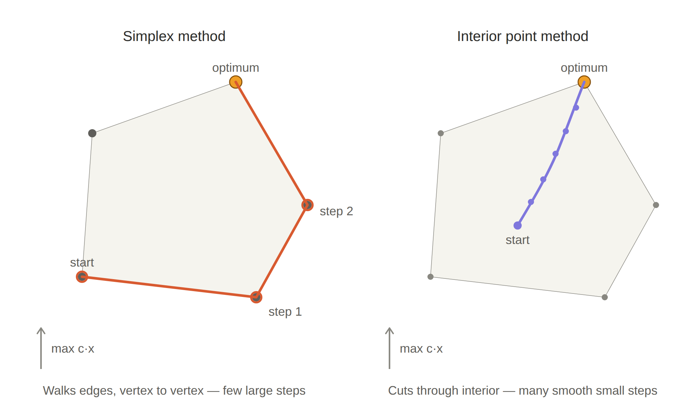

```{r, echo = FALSE, eval = TRUE}
library(tidyverse)
library(microbenchmark)
library(patchwork)
```

## Overview

Today, we cover:

- Finish linear programming
- Quadratic programming
- Examples of LP and QP in statistics

Announcements

- Final project due

::: notes
Welcome to the last stretch of optimization. We'll finish LP — specifically the interior point algorithm — and then move into quadratic programming. After that, we'll see how LP and QP show up directly in statistics: quantile regression and LASSO are both estimation problems that reduce to LP or QP. Make sure to mention the final project deadline and answer any questions about it.
:::

---

## Course evaluations


---

## Strong duality 

\fontsize{10pt}{11pt}\selectfont
- We know that at feasible solutions for both dual and primal, the solution to the dual is always greater or equal
- If there is a difference between the largest primal value and
the smallest dual value it is called the "**Duality gap**".
  - When are these values equal?

**Strong Duality Theorem:** If the primal has an optimal solution, then the dual also has an optimal solution and there is no duality gap, i.e.:

$$\mbox{objective of dual } = \mbox{ objective of primal}.$$

- Condition for strong duality: the feasible region must be nonempty and bounded.
- The **duality gap** is zero when strong duality holds.

::: notes
Weak duality says the dual ≥ primal for any feasible solutions. Strong duality says at the OPTIMAL solutions they're EQUAL — the gap closes. This is a much stronger result. The condition (feasible region nonempty and bounded) is the standard assumption for LP problems that have solutions. Economic interpretation: at optimality, the carpenter earns the same whether they use the materials to build furniture or sell them at the optimal shadow prices. The market has perfectly priced the resources. Strong duality is what lets interior point methods use the duality gap as a stopping criterion — when the gap is zero (or negligibly small), you're done.
:::

---


## Complementary slackness theorem

The **complementary slackness theorem** provides a necessary condition for optimality in linear programming. It states that:

*If* $x^*$ *and* $y^*$ *are feasible solutions of primal and dual problems, then* $x^*$ *and* $y^*$ *are both optimal if and only if*

1. $y^{*T}(b-Ax^*)=0$
2. $(y^{*T}A-c)x^* = 0$


This theorem is the foundation of the **interior point method** class of LP solvers.

::: notes
Complementary slackness is the key tool for certifying optimality. The two conditions encode a simple principle: at the optimum, every resource is either fully used OR its dual price is zero — you never pay for slack capacity. Condition 1: y*^T(b - Ax*) = 0 means for each constraint i, either y_i* = 0 (shadow price zero) or b_i - (Ax*)_i = 0 (constraint is binding). Condition 2: (y*^T A - c)x* = 0 means for each variable j, either x_j* = 0 (variable not in solution) or the dual constraint for j holds with equality. These conditions together give us a way to verify optimality without solving the problem from scratch.
:::

---

## Complementary slackness theorem

\fontsize{9pt}{10pt}\selectfont
Consider a simple LP problem:

\begin{align*}
    \textit{max} \quad &z = x_1 + x_2, \\
    \textit{s.t.} \quad &x_1 + 2x_2 \leq 100, \\
    &2x_1 + x_2 \leq 100, \\
    &x_1, x_2 \geq 0.
\end{align*}

Its dual problem is:


\vspace{20mm}

::: notes
Pause here. Ask students to write out the dual. They have all the tools now. Primal has two ≤ constraints → both dual variables y1, y2 ≥ 0. Both primal variables x1, x2 ≥ 0 → both dual constraints are ≥. Dual objective coefficients are b = (100, 100). Dual constraint coefficients come from transposing A. Show the answer on the next slide.
:::

---


## Complementary slackness theorem

\fontsize{9pt}{10pt}\selectfont
Consider a simple LP problem:

\begin{align*}
    \textit{max} \quad &z = x_1 + x_2, \\
    \textit{s.t.} \quad &x_1 + 2x_2 \leq 100, \\
    &2x_1 + x_2 \leq 100, \\
    &x_1, x_2 \geq 0.
\end{align*}

Its dual problem is:

\begin{align*}
    \textit{min} \quad &z = 100y_1 + 100y_2, \\
    \textit{s.t.} \quad &y_1 + 2y_2 \geq 1, \\
    &2y_1 + y_2 \geq 1, \\
    &y_1, y_2 \geq 0.
\end{align*}

::: notes
The dual has the same constraint matrix A transposed. Objective coefficients come from b = (100, 100). The inequality direction flips: primal ≤ becomes dual ≥. Dual constraint coefficients come from the columns of A — column 1 of A is (1, 2)^T, so dual constraint 1 is y1 + 2y2 ≥ c1 = 1. Column 2 of A is (2, 1)^T, so dual constraint 2 is 2y1 + y2 ≥ c2 = 1. Students should be able to do this mechanically now — refer back to the duality slide if anyone is uncertain about the construction.
:::

---

## Complementary slackness theorem

\fontsize{10pt}{11pt}\selectfont
The complementary slackness theorem states:

\vspace{40mm}


::: notes
Before writing the CS conditions, explain what they mean geometrically. This problem has a symmetric objective (x1 + x2, equal coefficients), so the optimal will be at the intersection of both constraint boundaries — both constraints active at the optimum. That means both slacks are zero AND both dual variables can be non-zero. In the asymmetric example coming later, we'll see a case where only one constraint is active. Ask students: what do you expect the optimal x to be here, given the symmetry?
:::

---


## Complementary slackness theorem

\fontsize{10pt}{11pt}\selectfont
The complementary slackness theorem states:

\begin{align*}
    y_1(100 - x_1 - 2x_2) &= 0, \\
    y_2(100 - 2x_1 - x_2) &= 0, \\
    x_1(y_1 + 2y_2 - 1) &= 0, \\
    x_2(2y_1 + y_2 - 1) &= 0.
\end{align*}


At the optimal point, we have $\bf{x} = (100/3, 100/3)$, $\bf{y = (1/3, 1/3)}$. The complementary slackness holds.

- All the constraints are bounded in both primal and dual
problems.

::: notes
Walk through the verification. Optimal x = (100/3, 100/3). Check: constraint 1: 100/3 + 2(100/3) = 100 — exactly binding. Constraint 2: 2(100/3) + 100/3 = 100 — exactly binding. Both constraints active, so y1 and y2 can be non-zero. Optimal y = (1/3, 1/3). Check dual constraints: y1 + 2y2 = 1/3 + 2/3 = 1 ✓ (equality, so x1 can be non-zero). 2y1 + y2 = 2/3 + 1/3 = 1 ✓ (equality, so x2 can be non-zero). Check CS conditions: y1(100 - 100/3 - 200/3) = (1/3)(0) = 0 ✓. Everything is consistent. This symmetric case is clean — next we see an asymmetric case that's more interesting.
:::

---

## Plot of constraints

```{r, echo = FALSE, eval = TRUE, fig.align = 'center', fig.width = 10, fig.height = 4.5, warning = FALSE, message = FALSE}

x_vals <- seq(0, 100, length.out = 100)
y1_vals <- (100 - x_vals) / 2  # From x1 + 2x2 = 100
y2_vals <- 100 - 2*x_vals      # From 2x1 + x2 = 100

# Create a data frame for ggplot
df <- data.frame(x1 = c(x_vals, x_vals),
                 x2 = c(y1_vals, y2_vals),
                 equation = rep(c("x1 + 2x2 = 100", "2x1 + x2 = 100"), each = length(x_vals)))

# Plot the lines
primal = ggplot(df, aes(x = x1, y = x2, color = equation)) +
  geom_line(size = 1) +
  xlim(0, 100) + ylim(0, 100) +
  ggtitle("Primal constraints") +
    geom_hline(yintercept = 0, linetype = 2, color = "gray") +
  geom_vline(xintercept = 0, linetype = 2, color = "gray") +
  theme_minimal() + theme(legend.position =  c(0.6,0.7))


#### dual
x_vals <- seq(-1, 2, length.out = 100)  # Define x range
y1_vals <- (1 - x_vals) / 2   # From x + 2y = 1
y2_vals <- 1 - 2*x_vals       # From 2x + y = 1

# Create a data frame for ggplot
df <- data.frame(x = c(x_vals, x_vals),
                 y = c(y1_vals, y2_vals),
                 equation = rep(c("y1 + 2y2 = 1", "2y1 + y2 = 1"), each = length(x_vals)))

# Create the plot
dual = ggplot(df, aes(x = x, y = y, color = equation)) +
  geom_line(size = 1) +
  xlim(-1, 2) + ylim(-1, 2) +
  ggtitle("Dual constraints") +
  labs(x = "y1", y = "y2") +
    geom_hline(yintercept = 0, linetype = 2, color = "gray") +
  geom_vline(xintercept = 0, linetype = 2, color = "gray") +
  theme_minimal() +
  theme(legend.position = c(0.6,0.7))

primal + dual
```

::: notes
[Note: activate eval=TRUE once you want this to render.] The left panel shows the primal feasible region — the two constraint lines intersect at (100/3, 100/3), which is the optimal point where both constraints are binding. The right panel shows the dual constraint lines, which also intersect at y = (1/3, 1/3). Notice that in the symmetric case, the feasible regions of both primal and dual are "nice" — the optimal is at the intersection of both active constraints in both problems.
:::

---

## Complementary slackness theorem

\fontsize{10pt}{11pt}\selectfont
Modify the simple LP problem a bit:

\begin{align*}
    \textit{max} \quad &z = 3x_1 + x_2, \\
    \textit{s.t.} \quad &x_1 + 2x_2 \leq 100, \\
    &2x_1 + x_2 \leq 100, \\
    &x_1, x_2 \geq 0.
\end{align*}

and its dual problem is:

\begin{align*}
    \textit{min} \quad &z = 100y_1 + 100y_2, \\
    \textit{s.t.} \quad &y_1 + 2y_2 \geq 3, \\
    &2y_1 + y_2 \geq 1, \\
    &y_1, y_2 \geq 0.
\end{align*}

::: notes
Now the objective is 3x1 + x2 — the x1 coefficient is three times larger. Intuitively this should push the optimal toward x1. Before showing the CS conditions and solution, ask students to predict: will both constraints be active at the optimum? The answer is no — only one constraint will be active, because the asymmetry in profits means we'll hit one resource limit before the other. This is the more interesting and practically relevant case.
:::

---

## Complementary slackness theorem

\fontsize{9pt}{10pt}\selectfont
Now the complementary slackness theorem states:

\begin{align*}
    y_1(100 - x_1 - 2x_2) &= 0, \\
    y_2(100 - 2x_1 - x_2) &= 0, \\
    x_1(y_1 + 2y_2 - 3) &= 0, \\
    x_2(2y_1 + y_2 - 1) &= 0.
\end{align*}

For this LP problem, the optimal solutions are $\bf{x} = (50, 0)$, $\bf{y = (0, 1.5)}$. Complementary slackness still holds. We observe that:

- In the primal problem:
  - The first constraint is **inactive** (slack $> 0$) at the optimum, so its shadow price $y_1 = 0$
  - Second constraint is **active** (binding, slack $= 0$), so $y_2$ can be non-zero

::: notes
Walk through what CS tells us here. x = (50, 0), y = (0, 1.5). Check primal constraint 1: 50 + 2(0) = 50 < 100 — inactive (slack = 50). CS says y1 must be 0. Check: y1 = 0 ✓. Check primal constraint 2: 2(50) + 0 = 100 — active (binding). CS says y2 can be non-zero. Check: y2 = 1.5 ≠ 0 ✓. Key insight: constraint 1 has 50 units of slack — there's unused capacity. The shadow price y1 = 0 means relaxing constraint 1 (giving us more of resource 1) wouldn't help, because we're not using what we have.
:::

---

## Complementary slackness theorem

\fontsize{10pt}{11pt}\selectfont
For this LP problem, the optimal solutions are $\bf{x} = (50, 0)$, $\bf{y = (0, 1.5)}$. Complementary slackness still holds. We observe that:

- In the primal problem:
  - The first constraint is **inactive** (slack $> 0$), so its shadow price $y_1 = 0$.
  - The second constraint is **active** (binding, slack $= 0$), so $y_2$ can be non-zero.

- In the dual problem:
  - The first constraint is **active** (binding), so its primal variable $x_1$ can be non-zero.
  - The second constraint is **inactive** (slack $> 0$), so its primal variable $x_2 = 0$.

::: notes
Now check the dual side. Dual constraint 1: y1 + 2y2 = 0 + 3 = 3 ≥ 3 — active, holds with equality. CS condition 3 says x1(y1 + 2y2 - 3) = 0. Since the constraint is tight (= 3), the term in parentheses is 0, so x1 can be anything non-negative — and indeed x1 = 50 ≠ 0. Dual constraint 2: 2y1 + y2 = 0 + 1.5 = 1.5 > 1 — inactive (slack = 0.5). CS condition 4 says x2(2y1 + y2 - 1) = 0. The term in parentheses is 0.5 ≠ 0, so x2 must be 0. And indeed x2 = 0. Everything is self-consistent and confirms the solution is optimal.
:::

---

## Plot of constraints

```{r, echo = FALSE, eval = TRUE, fig.align = 'center', fig.width = 10, fig.height = 4.5, warning = FALSE, message = FALSE}
x_vals <- seq(0, 100, length.out = 100)
y1_vals <- (100 - x_vals) / 2  # From x1 + 2x2 = 100
y2_vals <- 100 - 2*x_vals      # From 2x1 + x2 = 100

# Create a data frame for ggplot
df <- data.frame(x1 = c(x_vals, x_vals),
                 x2 = c(y1_vals, y2_vals),
                 equation = rep(c("x1 + 2x2 = 100", "2x1 + x2 = 100"), each = length(x_vals)))

# Plot the lines
primal = ggplot(df, aes(x = x1, y = x2, color = equation)) +
  geom_line(size = 1) +
  xlim(0, 100) + ylim(0, 100) +
    geom_hline(yintercept = 0, linetype = 2, color = "gray") +
  geom_vline(xintercept = 0, linetype = 2, color = "gray") +
  ggtitle("Primal constraints") +
  theme_minimal() + theme(legend.position =  c(0.6,0.7))


#### dual
x_vals <- seq(-1, 2, length.out = 100)  # Define x range
y1_vals <- (3 - x_vals) / 2   # From x + 2y = 1
y2_vals <- 1 - 2*x_vals       # From 2x + y = 1

# Create a data frame for ggplot
df <- data.frame(x = c(x_vals, x_vals), 
                 y = c(y1_vals, y2_vals), 
                 equation = rep(c("y1 + 2y2 = 3", "2y1 + y2 = 1"), each = length(x_vals)))

# Create the plot
dual = ggplot(df, aes(x = x, y = y, color = equation)) +
  geom_line(size = 1) +
  #xlim(-1, 2) + ylim(-1, 2) +
  ggtitle("Dual constraints") + 
  labs(x = "y1", y = "y2") +
  geom_hline(yintercept = 0, linetype = 2, color = "gray") +
  geom_vline(xintercept = 0, linetype = 2, color = "gray") +
  theme_minimal() + 
  theme(legend.position = c(0.6,0.7))

primal + dual
```

---

## Economics interpretation

Dual variables can be called "**shadow prices**" of the primal constraint, how objective function would increase if constraint was relaxed.

- If a primal constraint is bounded, relaxing that constraint would result in a gain
(improve the objective function), shadow price is non-zero.
- If a primal constraint is unbounded, relaxing that constraint would not improve
the objective function, shadow price is zero.


::: notes
Shadow prices are one of the most practically useful outputs of LP. The dual variable y_i tells you the marginal value of relaxing constraint i by one unit. If constraint i is active (binding), its shadow price is positive — you could improve the objective if you had a little more of resource i. If constraint i is inactive (slack > 0), its shadow price is zero — you already have more than you need, so adding more doesn't help. This connects directly to complementary slackness: inactive constraint → zero shadow price.
:::

---

## Economics interpretation

\fontsize{10pt}{11pt}\selectfont
**Bakery example**: Imagine you're running a bakery, and can make a limited number of cakes because you have a limited amount of flour. Shadow price tells you how much more profit you’d gain if you had a little more flour.

- If you're tight on flour, getting more flour would let you bake more cakes and make more money.   - In this case, the shadow price is nonzero because the extra resource improves your outcome.
- If you have plenty of flour, adding more doesn’t help—you’re already making as many cakes as you can sell. In this case, the shadow price is zero because extra flour doesn’t change your profit.


So, the dual variable (shadow price) tells you how valuable it would be to relax a constraint. Allowing more of that constrained resource. If relaxing the constraint helps, the shadow price is positive. If it doesn’t make a difference, the shadow price is zero.

::: notes
The bakery example makes shadow prices concrete. If you're out of flour (binding constraint), the shadow price of flour is positive — each extra bag lets you bake more and earn more. If you have leftover flour (inactive constraint), the shadow price is zero — more flour won't help because something else (oven time, staff hours) is the binding constraint. The second scenario also illustrates an important point: before investing in more capacity, always check which constraint is binding. In the carpenter example: if the labor constraint is binding but not the lumber constraint, buying more lumber doesn't help — you'd want to hire more labor instead.
:::

---

## Slack and surplus variables

\fontsize{10pt}{11pt}\selectfont
Both are non-negative variables added to convert an inequality constraint into an equality.

**Slack variable**: added to a $\leq$ constraint:
  $$2x_1 + x_2 \leq 100 \quad\longrightarrow\quad 2x_1 + x_2 + \underbrace{w}_{\geq 0} = 100$$
  $w$ absorbs the difference: $w = 100 - 2x_1 - x_2$ (unused capacity). If $w = 0$, the constraint is **binding**.
  
  **Surplus variable**: subtracted from a $\geq$ constraint:
  $$y_1 + 2y_2 \geq 1 \quad\longrightarrow\quad y_1 + 2y_2 - \underbrace{z}_{\geq 0} = 1$$
  $z$ measures the excess: $z = y_1 + 2y_2 - 1$ (how far above the bound). If $z = 0$, the constraint is **binding**.
  
::: notes
  Students typically know slack variables but surplus is less familiar. The key difference: slack is added to ≤ constraints (primal), surplus is subtracted from ≥ constraints (dual). Both play the same role — they record how far a constraint is from being active. When the slack or surplus is zero, the constraint is binding. This is exactly what complementary slackness tracks: at the optimum, a constraint is either binding (slack/surplus = 0) or its shadow price is zero — never both nonzero at the same time.
:::
  
---


## Primal/dual optimality conditions

\fontsize{8pt}{9pt}\selectfont
**Goal**: collect all conditions for optimality into a single system we can solve numerically.

**Step 1**: add slack/surplus variables to turn inequalities into equalities.

::: notes
Now we set up the machinery for interior point methods. We add slack/surplus variables to convert both the primal and dual into equality-constrained form. w are slack variables for the primal (Ax + w = b). z are surplus variables for the dual (A^T y - z = c^T). Complementary slackness in matrix form: X and Z are diagonal matrices with x and z on the diagonal. The condition x_j z_j = 0 for all j becomes XZe = 0 where e is the all-ones vector. Similarly WYe = 0. Count the variables: we have x (n), y (m), w (m), z (n) — that's 2n + 2m unknowns total.
:::

\begin{align*}
    &\textbf{Primal:} &\quad &\textit{max} \quad c x \\
    & &\quad &\textit{s.t.} \quad \underbrace{A x + w}_{\text{add slack } w} = b, \quad x, w \geq 0.
\end{align*}

\begin{align*}
    &\textbf{Dual:} &\quad &\textit{min} \quad b^T y \\
    & &\quad &\textit{s.t.} \quad \underbrace{A^T y - z}_{\text{subtract surplus } z} = c^T, \quad y, z \geq 0.
\end{align*}

\begin{center}
\begin{tabular}{lll}
\hline
Variable & Size & Meaning \\
\hline
$w = b - Ax \geq 0$ & $m \times 1$ & primal slack (unused capacity in each constraint) \\
$z = A^Ty - c^T \geq 0$ & $n \times 1$ & dual surplus (headroom in each dual constraint) \\
\hline
\end{tabular}
\end{center}

---


## Primal/dual optimality conditions

**Step 2**: rewrite complementary slackness in matrix form. At optimality, $x_jz_j = 0\ \forall j$ and $w_iy_i = 0\ \forall i$.

$$XZe=0, \quad WYe = 0 \qquad (X,Z,W,Y \text{ diagonal; } e = \mathbf{1})$$

---

## Primal/dual optimality conditions

\fontsize{9pt}{10pt}\selectfont

**Why does $XZe = 0$ encode complementary slackness?** Suppose $n = 2$:

$$X = \begin{bmatrix} x_1 & 0 \\ 0 & x_2 \end{bmatrix}, \quad Z = \begin{bmatrix} z_1 & 0 \\ 0 & z_2 \end{bmatrix} \implies XZe = \begin{bmatrix} x_1 z_1 \\ x_2 z_2 \end{bmatrix} = \begin{bmatrix} 0 \\ 0 \end{bmatrix}$$

This forces $x_j z_j = 0$ for each $j$. The matrix form  stacks all $n$ conditions at once.

Collecting everything: the **optimality conditions** are:

\begin{align*}
    A x + w - b &= 0 & &\text{(primal feasibility)} \\
    A^T y - z - c^T &= 0 & &\text{(dual feasibility)} \\
    XZ e &= 0 & &\text{(CS: each } x_j z_j = 0) \\
    WYe &= 0 & &\text{(CS: each } w_i y_i = 0) \\
    x, y, w, z &\geq 0 & &\text{(non-negativity)}
\end{align*}

::: notes
Walk through each condition. Conditions 1 and 2 are just primal and dual feasibility — the constraints must be satisfied. Conditions 3 and 4 are complementary slackness in matrix form — XZe = 0 means x_j z_j = 0 for each j, and WYe = 0 means w_i y_i = 0 for each i. Condition 5 is non-negativity. Together these are necessary AND sufficient for optimality (by strong duality). Count: conditions 1 gives m equations, condition 2 gives n equations, conditions 3 gives n equations, condition 4 gives m equations. Total: 2n + 2m equations. Same as the number of unknowns — square system!
:::

---


## Primal/dual optimality conditions

\fontsize{10pt}{11pt}\selectfont

Conditions 1--4 give $2n + 2m$ equations in $2n + 2m$ unknowns:

| Condition | Equations | Unknowns involved |
|-----------|-----------|------------------|
| Primal feasibility | $m$ | $x, w$ |
| Dual feasibility | $n$ | $y, z$ |
| CS ($XZe = 0$) | $n$ | $x, z$ |
| CS ($WYe = 0$) | $m$ | $w, y$ |

Can use Newton's method to solve this system.

::: notes
Key insight: if we ignore the non-negativity constraint (condition 5) for a moment, we have a square nonlinear system of 2n + 2m equations in 2n + 2m unknowns. Nonlinear because of the complementary slackness terms XZe and WYe — these are products of variables. We know how to solve nonlinear square systems: Newton's method. The challenge is enforcing non-negativity throughout the iterations. This is what makes interior point methods more sophisticated than naive Newton — they take steps that keep all variables strictly positive.
:::

---

## Two strategies for solving LP

\fontsize{10pt}{11pt}\selectfont

|  | **Simplex** | **Interior point** |
|--|-------------|-------------------|
| Path | Walks along edges of the feasible region, vertex to vertex | Stays inside feasible region and follows a curved path |
| Worst for | Exponential (rarely in practice) | Polynomial ~20–50 iterations regardless of problem size |
| Best for | Small–medium problems | Large-scale problems |

**Interior point strategy**:

1. Express all optimality conditions as a system $F(x,y,w,z) = 0$
2. Apply Newton’s method to drive $F \to 0$
3. At each step, shrink the step size to keep all variables $> 0$ (stay in the interior)

::: notes
The name "interior point" comes from the path the algorithm takes: unlike simplex, which moves along the boundary (edges and vertices), interior point always stays strictly inside the feasible region. The key insight is that the optimality conditions (primal feasibility + dual feasibility + complementary slackness) can all be written as a single nonlinear system F = 0, and Newton’s method can solve it efficiently. The non-negativity constraints are the one complication — they force us to be careful about step sizes.
:::

---

## Two strategies for solving LP  

```{r, echo = FALSE, eval = TRUE, fig.align = 'center', out.width = '90%'}

```


---

## Primal-dual interior point method

\fontsize{10pt}{11pt}\selectfont
The primal-dual interior point method finds $(x^*, y^*, w^*, z^*)$ by solving $F = 0$, where $F$ packages all four optimality conditions into one vector function:

$$\mathbf{F}(x, y, w, z) =
\begin{bmatrix}
    \mathbf{A}x + \mathbf{w} - \mathbf{b} \\
    \mathbf{A}^T y - \mathbf{z} - \mathbf{c}^T \\
    XZ e \\
    WYe
\end{bmatrix}
\begin{array}{l}
    \leftarrow \text{primal feasibility} \\
    \leftarrow \text{dual feasibility} \\
    \leftarrow \text{CS: each } x_jz_j = 0\\
    \leftarrow \text{CS: each } w_iy_i = 0
\end{array}$$

$F = 0$ is exactly the optimality conditions. We use Newton’s method to find the root, modifying each step so all variables stay $> 0$.

::: notes
We package the five optimality conditions into a vector function F. The domain and codomain are both R^{2n+2m}. F = 0 corresponds exactly to satisfying all optimality conditions (except non-negativity, which we handle separately). Newton’s method finds roots of nonlinear systems by iterating: at each step, linearize F around the current point, solve for the direction to move, take a step. The key modification for interior point: choose the step size α to ensure all variables remain strictly positive (stay in the interior of the non-negative orthant — hence "interior point").
:::

---

## Primal-dual interior point method

\fontsize{10pt}{11pt}\selectfont
Applying Newton’s method, if at iteration $k$ the variables are $(x^k, y^k, w^k, z^k)$,
we obtain a search direction  
$(\delta x, \delta y, \delta w, \delta z)$
by solving the linear equations:

$$
F'(x^k, y^k, w^k, z^k)
\begin{bmatrix}
    \delta x \\
    \delta y \\
    \delta w \\
    \delta z
\end{bmatrix}
=
-F(x^k, y^k, w^k, z^k).
$$

Here $F'$ is the Jacobian. At iteration $k$, the equations are:

$$\begin{bmatrix}
    A & 0 & I & 0 \\
    0 & A^T & 0 & -I \\
    Z & 0 & 0 & X \\
    0 & W & Y & 0
\end{bmatrix}
\begin{bmatrix}
    \delta x \\
    \delta y \\
    \delta w \\
    \delta z
\end{bmatrix}
=
\begin{bmatrix}
    -A x^k - w^k + b \\
    -A^T y^k + z^k + c^T \\
    -X^k Z^k e \\
    -W^k Y^k e
\end{bmatrix}$$

---

## Primal-dual interior point method

\fontsize{10pt}{11pt}\selectfont
Then the update will be:

$$
(x^{k+1}, y^{k+1}, w^{k+1}, z^{k+1})= (x^k, y^k, w^k, z^k) + \alpha (\delta x, \delta y, \delta w, \delta z)
$$

with $\alpha \in (0,1]$ chosen so that the result from the next iteration is feasible.

- Solving for $(\delta x, \delta y, \delta w, \delta z)$ using the equation on the previous slide enforces feasibility of solutions

::: notes
Given that at current iteration, both primal and dual are strictly feasible, the first two terms on the right hand side are 0.
:::

---


## An improved algorithm

\fontsize{9pt}{10pt}\selectfont
The algorithm in its current setup is not ideal because often the steps are small to
avoid violating the positivity constraints. Instead:

- The value of $XZe + WYe$ represents the duality gap
- Instead of trying to eliminate the duality gap (set it to 0), reduce the duality gap by some factor in each step

We replace the complementary slackness by:

\begin{align*}
XZe &= \mu_xe\\
WYe &= \mu_ye
\end{align*}

When $\mu_x, \mu_y\to 0$ as $k\to\infty$ the solution from this system will converge to the optimal solution of the original LP problem. Good selections of $\mu$ are $\mu_x^{k+1}=(x^k)^Tz^k/n$ and $\mu_y^{k+1}=(w^k)^Ty^k/m$ 

- $n$ and $m$ are the dimensions of $x$ and $y$

---

## An improved algorithm

\fontsize{10pt}{11pt}\selectfont
Under the new algorithm, at the $k$th iteration, the Newton equations become:

$$\begin{bmatrix}
    A & 0 & I & -0 \\
    0 & A^T & 0 & -I \\
    Z & 0 & 0 & X \\
    0 & W & Y & 0
\end{bmatrix}
\begin{bmatrix}
    \delta x \\
    \delta y \\
    \delta w \\
    \delta z
\end{bmatrix}
=
\begin{bmatrix}
    0 \\
    0 \\
    -X^k Z^k e + \mu_x^k e \\
    -W^k Y^k e + \mu_y^k e
\end{bmatrix}$$

This provides the **general primal-dual interior point method** as follows:

1. Choose strictly feasible initial solution $(x^0, y^0, w^0, z^0)$, and set $k = 0$. Then repeat (2) and (3) until convergence:
2. Solve system (1) to obtain the updates $(\delta x, \delta y, \delta w, \delta z)$
3. Update the solution $(x^{k+1}, y^{k+1}, w^{k+1}, z^{k+1}) = (x^k, y^k, w^k, z^k)+ \alpha^k(\delta x, \delta y, \delta w, \delta z)$. $\alpha^k$ is chosen so that all variables are $\ge$ 0.


::: notes
System (1) is the system above  
:::

---


## LP in R: simplex vs interior point

\fontsize{10pt}{11pt}\selectfont
Use the following simple LP: $\max\ x_1 + x_2$ s.t. $x_1 + 2x_2 \le 100,\ 2x_1 + x_2 \le 100,\ x_1, x_2 \ge 0$

```{r, eval = TRUE}
library(lpSolve)   # simplex method
library(CVXR)      # interior point method (ECOS solver)

obj <- c(1, 1)
A   <- matrix(c(1, 2, 2, 1), nrow = 2, byrow = TRUE)
rhs <- c(100, 100)
```

::: notes
We'll solve the same LP two ways so students can see that the answer is the same — only the algorithm differs. lpSolve uses the revised simplex method. CVXR is a disciplined convex programming interface that calls ECOS (Embedded Conic Solver) by default — ECOS is a pure primal-dual interior point solver. Make sure both packages are installed before class: install.packages(c("lpSolve", "CVXR")).
:::

---

## LP in R: simplex

\fontsize{10pt}{11pt}\selectfont
```{r, eval = TRUE}
# lpSolve uses the simplex method
sol_s <- lp("max", obj, const.mat = A,
            const.dir = c("<=", "<="), const.rhs = rhs)

sol_s$solution   # optimal x1, x2
sol_s$objval     # optimal objective value
```

::: notes
lp() arguments: "max" sets direction, objective vector, constraint matrix, direction vector, RHS vector. Non-negativity (x >= 0) is enforced by default. The solution matches what we derived analytically: x = (100/3, 100/3) ≈ (33.3, 33.3) with objective value ≈ 66.7.
:::

---

## LP in R: interior point

\fontsize{10pt}{11pt}\selectfont
```{r, eval = TRUE}
# CVXR calls ECOS: a pure primal-dual interior point solver
x     <- Variable(2, nonneg = TRUE)
prob  <- Problem(Maximize(sum(obj * x)),
                 list(A %*% x <= rhs))
sol_i <- solve(prob, solver = "ECOS")

sol_i$getValue(x)   # optimal x1, x2
sol_i$value         # optimal objective value
```

::: notes
CVXR lets you write the problem in the same form as the math — no need to negate for maximization. The solver = "ECOS" argument explicitly selects ECOS (Embedded Conic Solver), a well-known primal-dual interior point method. nonneg = TRUE enforces x1, x2 >= 0. Both methods give the same answer: x ≈ (33.3, 33.3), objective ≈ 66.7.
:::

---

## Introduction to quadratic programming


\fontsize{10pt}{11pt}\selectfont
We have discussed linear programming, where both the objective function and
constraints are linear functions of the unknowns.

The **quadratic programming** (QP) problem has a quadratic objective function and
linear constraints:

\begin{align*}
        \max \quad &f(x) = \frac12 x^TBx + cx\\
        s.t. \quad &Ax \le b, x\ge 0  
    \end{align*}

The algorithm for solving QP problem is very similar to that for LP. But first we need
to first introduce the **KKT conditions**.

::: notes
Transition from LP to QP. The only difference is the objective: LP has linear objective c^T x, QP has a quadratic objective (1/2)x^T B x + cx. Constraints remain linear. This makes QP much more widely applicable in statistics — many statistical estimators minimize quadratic loss. The matrix B is typically symmetric; for a maximization problem, B should be negative semidefinite so the objective is concave and we get a unique global maximum. The interior point algorithm from LP carries over almost directly — we just get a different Jacobian in the Newton step.
:::

---

## KKT conditions


\fontsize{9pt}{10pt}\selectfont
**KKT conditions** = complementary slackness, generalized to nonlinear objectives.

- For LP: $\nabla f = c$ (constant) $\Rightarrow$ CS conditions were enough
- For QP/general NLP: $\nabla f(x)$ depends on $x$ $\Rightarrow$ need one extra condition

For a general constrained problem with inequality constraints $g_i(x) \le 0$ and equality constraints $h_j(x) = 0$, the **KKT conditions** at the optimal $x^*$ are:

\begin{tabular}{ll}
Primal feasibility & $g_i(x^*)\le 0,\ h_j(x^*)=0$ \\
Dual feasibility & $y_i\ge 0$ \quad (multipliers for $\leq$ constraints are non-negative) \\
Complementary slackness & $y_ig_i(x^*)=0$ \quad (inactive constraint $\Rightarrow$ zero multiplier) \\
Stationarity & $\nabla f(x^*) = \sum_iy_i\nabla g_i(x^*)+\sum_jz_j\nabla h_j(x^*)$ \\
\end{tabular}

\vspace{2mm}
The stationarity condition is new: it says the gradient of $f$ must be expressible as a combination of the constraint gradients — you can't improve $f$ without violating a constraint.

::: notes
KKT conditions are the generalization of complementary slackness to nonlinear programming. For LP, the objective was linear so ∇f = c (a constant). For QP and beyond, ∇f depends on x. The four conditions: (1) Primal feasibility — the constraints must hold at x*. (2) Dual feasibility — multipliers for inequality constraints must be non-negative. (3) Complementary slackness — same idea as LP: inactive constraint implies zero dual variable. (4) Stationarity — the gradient of the Lagrangian with respect to x is zero at the optimum. For convex problems (convex f, convex feasible set), KKT conditions are both necessary AND sufficient for a global optimum. QP with a positive semidefinite B is convex.
:::

---

## Optimal solution for QP


\fontsize{10pt}{11pt}\selectfont
Apply KKT to the QP problem. Use multiplier $y$ for $Ax \le b$ and $z$ for $x \ge 0$:

$$L(x,y,z) = \underbrace{\tfrac12 x^TBx + cx}_{\text{QP objective}} - \underbrace{y^T(Ax-b)}_{\text{penalty for violating } Ax \le b}+\underbrace{z^Tx}_{\text{penalty for violating } x \ge 0}$$

KKT conditions — same four categories as before, but stationarity now has a $Bx$ term:

| Condition | Equation | vs. LP |
|-----------|----------|--------|
| Primal feasibility | $Ax\le b,\ x\ge 0$ | same |
| Dual feasibility | $y\ge 0,\ z\ge 0$ | same |
| Complementary slackness | $Y(Ax-b)=0,\ Zx = 0$ | same |
| **Stationarity** | $\mathbf{Bx}+c-A^Ty+z = 0$ | **new: $Bx$ term from quadratic objective** |

($Y$, $Z$ diagonal.) Solve using interior point — same approach as LP.

::: notes
Apply KKT to the QP problem specifically. The Lagrangian uses y for the constraints Ax ≤ b and z for the non-negativity constraints x ≥ 0 (written as -x ≤ 0). Stationarity gives Bx + c - A^T y + z = 0 — note the Bx term, which is what makes QP different from LP (where B = 0 and stationarity reduces to dual feasibility). Complementary slackness: Y(Ax - b) = 0 means inactive constraint i implies y_i = 0. Zx = 0 means x_j = 0 or z_j = 0. Same structure as LP complementary slackness — interior point will exploit this just as before.
:::

---

## Optimal solution for QP


\fontsize{10pt}{11pt}\selectfont
To be specific, define slack variable $w=b-Ax$, the optimality conditions become

\begin{align*}
    A x - b + w &= 0, \\
    B x + c - A^T y + z &= 0, \\
    Z x &= 0, \\
    Y w &= 0, \\
    x, y, z, w &\geq 0.
\end{align*}

The unknowns are $x, y, z, w$. We can then obtain the Jacobians, form the Newton
equation and solve for the optimal solution iteratively.

::: notes
Add slack variable w = b - Ax to convert Ax ≤ b into an equality constraint Ax - b + w = 0, exactly as we did for LP. The system is now square: Ax - b + w = 0 (m equations), Bx + c - A^T y + z = 0 (n equations), Zx = 0 (n equations, complementary slackness for x), Yw = 0 (m equations, complementary slackness for w), plus non-negativity. Unknowns: x (n), y (m), z (n), w (m) — total 2n + 2m, matching the equation count. This is a nonlinear square system — Newton's method, with the same step-size control to maintain non-negativity, solves it. The only difference from LP is the Bx term in the second condition.
:::

---


## QP in R


\fontsize{10pt}{11pt}\selectfont
The `quadprog` package provides functions (`solve.QP.compact`) to solve quadratic
programming problems.

- Solve $\min \frac12 (x_1^2 + x_2^2)$ s.t. $2x_1+x_2\ge 1$:

```{r, eval = FALSE}
library(quadprog)
Dmat = diag(rep(1,2))
dvec = rep(0,2)
Amat = matrix(c(2,1))
solve.QP(Dmat=Dmat, dvec=dvec, Amat=Amat, bvec=c(1))
```

::: notes
Quick demo of the quadprog package. Note: quadprog solves minimization by default — hence min (1/2)(x1^2 + x2^2). Dmat is the matrix B (must be positive definite for minimization). dvec is the linear term (zero here — pure quadratic objective). Amat and bvec encode the constraint 2x1 + x2 ≥ 1. Geometrically this finds the point on the line 2x1 + x2 = 1 closest to the origin — a simple projection problem. Answer: x = (2/5, 1/5). Important: quadprog's parameter conventions differ from our standard form notation — always read the documentation carefully when using a new solver.
:::

---

## Review


\fontsize{10pt}{11pt}\selectfont
We have now covered:

- LP problem set up
- Simplex methods
- Duality
- Interior point algorithms
- Quadratic programming

Now you should be able to formulate an LP/QP problem and solve it. But how are these useful in statistics?

- LP is an optimization algorithm
- There are plenty of optimization problems in statistics, e.g. MLE
- It's just a matter of formulating the objective function and constraints.

::: notes
Quick recap before the applied examples. We've built up from scratch: LP formulation → simplex (combinatorial, hitting corner points) → duality (shadow prices, primal-dual symmetry) → interior point (Newton on the KKT system, scales to large problems) → QP (same structure, quadratic objective). Everything is connected. The punchline for the rest of today: many statistical estimation problems ARE optimization problems. Once you can write down an objective function and constraints, you can hand it to a solver. The examples coming up (QR and LASSO) make this concrete.
:::

---


## Quantile regression


The goal of regression is to understand the relationship between an outcome and covariates. Traditional regression models the conditional mean, $E(Y|X)$

- Relies on normal error assumptions and homoscedasticity
- Sensitive to outliers and skewed distributions

Quantile regression:

- Provides a more exhaustive description of the data
- The collection of regressions at all quantiles would give a complete picture of outcome-covariate relationships

::: notes
Motivate quantile regression. Traditional linear regression models E(Y|X) — one number summarizing the conditional distribution. But often we care about other parts: healthcare costs (upper tail), housing affordability (lower tail), or detecting whether a treatment shifts the entire distribution vs. just the mean. Quantile regression lets you model any conditional quantile Q_τ(Y|X). Running it at τ = 0.1, 0.25, 0.5, 0.75, 0.9 gives a richer description of how Y relates to X across the whole distribution. The next slide shows what this looks like on real data.
:::

---

## Quantile regression

```{r, echo = FALSE, eval = TRUE, fig.align = 'center', out.width = '70%', message = FALSE}

library(quantreg)

data(engel)

attach(engel)
plot(income,foodexp,xlab="Household Income",ylab="Food Expenditure",type = "n", cex=.5)
points(income,foodexp,cex=.5,col="blue")
xx <- seq(min(engel$income),max(engel$income),100)
taus <- c(.05,.1,.25, .5, .75,.9,.95)

f <- coef(rq((foodexp)~(income),tau=taus, data = engel))
yy <- cbind(1,xx)%*%f
for(i in 1:length(taus)){
        lines(xx,yy[,i],col = "gray")
        }


```

::: notes
The Engel data: food expenditure vs. household income. Each gray line is a fitted quantile regression at a different quantile (5th, 10th, 25th, 50th, 75th, 90th, 95th percentile). Notice the lines are not parallel — the spread increases with income. Higher-income households vary more in food spending. A single OLS line would only give the conditional mean and completely miss this heteroscedasticity. Quantile regression captures how the entire distribution of food expenditure changes with income, not just the average.
:::

---

## Colorado cannabis and driving study

```{r, echo = FALSE, eval = TRUE, fig.align = 'center', out.width = '90%'}
knitr::include_graphics("ccds.png")
```


::: notes
Digression- I'm going to show some examples in class using data from a big study I'm a part of.  You'll also use this dataset in your homework
:::

---

## Colorado cannabis and driving study

```{r, echo = FALSE, eval = TRUE, fig.align = 'center', message = FALSE, warning = FALSE, fig.height = 4.5, fig.width = 10}

cannabis = readRDS(here::here("slides", "topic_optimization_II","cannabis.rds"))

p1 = cannabis %>%
  ggplot(aes(t_mmr1)) +
  geom_histogram(bins = 8) +
  ggtitle("THC molar metabolite ratio") +
  xlab("Molar metabolite ratio")

p2 = cannabis %>%
  ggplot(aes(p_change,t_mmr1)) +
  labs(x = "percent change in pupil diameter after light flash", 
       y = "THC molar metabolite ratio") +
  geom_point()


p1 + p2
```


::: notes
MMR tells you about acute cannabis impairment
Probably not great data for linear regression... why?
:::

---

## Quantile regression model

\fontsize{10pt}{11pt}\selectfont
Regress conditional quantiles of response on the covariates. Assume the outcome Y is continuous.

- Classical model: $Q_{\tau}(Y|X)=X\beta_{\tau}$
- $Q_{\tau}(Y|X)$ is the $\tau$th conditional quantile of $Y$ given $X$


The above model is equivalent to specifying

$$Y = X\beta_{\tau} + \epsilon; \quad Q_{\tau}(\epsilon|X) = 0.$$

In comparison, mean regression is:

$$Y = X\beta + \epsilon; \quad E(\epsilon|X) = 0.$$

::: notes
The model Q_τ(Y|X) = Xβ_τ is simple but important. Note β_τ changes with τ — a separate coefficient vector for each quantile. In OLS, β is a single vector (same for all quantiles under homoscedasticity). The error characterization Q_τ(ε|X) = 0 means the τth quantile of the residuals is zero — a weaker condition than E(ε|X) = 0. Quantile regression is more general: median regression (τ = 0.5) is the robust alternative to OLS, and if the errors are symmetric and homoscedastic, all quantile fits will be parallel lines — you'd get the same story as OLS. The interesting cases are when they're not.
:::

---

## Pros and cons

\fontsize{10pt}{11pt}\selectfont
**Advantages**:

- Regression at a sequence of quantiles provides a more complete view of data
- Inference is robust to outliers 
- Allows interpretation in the outcome's original scale of measurement

**Disadvantages**:

- To be useful, needs to regress on a set of quantiles: computational burden
- Solution has no closed form
- Adaptation to non-continuous outcomes is difficult

::: notes
Hit the key advantages. Completeness: fitting at multiple quantiles gives a richer picture than the conditional mean alone. Robustness: the loss function (coming up next) is based on absolute values, not squared errors, so outliers have bounded influence. Efficiency: when error distributions have heavy tails, QR can be more efficient than OLS. Original scale: unlike log transformations, QR coefficients stay in the original Y scale. On the downside: computational burden (solve a separate LP for each τ), no closed form unlike OLS, and extending to discrete or censored outcomes is non-trivial. In practice the computational cost is manageable with modern solvers.
:::

---

## The loss function

\fontsize{10pt}{11pt}\selectfont
Link between estimands and loss functions:

- To obtain sample mean of $\{y_1,y_2,\ldots y_n\}$ minimize $\sum_i(y_i-b)^2$
- To obtain sample median of $\{y_1,y_2,\ldots y_n\}$ minimize $\sum_i|y_i-b|$

It can be shown that to obtain the sample $\tau$th quantile, one needs to minimize asymmetric absolute loss, that is, compute

$$\hat{Q}_{\tau} = \arg\min_b \left\{ \sum_{i: y_i\ge b}\tau|y_i-b| + \sum_{i: y_i< b}(1-\tau)|y_i-b|\right\}.$$

For notational simplicity, define $\rho_{\tau}(x) = x[\tau-(x<0)]$, where $(x<0)$ is an indicator equal to 1 if $x<0$ and 0 otherwise. This compactly encodes the asymmetric weighting: $\rho_\tau(x) = \tau x$ when $x \ge 0$ and $\rho_\tau(x) = (\tau-1)x$ when $x < 0$.

::: notes
The check function ρ_τ is the key innovation. To get the sample mean: minimize squared loss — symmetric, equal weight on positive and negative residuals. To get the median: minimize absolute loss — also symmetric, but linear. To get the τth quantile: use asymmetric absolute loss. Upward residuals (y > b) get weight τ, downward (y < b) get weight 1-τ. At τ = 0.5 weights are equal → median. At τ = 0.9, upward residuals get 9× more weight than downward → the minimizer slides up to the 90th percentile. The compact ρ_τ notation: when x ≥ 0, ρ_τ(x) = τx; when x < 0, ρ_τ(x) = (τ-1)x = -(1-τ)|x|.
:::

---

## The loss function

```{r, echo = FALSE, eval = TRUE, fig.align = 'center', fig.height = 4.5, fig.width = 10, message = FALSE}
quantile_loss = function(b, y, tau) {
  loss <- ifelse(y >= b, tau * (y - b), (1 - tau) * (b - y))
  return(loss)
}

set.seed(2123)
y = rnorm(100)

tau = c(.1,.25, .5, .75, .9)
loss = map_dfc(tau, quantile_loss, b = 0, y = y)
colnames(loss) = paste0("tau_", tau)

loss %>%
  mutate(y = y) %>%
  pivot_longer(tau_0.1:tau_0.9, names_to = "tau", values_to = "loss", 
              names_prefix = "tau_") %>%
  mutate(tau = factor(tau)) %>%
  ggplot(aes(y, loss, group = tau)) + 
  geom_line(aes(color = tau, linetype = tau)) +
  theme_minimal()
```

::: notes
The plot shows ρ_τ(y) at b = 0 for different τ values. All curves are piecewise linear with a kink at y = 0. At τ = 0.5, the two arms have equal slope — symmetric V-shape, same as absolute value loss. At τ = 0.9, the right arm (y > 0) is steep (slope 0.9) and the left arm (y < 0) is shallow (slope 0.1). The minimum of the sum of these loss values over data gives the τth quantile. Key insight: this piecewise-linear, non-differentiable objective means standard gradient methods fail at the kink. We need LP methods — and that LP reformulation is exactly what's coming up.
:::

---

## Estimator

\fontsize{10pt}{11pt}\selectfont
The linear quantile regression model is fitted by determining

$$\hat{\beta}_{\tau} = \arg\min_b \sum_{i=1}^n \rho_{\tau}(y_i-x_ib)$$

The estimator has all "expected" properties:

- Scale equivariance: 
$$\hat{\beta}_{\tau}(ay, X) = a\hat{\beta}_{\tau}(y,X), \quad \hat{\beta}_{\tau}(-ay, X) = -a\hat{\beta}_{1-\tau}(y,X)$$

- Shift (or regression) equivariance: $\hat{\beta}_{\tau}(y+\gamma, X) = \hat{\beta}_{\tau}(y,X)+\gamma$

- Equivariance to reparametrization of design: $\hat{\beta}_{\tau}(y, XA) = A^{-1}\hat{\beta}_{\tau}(y,X)$


::: notes
- Scale equivariance in quantile regression means that if all input values are multiplied by a constant, the predicted quantiles are also multiplied by the same constant, preserving the relative distribution of the response variable.
- Shift equivariance in quantile regression means that if a constant is added to all input values, the predicted quantiles are also shifted by the same constant, preserving the relative spacing between them.
- Equivariance to reparameterization of the design in quantile regression means that if the predictor variables undergo a linear transformation (e.g., rescaling or shifting), the estimated quantiles transform accordingly, ensuring that the quantile function remains consistent with the new parameterization of the predictors.
:::

---

## Asymmetric Double Exponential (ADE) distribution

\fontsize{10pt}{11pt}\selectfont
Density function for ADE is

$$f(y;\mu,\sigma,\tau)= \frac{\tau(1-\tau)}{\sigma}\exp\left\{-\rho_{\tau}(\frac{y-\mu}{\sigma})\right\}$$


- Least squares estimator $\iff$ MLE if residuals are Normal
- QR estimator $\iff$ MLE if residuals are ADE
- If residuals re iid $ADE(0,1,\tau)$, then the log-likelihood for $\beta_{\tau}$ is 

$$l(\beta_{\tau}; Y,X,\tau)=-\sum_i^n \rho_{\tau}(y_i-x_i\beta_{\tau}) + c_0$$

::: notes
The ADE distribution is the quantile regression analogue of the Normal for OLS. Just as assuming Normal errors makes OLS = MLE, assuming ADE errors makes QR = MLE. The ADE density has the check function ρ_τ in the exponent, and the parameter τ controls the asymmetry. When τ = 0.5, ADE reduces to the symmetric double exponential (Laplace) distribution — median regression is then MLE under Laplace errors, which is why it's robust (Laplace has heavier tails than Normal). We'll revisit this Laplace connection when we get to LASSO: LASSO corresponds to a Bayesian model with a Laplace prior on the coefficients.
:::

---


## QR model fitting

\fontsize{9pt}{10pt}\selectfont
The QR estimation problem $\hat{\beta}_{\tau} = \arg\min_b \sum_{i=1}^n \rho_{\tau}(y_i-x_ib)$ can be framed as an LP problem!

- First, define a set of new variables

\begin{align}
    u_i &\equiv [y_i - x_i b]_+ \\
    v_i &\equiv [y_i - x_i b]_- \\
    b_+ &\equiv [b]_+ \\
    b_- &\equiv [b]_-
\end{align}

Note:

- $[\cdot]_+$ and $[\cdot]_-$ mean the positive and negative part of a number
- $x \equiv [x]_+ - [x]_-$
  - $[x]_+ = \max(x, 0)$
  - $[x]_- = \max(-x, 0)$

::: notes
We're reformulating QR as an LP by splitting residuals into positive and negative parts. u_i captures how much y_i exceeds x_i b (when the residual is positive); v_i captures how much x_i b exceeds y_i (when the residual is negative). At any point, exactly one of u_i, v_i is nonzero. Similarly, b+ and b- split the coefficient vector into non-negative parts. This decomposition is the trick that removes the non-differentiability: instead of an absolute value we get two non-negative variables. The same decomposition will appear again in LASSO for the coefficients β.
:::

---


## QR model fitting

Remember the objective function is $\sum_{i = 1}^n \rho_{\tau}(y_i-x_ib)$. Notice that 

- When $y_i-x_ib\ge 0$, we have $\rho_{\tau}(y_i-x_ib)=\tau u_i$, and $v_i =0$.
- When $y_i-x_ib < 0$, we have $\rho_{\tau}(y_i-x_ib)=(1-\tau) v_i$, and $u_i = 0$.

So we can write $\rho_{\tau}(y_i-x_ib)=\tau u_i + (1-\tau) v_i$.

::: notes
Key algebraic step — this is where the non-differentiability disappears. When y_i - x_i b ≥ 0: u_i = y_i - x_i b, v_i = 0, so ρ_τ = τ·u_i + (1-τ)·0 = τu_i. When y_i - x_i b < 0: v_i = x_i b - y_i, u_i = 0, so ρ_τ = (1-τ)·v_i + τ·0. In both cases, ρ_τ(y_i - x_i b) = τu_i + (1-τ)v_i. The sum of ρ_τ over all observations becomes τ∑u_i + (1-τ)∑v_i — a linear objective in the new variables. This is the bridge to LP.
:::

---

## QR model fitting

The optimization problem can then be reformulated as:

\begin{align*}
    &\max \quad - \sum_{i=1}^{n} [\tau u_i + (1 - \tau) v_i] \\
    &\text{s.t.} \quad y_i = x_i b_+ - x_i b_- + u_i - v_i \\
    &\quad u_i, v_i \geq 0, \quad i = 1, \dots, n \\
    &\quad b_+, b_- \geq 0
\end{align*}

This is a standard LP problem can be solved by simplex or interior point methods.

::: notes
The full LP form. The objective is linear in (u, v, b+, b-). Constraints are: the residual decomposition y_i = x_i b+ - x_i b- + u_i - v_i for each i (n equality constraints), plus non-negativity on all variables. Total variables: n values of u, n values of v, p values of b+, p values of b- — total 2n + 2p. This can be handed directly to a simplex or interior point LP solver. The `rq()` function in R does exactly this internally. Method "br" is the Barrodale-Roberts simplex method adapted for QR; method "fn" uses an interior point approach. Both solve the same LP — they just use different algorithms.
:::

---

## QR model fitting, cont


```{r, echo = FALSE, eval = TRUE, fig.align = 'center', out.width = '70%'}
knitr::include_graphics("qr.png")
```

::: notes
This figure illustrates the LP geometry of quantile regression. The piecewise-linear loss function creates a polytope structure where the optimal solution is at a vertex — exactly the setting where simplex methods excel. The residuals split cleanly into positive (u) and negative (v) parts at each candidate solution.
:::

---


## QR model fitting, cont


```{r, echo = FALSE, eval = TRUE, fig.align = 'center', out.width = '70%'}
knitr::include_graphics("qr2.png")
```

::: notes
Continuation of the LP reformulation visualization. Notice how the objective function in (u, v, b+, b-) space is a linear function over a polytope — the simplex method moves along edges of this polytope until it finds the optimal vertex. Interior point methods would follow a central path through the interior of this polytope.
:::

---


## QR model fitting, cont


```{r, echo = FALSE, eval = TRUE, fig.align = 'center', out.width = '70%'}
knitr::include_graphics("qr3.png")
```

::: notes
Final figure in the QR fitting sequence. The LP reformulation is complete — what started as a non-differentiable minimization problem is now a standard LP that any solver can handle. This is a template: whenever you have an optimization problem with absolute values, check whether the same u/v splitting trick applies.
:::

---

## QR in R

```{r, echo = FALSE, eval = TRUE, fig.align = 'center', message = FALSE, warning = FALSE, fig.height = 4.5, fig.width = 10}
p1 + p2
```

::: notes
Now we're going to fit this quantile regression
:::

---


## QR in R

\fontsize{8pt}{9pt}\selectfont
Want to compare linear and quantile regression

```{r, eval = TRUE}
ols = lm(t_mmr1 ~ p_change, data = cannabis)

# default method, which is a simplex method
median_regression = rq(t_mmr1 ~ p_change, tau = 0.5, data = cannabis, 
                       method = "br")
qr.9 = rq(t_mmr1 ~ p_change, tau = 0.9, data = cannabis, 
          method = "br")
qr.1 = rq(t_mmr1 ~ p_change, tau = 0.1, data = cannabis, 
          method = "br")
qr.7 = rq(t_mmr1 ~ p_change, tau = 0.7, data = cannabis, 
          method = "br")
qr.8 = rq(t_mmr1 ~ p_change, tau = 0.8, data = cannabis, 
          method = "br")

summary(ols)$coefficients
summary(median_regression, se = "boot")$coefficients
```

::: notes
Walk through the code. `lm` fits OLS. `rq` with tau = 0.5 fits median regression. Method "br" is Barrodale-Roberts, a simplex method adapted for QR — the default and typically fastest for small datasets. We use bootstrap SE (`se = "boot"`) rather than the asymptotic formula because the asymptotic SE requires estimating the sparsity function (density at the quantile), which is more complex. Bootstrap is more robust. Compare the coefficients: does the median regression slope differ from OLS? For the skewed THC data, we expect it to.
:::

---

## QR in R

\fontsize{10pt}{11pt}\selectfont
Blue is ols, red is median regression, pink is tau = 0.9


```{r, echo = FALSE, eval = TRUE,  fig.align = 'center', message = FALSE, warning = FALSE, fig.height = 4, fig.width = 10}
p2 + 
  geom_abline(slope = coef(ols)[2], intercept = coef(ols)[1], color = "blue") +
  geom_abline(slope = coef(median_regression)[2], intercept = coef(median_regression)[1], color = "red") +
  geom_abline(slope = coef(qr.9)[2], intercept = coef(qr.9)[1], color = "pink") +
geom_abline(slope = coef(qr.1)[2], intercept = coef(qr.1)[1], color = "pink") +
geom_abline(slope = coef(qr.7)[2], intercept = coef(qr.7)[1], color = "pink") +
geom_abline(slope = coef(qr.8)[2], intercept = coef(qr.8)[1], color = "pink")


```

::: notes
Three regression lines overlaid on the scatterplot. Blue (OLS) minimizes squared error — sensitive to high outliers in the THC data. Red (median regression, τ = 0.5) minimizes absolute error — more robust. Pink (τ = 0.9) fits the upper tail of THC values — captures high-impairment subjects. For skewed data like THC metabolite ratios, OLS can be pulled upward by extreme values. Ask students: for assessing whether p_change is associated with high THC levels (upper tail, most impaired subjects), which regression would you report?
:::

---


## LASSO

\fontsize{10pt}{11pt}\selectfont
Consider usual regression settings with data $(\bf{x}_i, y_i)$, where $\textbf{x}_i = (x_{i1},\ldots, x_{ip})$ is a p-vector of predictors and $y_i$ is the response for the $i$th subject. The OLS setting finds a coefficient vector to minimize the residual sum of squares:

$$\hat{\beta} = \arg\min_{\beta}\sum_i^n(y_i-x_i\beta)^2$$

- Solution is the MLE assuming a Normal model:

$$y_i = \textbf{x}_i\beta + \epsilon_i, \quad \epsilon_i\sim N(0, \sigma^2)$$

- This is undesirable when $p$ is large because

1. When p>n, model can't be fit
2. One typically wants a more parsimonius model for interpretability

::: notes
Setup for LASSO. OLS works well when p << n and all predictors matter. But modern high-dimensional data is common: genomics (20,000 genes, 200 patients), text analysis, high-dimensional biomarkers like in the cannabis study. When p > n, OLS has infinitely many solutions — the system is underdetermined and (X^T X) is not invertible. Even when p < n, if p is large relative to n, OLS overfits. We want a method that simultaneously selects a sparse set of predictors (variable selection) and estimates their coefficients. LASSO does both in one step.
:::

---

## LASSO

\fontsize{10pt}{11pt}\selectfont
LASSO stands for "Least Absolute Shrinkage and Selection Operator", which aims for model selection when $p$ is large (works even $p > n$). The LASSO procedure will "shrink" the coefficients toward 0 and eventually force some to be exactly zero

- predictors with $\beta=0$ will be selected out

The LASSO estimates are defined as:

$$\tilde{\beta} = \arg\min_{\beta} \left\{\sum_i^n(y_i-\textbf{x}_i\beta)^2\right\} s.t. ||\beta||_1\le \lambda$$

- $||\beta||_1 = \sum_{j=1}^p|b_j|$ is the $L_1$ norm
- $\lambda\ge 0$ is a tuning parameter controlling the strength of shrinkage 

**What kind of optimization problem does this look like?**

::: notes
So LASSO tries to minimize the residual sum of squares, with a constraint on the
sum of the absolute values of the coefficients.
:::

---

## Regularization side note

LASSO is a regularization approach- regularization prevents overfitting by adding a penalty term to the objective function.

- LASSO tries to minimize the residual sum of squares, with a constraint on the sum of the absolute values of the coefficients.


- There are other types of regularized regressions
- **Ridge regression**: adds an $L_2$ penalty, $\sum_jb_j^2\le \lambda$

::: notes
Regularization adds a penalty for model complexity, preventing overfitting. LASSO uses the L1 norm (sum of absolute values), Ridge uses the L2 norm (sum of squares). The key geometric difference: the L1 constraint region is a diamond with sharp corners, so the objective function contours tend to first touch the constraint boundary at a corner where a variable is exactly zero — producing sparse solutions. The L2 constraint region is a sphere with no corners, so all coefficients shrink but none hit zero exactly. Elastic net combines both penalties, inheriting LASSO's sparsity and Ridge's grouping behavior. λ is chosen by cross-validation.
:::

---

## LASSO vs. Ridge visualized

```{r, echo = FALSE, eval = TRUE, fig.align = 'center', out.width = '100%'}
knitr::include_graphics("lasso.png")
```


::: notes
Standard lasso picture. The diamond-shaped region (blue) is the constraint imposed by the L1 penalty.
- The elliptical contours (red) represent the objective function of least squares regression.
- Because of the sharp corners of the diamond, the solution (where the contours first touch the constraint) often lies on an axis, meaning some coefficients are exactly zero (sparse solution).

For ridge
- The circular region (blue) is the constraint imposed by the L2 penalty.
- The smooth shape does not favor solutions on the axes, meaning all coefficients remain nonzero but shrink toward zero.
:::

---

## LASSO model fitting


The LASSO problem can be solved by quadratic programming algorithms.

\begin{align}
\max \quad -&\sum_i^n\left(y_i-\sum_j\beta_jx_{ij}\right)^2\\
s.t. \quad &\sum_j|b_j|\le \lambda
\end{align}

- **Issue**: not in standard LP/QP form, since the constraints have the absolute value operator

::: notes
The LASSO objective is quadratic (sum of squared residuals) — that's the QP part. But the constraint ‖β‖₁ ≤ λ involves absolute values, which aren't linear. Standard LP/QP solvers require linear constraints. Pause here and ask students: how do we remove the absolute value? They've already seen this exact trick in QR model fitting — the same β+ / β- decomposition applies. The next slide shows it applied to the coefficients.
:::

---


## LASSO model fitting

\fontsize{10pt}{11pt}\selectfont
The trick is to convert the problem into the standard QP problem setting, i.e., to remove the absolute value operator. This is the **same decomposition used in QR** model fitting ($u_i, v_i$ for residuals), now applied to the coefficients $\beta_j$.

- Let $\beta_j = \beta_j^+-\beta_j^-$, where $\beta_j^+, \beta_j^-\ge0$ (positive and negative parts)
- Then $|\beta_j|=\beta_j^++\beta_j^-$ and the problem can be written as:

\begin{align*}
\max \quad -&\sum_i^n\left(y_i-\sum_j\beta_j^+x_{ij} + \sum_j\beta_j^-x_{ij}\right)^2\\
s.t. \quad &\sum_j (\beta_j^++\beta_j^-)\le \lambda,\\
&\beta_j^+, \beta_j^- \ge 0
\end{align*}


This is now a standard QP problem can be solved by standard QP solvers.


::: notes
Need to explain exactly what this notation means- this is the same thing as what we did for quantile regression.
- this notation essentially stores the magnitude and sign of the value separately
- note that the variables here are $\beta$ not x
:::

---


## A little more on LASSO

\fontsize{9pt}{10pt}\selectfont
The Lagrangian for the LASSO optimization problem is:

$$L(\mathbf{\beta},\lambda) = -\sum_{i=1}^n\left (y_i-\sum_j\beta_jx_{ij}\right)^2 - \lambda\sum_{j = 1}^p|\beta_j|$$

This is equivalent to the likelihood function for a Bayesian model with a double exponential (DE) prior on $\beta$s (remember ADE used in quantile regression?):

\begin{align*}
Y|X, \beta &\sim N(X\beta, \sigma^2)\\
\beta_j &\sim DE(1/\lambda)
\end{align*}

where the DE density function is 

$$f(x,\tau) = \frac1{2\tau}\exp\left(\frac{-|x|}{\tau}\right)$$

::: notes
The LASSO Lagrangian is exactly the log-posterior of a Bayesian regression with a double exponential (Laplace) prior on the coefficients. This is why LASSO produces sparse solutions — the Laplace prior has sharp peaks at zero, pulling coefficients exactly to zero. In contrast, Ridge regression corresponds to a Normal prior on beta: the Normal prior has no such sharp peak, so it shrinks coefficients toward zero but never exactly to zero. This Bayesian connection also tells us how to choose λ: it corresponds to the prior precision, which can be set by empirical Bayes or cross-validation.
:::

---

## LASSO in R

\fontsize{10pt}{11pt}\selectfont
The package `glmnet` is standard for elastic net and LASSO in R.


```{r, fig.align = 'center', eval = FALSE,  fig.height = 4.5, fig.width = 9, message = FALSE}
### Lasso results from R package "glmnet"
library(glmnet)
lasso_mod = glmnet(x = dplyr::select(cannabis, -id, -t_mmr1), 
                   y = cannabis$t_mmr1)
plot(lasso_mod, "lambda")
```

::: notes
There are other functions for this as well
:::


---


## LASSO in R

\fontsize{10pt}{11pt}\selectfont
The package `glmnet` is standard for elastic net and LASSO in R.


```{r, fig.align = 'center', eval = TRUE, echo = FALSE, fig.height = 4.5, fig.width = 9, message = FALSE}
### Lasso results from R package "glmnet"
library(glmnet)
lasso_mod = glmnet(x = dplyr::select(cannabis, -id, -t_mmr1), 
                   y = cannabis$t_mmr1)
plot(lasso_mod, "lambda")
```

::: notes
There are other functions for this as well
:::


---

## Resources

- [Hao Wu's lecture with matrix representation of Simplex algorithm](https://www.haowulab.org/teaching/statcomp/Notes/lp1.pdf)


**Some videos**


- [convexity explained, and duality](https://www.youtube.com/watch?v=d0CF3d5aEGc&ab_channel=VisuallyExplained)
- [KKT conditions explained](https://www.youtube.com/watch?v=uh1Dk68cfWs&ab_channel=VisuallyExplained)
- [Simple explanation of Lagrangian](https://www.youtube.com/watch?v=GR4ff0dTLTw&ab_channel=MATLAB)


---


## Lagrange multipliers


\fontsize{10pt}{11pt}\selectfont
The method of Lagrange multiplier is a general algorithm for optimization problems with equality constraints. For example, consider a problem:

\begin{align*}
        \max \quad &f(x,y)\\
        s.t. \quad &g(x,y) = c
    \end{align*}

We introduce a new variable $\lambda$ called a **Lagrange multiplier** and form the following new objective function:

$$L(x,y,\lambda) = f(x,y) + \lambda[g(x,y)-c]$$

We will then optimize $L$ with respect to $x,y$ and $\lambda$ using typical methods. Note that the condition $\partial L/\partial \lambda = 0$ at the optimal solution guarantees that the constraints will be satisfied.

::: notes
Before the barrier problem, a brief review of Lagrange multipliers in case students haven't seen them recently. The key idea: convert a constrained optimization into an unconstrained one by adding a penalty for violating the constraint. The multiplier λ plays the role of a shadow price — it tells you how much the optimal objective would change if you relaxed the constraint (changed the value of c). Setting ∂L/∂λ = 0 gives g(x,y) = c — the constraint is automatically satisfied at the optimum. Setting ∂L/∂x = ∂L/∂y = 0 gives the optimality conditions for x and y given the constraint. This is the foundation for the barrier approach to interior point methods.
:::

---

## The barrier problem


\fontsize{10pt}{11pt}\selectfont
The interior point algorithm is closely related to the **Barrier Problem**. Go back to
the primal problem:

\begin{align*}
        \max \quad &z=cx\\
        s.t. \quad &Ax + w = b; x,w\ge0
    \end{align*}

The non-negativity constraints can be replaced by adding two **barrier terms** in the
objective function. The barrier term is defined as $B(x) = \sum_j\log x_j$, which is finite as long as $x_j$ is positive. Then the primal problem becomes:


\begin{align*}
        \max \quad &z=cx +\mu_xB(x) + \mu_yB(w)\\
        s.t. \quad &Ax + w = b
\end{align*}

The barrier terms make sure $x$ and $w$ won't become negative.

::: notes
The barrier approach is an alternative derivation that gives the same algorithm. Instead of explicitly constraining x ≥ 0, we add log(x_j) terms to the objective. The log function goes to -∞ as x_j → 0, creating a "wall" that prevents any variable from reaching zero. The parameter μ controls how strong the barrier is: large μ keeps us far from the boundary, small μ lets us get close to the boundary (and to the actual constrained optimum). As μ → 0, the barrier disappears and the modified problem converges to the original constrained problem. The only remaining constraints are the equality constraints Ax + w = b, which we can handle directly with Lagrange multipliers.
:::

---


## The barrier problem


\fontsize{10pt}{11pt}\selectfont
The Lagrangian for this problem is (using $y$ as the multiplier):

$$L(x,y,w) = cx +  \mu_xB(x) + \mu_yB(w) + y^T(b-w-Ax)$$

The optimal solution for the problem satisfies:

\begin{align}
c + \mu_xX^{-1}e-A^Ty &= 0\\
b-w-Ax &= 0\\
\mu_yW^{-1}e-y &= 0
\end{align}

Define new variables $z = \mu_xX^{-1}e$ and rewrite these conditions, we obtain exactly the same set of equations as the relaxed optimality conditions for primal-dual problem.
**Note**: $z = \mu_xX^{-1}e$ is also a condition so there are 4 in total.


::: notes
Walk through the Lagrangian. We use y as the multiplier for the equality constraint Ax + w = b. Taking first-order conditions: ∂L/∂x = c + μ_x X^{-1} e - A^T y = 0. ∂L/∂w = μ_y W^{-1} e - y = 0. Plus the constraint Ax + w = b = 0. Three conditions, four unknowns (x, y, w and then z we define). Now define z = μ_x X^{-1} e — this is a new variable. With this substitution, the conditions become: c + z - A^T y = 0, Ax + w - b = 0, μ_y W^{-1} e = y → W y = μ_y e (which is WYe = μ_y e), and by definition XZe = μ_x e. This is EXACTLY the relaxed optimality conditions from the primal-dual approach! The two methods — barrier function and primal-dual — are mathematically equivalent. Beautiful convergence of two independent ideas.
:::

---


