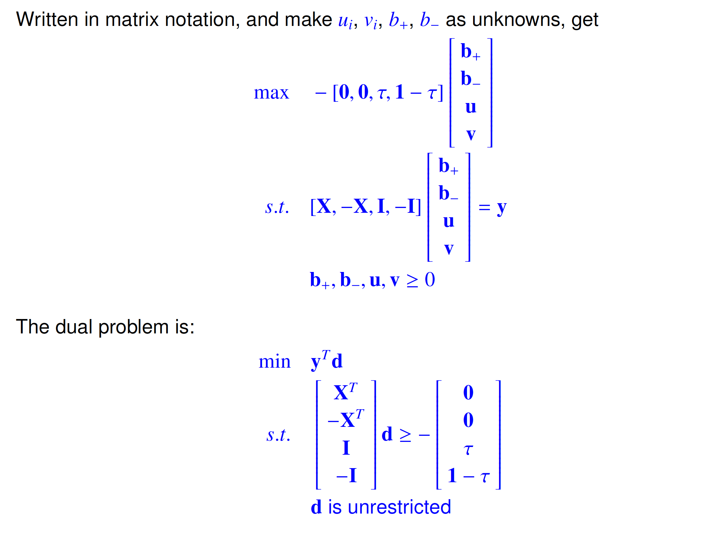
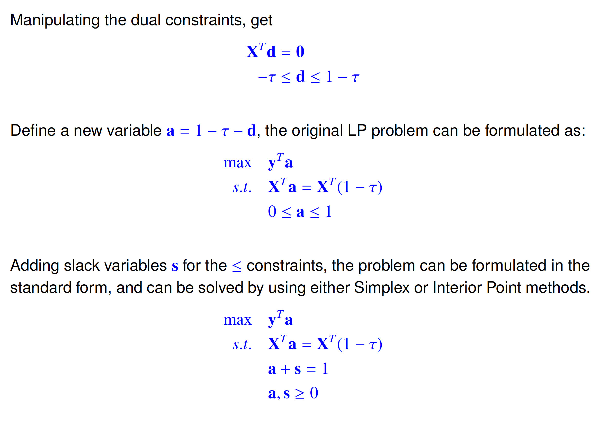
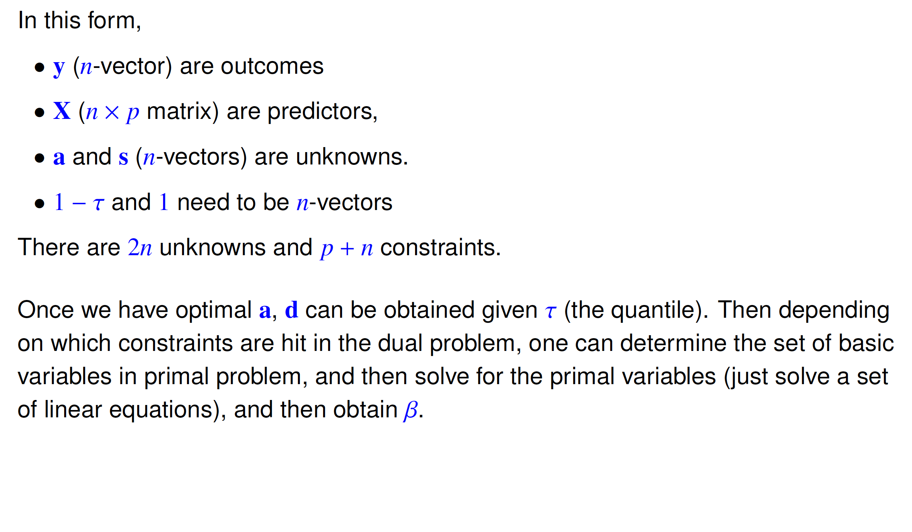
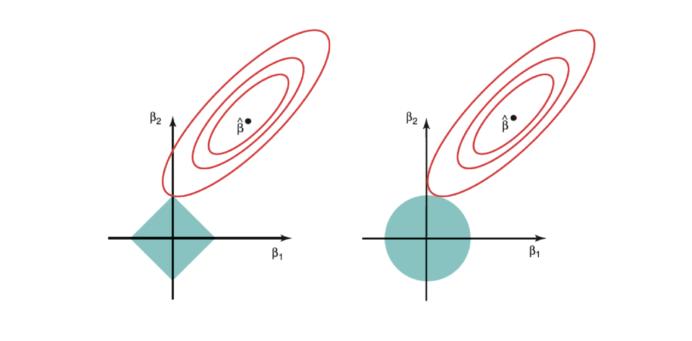

```{r, echo = FALSE, eval = TRUE}
library(tidyverse)
library(microbenchmark)
```

## Overview

Today, we cover:

- Finish linear programming
- Quadratic programming
- Examples of LP and QP in statistics

Announcements

- Final project due 

---


## Primal/dual optimality conditions

\fontsize{9pt}{10pt}\selectfont
Given the primal and dual problem with slack/surplus variables added:

::: notes
Now we set up the machinery for interior point methods. We add slack/surplus variables to convert both the primal and dual into equality-constrained form. w are slack variables for the primal (Ax + w = b). z are surplus variables for the dual (A^T y - z = c^T). Complementary slackness in matrix form: X and Z are diagonal matrices with x and z on the diagonal. The condition x_j z_j = 0 for all j becomes XZe = 0 where e is the all-ones vector. Similarly WYe = 0. Count the variables: we have x (n), y (m), w (m), z (n) — that's 2n + 2m unknowns total.
:::


\begin{align*}
    &\textbf{Primal:} &\quad &\textit{max} \quad c x \\
    & &\quad &\textit{s.t.} \quad A x + w = b, \quad x, w \geq 0.
\end{align*}

\begin{align*}
    &\textbf{Dual:} &\quad &\textit{min} \quad b^T y \\
    & &\quad &\textit{s.t.} \quad A^T y - z = c^T, \quad y, z \geq 0.
\end{align*}

The *complementary slackness theorem* states that at optimal solution, we should have $x_jz_j = 0 \forall j$, and $w_iy_i = 0 \forall i$. In matrix notation, the complementary conditions can be rewritten as 
$$XZe=0, WYe = 0$$

- $X,Z,W,Y$ are diagonal matrices
- $e$ is a vector of $1$'s

---

## Primal/dual optimality conditions

\fontsize{10pt}{11pt}\selectfont
We now have the optimality conditions for the primal/dual problems as:

\begin{align*}
    A x + w - b &= 0, \\
    A^T y - z - c^T &= 0, \\
    XZ e &= 0, \\
    WYe &= 0, \\
    x, y, w, z &\geq 0.
\end{align*}

- The first two conditions are simply the constraints for primal/dual problems
- The next two are complementary slackness
- The last one is the non-negativity constraint

::: notes
Walk through each condition. Conditions 1 and 2 are just primal and dual feasibility — the constraints must be satisfied. Conditions 3 and 4 are complementary slackness in matrix form — XZe = 0 means x_j z_j = 0 for each j, and WYe = 0 means w_i y_i = 0 for each i. Condition 5 is non-negativity. Together these are necessary AND sufficient for optimality (by strong duality). Count: conditions 1 gives m equations, condition 2 gives n equations, conditions 3 gives n equations, condition 4 gives m equations. Total: 2n + 2m equations. Same as the number of unknowns — square system!
:::

---


## Primal/dual optimality conditions

\fontsize{10pt}{11pt}\selectfont
We now have the optimality conditions for the primal/dual problems as:

\begin{align*}
    A x + w - b &= 0, \\
    A^T y - z - c^T &= 0, \\
    XZ e &= 0, \\
    WYe &= 0, \\
    x, y, w, z &\geq 0.
\end{align*}


Ignoring the non-negativity constraints, this is a set of $2n + 2m$ equations with
$2n + 2m$ unknowns ($n$ and $m$ are the number of unknowns and constraints in the
primal problem), which can be solved using Newton's method.

::: notes
Key insight: if we ignore the non-negativity constraint (condition 5) for a moment, we have a square nonlinear system of 2n + 2m equations in 2n + 2m unknowns. Nonlinear because of the complementary slackness terms XZe and WYe — these are products of variables. We know how to solve nonlinear square systems: Newton's method. The challenge is enforcing non-negativity throughout the iterations. This is what makes interior point methods more sophisticated than naive Newton — they take steps that keep all variables strictly positive.
:::

---

## Primal-dual interior point method

\fontsize{10pt}{11pt}\selectfont
The primal-dual interior point method finds the primal-dual optimal solution $(x^*, y^*, w^*, z^*)$ by applying Newton’s method to the primal-dual optimality conditions.

- The direction and length of the steps are modified in each step so that the
non-negativity condition is strictly satisfied in each iteration.

To be specific, define the following function $F:R^{2n+2m}\to R^{2n + 2m}$:


$$\mathbf{F}(x, y, w, z) =
\begin{bmatrix}
    \mathbf{A}x + \mathbf{w} - \mathbf{b} \\
    \mathbf{A}^T y - \mathbf{z} - \mathbf{c}^T \\
    XZ e \\
    WYe
\end{bmatrix}$$

The goal is to find solution for $F = 0$.

::: notes
We package the five optimality conditions into a vector function F. The domain and codomain are both R^{2n+2m}. F = 0 corresponds exactly to satisfying all optimality conditions (except non-negativity, which we handle separately). Newton’s method finds roots of nonlinear systems by iterating: at each step, linearize F around the current point, solve for the direction to move, take a step. The key modification for interior point: choose the step size α to ensure all variables remain strictly positive (stay in the interior of the non-negative orthant — hence "interior point").
:::

---

## Primal-dual interior point method

\fontsize{10pt}{11pt}\selectfont
Applying Newton’s method, if at iteration $k$ the variables are $(x^k, y^k, w^k, z^k)$,
we obtain a search direction
$(\delta x, \delta y, \delta w, \delta z)$
by solving the linear equations:

$$
F’(x^k, y^k, w^k, z^k)
\begin{bmatrix}
    \delta x \\
    \delta y \\
    \delta w \\
    \delta z
\end{bmatrix}
=
-F(x^k, y^k, w^k, z^k).
$$

::: notes
This is Newton’s method written out explicitly. F’ is the Jacobian of F with respect to all the variables — a (2n+2m) × (2n+2m) matrix. The Newton step solves a linear system (Jacobian × direction = -F) to find the search direction (δx, δy, δw, δz). Notice that if we’re already primal and dual feasible (conditions 1 and 2 satisfied), the first two blocks of F are zero, and the Newton equation simplifies significantly — we only need to deal with the complementary slackness blocks. In practice, solvers maintain primal and dual feasibility throughout and only worry about reducing XZe and WYe to zero.
:::

---

## Primal-dual interior point method


\fontsize{10pt}{11pt}\selectfont
Then the update will be:

$$
(x^{k+1}, y^{k+1}, w^{k+1}, z^{k+1})= (x^k, y^k, w^k, z^k) + \alpha (\delta x, \delta y, \delta w, \delta z)
$$

with $\alpha \in (0,1]$ chosen so that the result from the next iteration is feasible.

- Solving for $(\delta x, \delta y, \delta w, \delta z)$ using the equation on the previous slide enforces feasibility of solutions

::: notes
The update formula. After solving for the search direction, take a step of size α in that direction. The crucial constraint: α must be chosen so that all four variable vectors (x, y, w, z) remain strictly positive — no variable can hit zero. A simple approach: find the maximum step α_max that would bring any variable to zero (set it to that value and solve for α), then take α = 0.99 × α_max to stay in the interior. More sophisticated step selection rules (like Mehrotra's predictor-corrector) are used in production solvers. The name "interior point" comes from this: we always stay in the strict interior of the feasible region, never touching the boundary.
:::

---


## An improved algorithm


\fontsize{10pt}{11pt}\selectfont
The algorithm in its current setup is not ideal because often the steps are small to
avoid violating the positivity constraints. Instead:

- The value of $XZe + WYe$ represents the duality gap
- Instead of trying to eliminate the duality gap (set it to 0), reduce the duality gap by some factor in each step

We replace the complementary slackness by:

\begin{align}
XZe &= \mu_xe\\
WYe &= \mu_ye
\end{align}

When $\mu_x, \mu_y\to 0$ as $k\to\infty$ the solution from this system will converge to the optimal solution of the original LP problem. Good selections of $\mu$ are $\mu_x^{k+1}=(x^k)^Tz^k/n$ and $\mu_y^{k+1}=(w^k)^Ty^k/m$

- $n$ and $m$ are the dimensions of $x$ and $y$

::: notes
The basic algorithm has a practical problem: near the boundary, the steps become tiny (to avoid violating non-negativity), so convergence slows dramatically. The fix: instead of driving XZe → 0 exactly, aim for XZe = μe where μ > 0 is a small positive number. This keeps the iterates away from the boundary and allows larger steps. μ is called the "centering parameter" — larger μ pushes you toward the center of the feasible region, smaller μ pushes toward the boundary (and toward optimality). The recommended choice for μ is the current average complementarity: (x^T z)/n and (w^T y)/m. These are the mean of the x_j z_j products — when all of these are small, we're near the optimal.
:::

---

## An improved algorithm


\fontsize{10pt}{11pt}\selectfont
Under the new algorithm, at the $k$th iteration, the Newton equations become:

$$\begin{bmatrix}
    A & 0 & I & -0 \\
    0 & A^T & 0 & -I \\
    Z & 0 & 0 & X \\
    0 & W & Y & 0
\end{bmatrix}
\begin{bmatrix}
    \delta x \\
    \delta y \\
    \delta w \\
    \delta z
\end{bmatrix}
=
\begin{bmatrix}
    0 \\
    0 \\
    -X^k Z^k e + \mu_x^k e \\
    -W^k Y^k e + \mu_y^k e
\end{bmatrix}$$

This provides the **general primal-dual interior point method** as follows:

1. Choose strictly feasible initial solution $(x^0, y^0, w^0, z^0)$, and set $k = 0$. Then repeat (2) and (3) until convergence:
2. Solve system (1) to obtain the updates $(\delta x, \delta y, \delta w, \delta z)$
3. Update the solution $(x^{k+1}, y^{k+1}, w^{k+1}, z^{k+1}) = (x^k, y^k, w^k, z^k)+ \alpha^k(\delta x, \delta y, \delta w, \delta z)$. $\alpha^k$ is chosen so that all variables are $\ge$ 0.


::: notes
The full matrix system for the Newton step at each iteration. The 4×4 block structure comes from the four groups of variables (x, y, w, z). The right-hand side has zeros in the first two blocks (because we maintain primal and dual feasibility throughout) and the relaxed complementary slackness terms in the last two blocks. This is the algorithm that underlies modern LP solvers like CPLEX, Gurobi, and MOSEK. They use sophisticated variants of this with Mehrotra's predictor-corrector, warm starts, and preconditioning — but the core is this primal-dual interior point iteration. Convergence is typically in 20-50 iterations regardless of problem size, which is why it scales so well.
:::

---


## Lagrange multipliers


\fontsize{10pt}{11pt}\selectfont
The method of Lagrange multiplier is a general algorithm for optimization problems with equality constraints. For example, consider a problem:

\begin{align*}
        \max \quad &f(x,y)\\
        s.t. \quad &g(x,y) = c
    \end{align*}

We introduce a new variable $\lambda$ called a **Lagrange multiplier** and form the following new objective function:

$$L(x,y,\lambda) = f(x,y) + \lambda[g(x,y)-c]$$

We will then optimize $L$ with respect to $x,y$ and $\lambda$ using typical methods. Note that the condition $\partial L/\partial \lambda = 0$ at the optimal solution guarantees that the constraints will be satisfied.

::: notes
Before the barrier problem, a brief review of Lagrange multipliers in case students haven't seen them recently. The key idea: convert a constrained optimization into an unconstrained one by adding a penalty for violating the constraint. The multiplier λ plays the role of a shadow price — it tells you how much the optimal objective would change if you relaxed the constraint (changed the value of c). Setting ∂L/∂λ = 0 gives g(x,y) = c — the constraint is automatically satisfied at the optimum. Setting ∂L/∂x = ∂L/∂y = 0 gives the optimality conditions for x and y given the constraint. This is the foundation for the barrier approach to interior point methods.
:::

---

## The barrier problem


\fontsize{10pt}{11pt}\selectfont
The interior point algorithm is closely related to the **Barrier Problem**. Go back to
the primal problem:

\begin{align*}
        \max \quad &z=cx\\
        s.t. \quad &Ax + w = b; x,w\ge0
    \end{align*}

The non-negativity constraints can be replaced by adding two **barrier terms** in the
objective function. The barrier term is defined as $B(x) = \sum_j\log x_j$, which is finite as long as $x_j$ is positive. Then the primal problem becomes:


\begin{align*}
        \max \quad &z=cx +\mu_xB(x) + \mu_yB(w)\\
        s.t. \quad &Ax + w = b
\end{align*}

The barrier terms make sure $x$ and $w$ won't become negative.

::: notes
The barrier approach is an alternative derivation that gives the same algorithm. Instead of explicitly constraining x ≥ 0, we add log(x_j) terms to the objective. The log function goes to -∞ as x_j → 0, creating a "wall" that prevents any variable from reaching zero. The parameter μ controls how strong the barrier is: large μ keeps us far from the boundary, small μ lets us get close to the boundary (and to the actual constrained optimum). As μ → 0, the barrier disappears and the modified problem converges to the original constrained problem. The only remaining constraints are the equality constraints Ax + w = b, which we can handle directly with Lagrange multipliers.
:::

---


## The barrier problem


\fontsize{10pt}{11pt}\selectfont
The Lagrangian for this problem is (using $y$ as the multiplier):

$$L(x,y,w) = cx +  \mu_xB(x) + \mu_yB(w) + y^T(b-w-Ax)$$

The optimal solution for the problem satisfies:

\begin{align}
c + \mu_xX^{-1}e-A^Ty &= 0\\
b-w-Ax &= 0\\
\mu_yW^{-1}e-y &= 0
\end{align}

Define new variables $z = \mu_xX^{-1}e$ and rewrite these conditions, we obtain exactly the same set of equations as the relaxed optimality conditions for primal-dual problem.
**Note**: $z = \mu_xX^{-1}e$ is also a condition so there are 4 in total.


::: notes
Walk through the Lagrangian. We use y as the multiplier for the equality constraint Ax + w = b. Taking first-order conditions: ∂L/∂x = c + μ_x X^{-1} e - A^T y = 0. ∂L/∂w = μ_y W^{-1} e - y = 0. Plus the constraint Ax + w = b = 0. Three conditions, four unknowns (x, y, w and then z we define). Now define z = μ_x X^{-1} e — this is a new variable. With this substitution, the conditions become: c + z - A^T y = 0, Ax + w - b = 0, μ_y W^{-1} e = y → W y = μ_y e (which is WYe = μ_y e), and by definition XZe = μ_x e. This is EXACTLY the relaxed optimality conditions from the primal-dual approach! The two methods — barrier function and primal-dual — are mathematically equivalent. Beautiful convergence of two independent ideas.
:::

---

## Introduction to quadratic programming


\fontsize{10pt}{11pt}\selectfont
We have discussed linear programming, where both the objective function and
constraints are linear functions of the unknowns.

The **quadratic programming** (QP) problem has a quadratic objective function and
linear constraints:

\begin{align*}
        \max \quad &f(x) = \frac12 x^TBx + cx\\
        s.t. \quad &Ax \le b, x\ge 0  
    \end{align*}

The algorithm for solving QP problem is very similar to that for LP. But first we need
to first introduce the **KKT conditions**.

---

## KKT conditions


\fontsize{10pt}{11pt}\selectfont
For LP, complementary slackness gave us conditions for optimality. **KKT conditions** generalize this to non-linear objective functions. They are necessary conditions for a solution to be optimal in a general non-linear programming problem.

Consider the following problem:

\begin{align*}
        \max \quad &f(x)\\
        s.t. \quad &g_i(x) \le 0, i = 1,\ldots,I\\
        &h_j(x)=0, j = 1,\ldots, J
    \end{align*}

The Lagrangian is: $L(x,y,z) = f(x) - \sum_iy_ig_i(x) - \sum_jz_jh_j(x)$. Then at the optimal solution, the following **KKT** conditions must be satisfied:

- Primal feasibility: $g_i(x^*)\le 0, h_j(x^*)=0$
- Dual feasibility: $y_i\ge 0$
- Complementary slackness: $y_ig_i(x^*)=0$
- Stationary: $\nabla f(x^*)-\sum_iy_i\nabla g_i(x)-\sum_jz_j\nabla h_j(x) = 0$

---

## Optimal solution for QP


\fontsize{10pt}{11pt}\selectfont
The Lagrangian for the QP problem is

$$L(x,\mu,\lambda) = \frac12 x^TBx + cx - y^T(Ax-b)+z^Tx$$

The KKT conditions for the QP problem are:

- Primal feasibility: $Ax\le b, x\ge 0$
- Dual feasibility: $y\ge 0, z\ge 0$ ($z$ multiplies the constraint $x\ge 0$, written as $-x\le 0$, so it requires the same non-negativity as $y$)
- Complementary slackness: $Y(Ax-b)=0, Zx = 0$
- Stationary: $Bx+c-A^Ty+z = 0$

Here, $Y$ and $Z$ are diagonal matrices with $y$ and $z$ at the diagonal.  This can be solved using an interior point method.

---

## Optimal solution for QP


\fontsize{10pt}{11pt}\selectfont
To be specific, define slack variable $w=b-Ax$, the optimality conditions become

\begin{align*}
    A x - b + w &= 0, \\
    B x + c - A^T y + z &= 0, \\
    Z x &= 0, \\
    Y w &= 0, \\
    x, y, z, w &\geq 0.
\end{align*}

The unknowns are $x, y, z, w$. We can then obtain the Jacobians, form the Newton
equation and solve for the optimal solution iteratively.

---


## QP in R


\fontsize{10pt}{11pt}\selectfont
The `quadprog` package provides functions (`solve.QP.compact`) to solve quadratic
programming problem. Pay attention to the definition of function parameters. They are slightly different from what I have used in the standard form!  

- Solve $\min \frac12 (x_1^2 + x_2^2)$ s.t. $2x_1+x_2\ge 1$:

```{r, eval = FALSE}
library(quadprog)
Dmat = diag(rep(1,2))
dvec = rep(0,2)
Amat = matrix(c(2,1))
solve.QP(Dmat=Dmat, dvec=dvec, Amat=Amat, bvec=c(1))
```


---

## Review


\fontsize{10pt}{11pt}\selectfont
We have now covered:

- LP problem set up
- Simplex methods
- Duality
- Interior point algorithms
- Quadratic programming

Now you should be able to formulate an LP/QP problem and solve it. But how are these useful in statistics?

- Remember that LP is an optimization algorithm
- There are plenty of optimization problems in statistics, e.g. MLE
- It's just a matter of formulating the objective function and constraints.

---

## Lab problem

Write out the primal and dual for the carpenter problem.

- Check the set of feasible solutions (corner points).  
  - What are the values of the objective functions of the primal and dual at each vertex? 
  - Does weak duality appear to hold?

---


## Quantile regression


The goal of regression is to understand the relationship between an outcome and covariates. Traditional regression models the conditional mean, $E(Y|X)$
- Relies on normal error assumptions and homoscedasticity
- Sensitive to outliers and skewed distributions

Quantile regression:
- Provides a more exhaustive description of the data
- The collection of regressions at all quantiles would give a complete picture of outcome-covariate relationships

---

## Quantile regression

```{r, echo = FALSE, fig.align = 'center', out.width = '70%', message = FALSE}

data(engel)

attach(engel)
plot(income,foodexp,xlab="Household Income",ylab="Food Expenditure",type = "n", cex=.5)
points(income,foodexp,cex=.5,col="blue")
xx <- seq(min(engel$income),max(engel$income),100)
taus <- c(.05,.1,.25, .5, .75,.9,.95)

f <- coef(rq((foodexp)~(income),tau=taus, data = engel))
yy <- cbind(1,xx)%*%f
for(i in 1:length(taus)){
        lines(xx,yy[,i],col = "gray")
        }


```

---

## Colorado cannabis and driving study

```{r, echo = FALSE, fig.align = 'center', out.width = '90%'}

```


::: notes
Digression- I'm going to show some examples in class using data from a big study I'm a part of.  You'll also use this dataset in your homework
:::

---

## Colorado cannabis and driving study

```{r, echo = FALSE, fig.align = 'center', out.width = '90%', message = FALSE, warning = FALSE, fig.height = 6, fig.width = 10}

cannabis = readRDS(here::here("Homework", "4_constrained_optimization/", "cannabis.rds"))

p1 = cannabis %>%
  ggplot(aes(t_mmr1)) +
  geom_histogram(bins = 8) +
  ggtitle("THC molar metabolite ratio") +
  xlab("Molar metabolite ratio")

p2 = cannabis %>%
  ggplot(aes(p_change,t_mmr1)) +
  labs(x = "percent change in pupil diameter after light flash", 
       y = "THC molar metabolite ratio") +
  geom_point()


p1 + p2
```


::: notes
MMR tells you about acute cannabis impairment
Probably not great data for linear regression... why?
:::

---

## Quantile regression model

Regress conditional quantiles of response on the covariates. Assume the outcome Y is continuous.

- Classical model: $Q_{\tau}(Y|X)=X\beta_{\tau}$
- $Q_{\tau}(Y|X)$ is the $\tau$th conditional quantile of $Y$ given $X$


The above model is equivalent to specifying

$$Y = X\beta_{\tau} + \epsilon; \quad Q_{\tau}(\epsilon|X) = 0.$$

In comparison, mean regression is:

$$Y = X\beta + \epsilon; \quad E(\epsilon|X) = 0.$$

---

## Pros and cons

**Advantages**:

- Regression at a sequence of quantiles provides a more complete view of data
- Inference is robust to outliers
- Estimation is more efficient when residual normality is highly violated
- Allows interpretation in the outcome's original scale of measurement

**Disadvantages**:

- To be useful, needs to regress on a set of quantiles: computational burden
- Solution has no closed form
- Adaptation to non-continuous outcomes is difficult

---

## The loss function

Link between estimands and loss functions:

- To obtain sample mean of $\{y_1,y_2,\ldots y_n\}$ minimize $\sum_i(y_i-b)^2$
- To obtain sample median of $\{y_1,y_2,\ldots y_n\}$ minimize $\sum_i|y_i-b|$

It can be shown that to obtain the sample $\tau$th quantile, one needs to minimize asymmetric absolute loss, that is, compute

$$\hat{Q}_{\tau} = \arg\min_b \left\{ \sum_{i: y_i\ge b}\tau|y_i-b| + \sum_{i: y_i< b}(1-\tau)|y_i-b|\right\}.$$

For notational simplicity, define $\rho_{\tau}(x) = x[\tau-(x<0)]$, where $(x<0)$ is an indicator equal to 1 if $x<0$ and 0 otherwise. This compactly encodes the asymmetric weighting: $\rho_\tau(x) = \tau x$ when $x \ge 0$ and $\rho_\tau(x) = (\tau-1)x$ when $x < 0$.
---

## The loss function

```{r, echo = FALSE, fig.align = 'center', fig.height = 7, fig.width = 11, message = FALSE}
quantile_loss = function(b, y, tau) {
  loss <- ifelse(y >= b, tau * (y - b), (1 - tau) * (b - y))
  return(loss)
}

set.seed(2123)
y = rnorm(100)

tau = c(.1,.25, .5, .75, .9)
loss = map_dfc(tau, quantile_loss, b = 0, y = y)
colnames(loss) = paste0("tau_", tau)

loss %>%
  mutate(y = y) %>%
  pivot_longer(tau_0.1:tau_0.9, names_to = "tau", values_to = "loss", 
              names_prefix = "tau_") %>%
  mutate(tau = factor(tau)) %>%
  ggplot(aes(y, loss, group = tau)) + 
  geom_line(aes(color = tau, linetype = tau)) +
  theme_minimal()
```

---

## Estimator

The linear quantile regression model is fitted by determining

$$\hat{\beta}_{\tau} = \arg\min_b \sum_{i=1}^n \rho_{\tau}(y_i-x_ib)$$

The estimator has all "expected" properties:

- Scale equivariance: 
$$\hat{\beta}_{\tau}(ay, X) = a\hat{\beta}_{\tau}(y,X), \quad \hat{\beta}_{\tau}(-ay, X) = -a\hat{\beta}_{1-\tau}(y,X)$$

- Shift (or regression) equivariance: $\hat{\beta}_{\tau}(y+\gamma, X) = \hat{\beta}_{\tau}(y,X)+\gamma$

- Equivariance to reparametrization of design: $\hat{\beta}_{\tau}(y, XA) = A^{-1}\hat{\beta}_{\tau}(y,X)$


::: notes
- Scale equivariance in quantile regression means that if all input values are multiplied by a constant, the predicted quantiles are also multiplied by the same constant, preserving the relative distribution of the response variable.
- Shift equivariance in quantile regression means that if a constant is added to all input values, the predicted quantiles are also shifted by the same constant, preserving the relative spacing between them.
- Equivariance to reparameterization of the design in quantile regression means that if the predictor variables undergo a linear transformation (e.g., rescaling or shifting), the estimated quantiles transform accordingly, ensuring that the quantile function remains consistent with the new parameterization of the predictors.
:::

---

## Asymmetric Double Exponential (ADE) distribution

Density function for ADE is

$$f(y;\mu,\sigma,\tau)= \frac{\tau(1-\tau)}{\sigma}\exp\left\{-\rho_{\tau}(\frac{y-\mu}{\sigma})\right\}$$


- Least squares estimator $\iff$ MLE if residuals are Normal
- QR estimator $\iff$ MLE if residuals are ADE
- If residuals re iid $ADE(0,1,\tau)$, then the log-likelihood for $\beta_{\tau}$ is 

$$l(\beta_{\tau}; Y,X,\tau)=-\sum_i^n \rho_{\tau}(y_i-x_i\beta_{\tau}) + c_0$$
---


## QR model fitting

The QR estimation problem $\hat{\beta}_{\tau} = \arg\min_b \sum_{i=1}^n \rho_{\tau}(y_i-x_ib)$ can be framed as an LP problem!
- First, define a set of new variables

\begin{align}
    u_i &\equiv [y_i - x_i b]_+ \\
    v_i &\equiv [y_i - x_i b]_- \\
    b_+ &\equiv [b]_+ \\
    b_- &\equiv [b]_-
\end{align}

Note:
- $[\cdot]_+$ and $[\cdot]_-$ mean the positive and negative part of a number
- $x \equiv [x]_+ - [x]_-$
  - $[x]_+ = \max(x, 0)$
  - $[x]_- = \max(-x, 0)$

---


## QR model fitting

Remember the objective function is $\sum_{i = 1}^n \rho_{\tau}(y_i-x_ib)$. Notice that 
- When $y_i-x_ib\ge 0$, we have $\rho_{\tau}(y_i-x_ib)=\tau u_i$, and $v_i =0$.
- When $y_i-x_ib < 0$, we have $\rho_{\tau}(y_i-x_ib)=(1-\tau) v_i$, and $u_i = 0$.

So we can write $\rho_{\tau}(y_i-x_ib)=\tau u_i + (1-\tau) v_i$.

---

## QR model fitting

The optimization problem can then be reformulated as:

\begin{align}
    &\max \quad - \sum_{i=1}^{n} [\tau u_i + (1 - \tau) v_i] \\
    &\text{s.t.} \quad y_i = x_i b_+ - x_i b_- + u_i - v_i \\
    &\quad u_i, v_i \geq 0, \quad i = 1, \dots, n \\
    &\quad b_+, b_- \geq 0
\end{align}


This is a standard LP problem can be solved by Simplex or interior point methods.
---

## QR model fitting, cont


```{r, echo = FALSE, fig.align = 'center', out.width = '90%'}

```


---


## QR model fitting, cont


```{r, echo = FALSE, fig.align = 'center', out.width = '90%'}

```


---


## QR model fitting, cont


```{r, echo = FALSE, fig.align = 'center', out.width = '90%'}

```


---

## QR in R

```{r, echo = FALSE, fig.align = 'center', out.width = '90%', message = FALSE, warning = FALSE, fig.height = 6, fig.width = 10}
p1 + p2
```

::: notes
Now we're going to fit this quantile regression
:::

---


## QR in R

Want to compare linear and quantile regression

```{r}
ols = lm(t_mmr1 ~ p_change, data = cannabis)

# default method, which is a simplex method
median_regression = rq(t_mmr1 ~ p_change, tau = 0.5, data = cannabis, 
                       method = "br")
qr.9 = rq(t_mmr1 ~ p_change, tau = 0.9, data = cannabis, 
          method = "br")

summary(ols)$coefficients
summary(median_regression, se = "boot")$coefficients
```


---

## QR in R

Blue is ols, red is median regression, pink is tau = 0.9


```{r, echo = FALSE, fig.align = 'center', out.width = '90%', message = FALSE, warning = FALSE, fig.height = 6, fig.width = 10}
p2 + 
  geom_abline(slope = coef(ols)[2], intercept = coef(ols)[1], color = "blue") +
  geom_abline(slope = coef(median_regression)[2], intercept = coef(median_regression)[1], color = "red") +
  geom_abline(slope = coef(qr.9)[2], intercept = coef(qr.9)[1], color = "pink") 


```

---


## LASSO

Consider usual regression settings with data $(\bf{x}_i, y_i)$, where $\textbf{x}_i = (x_{i1},\ldots, x_{ip})$ is a p-vector of predictors and $y_i$ is the response for the $i$th subject.The OLS setting finds a coefficient vector to minimize the residual sum of squares:

$$\hat{\beta} = \arg\min_{\beta}\sum_i^n(y_i-x_i\beta)^2$$
- Solution is the MLE assuming a Normal model:
$$y_i = \textbf{x}_i\beta + \epsilon_i, \quad \epsilon_i\sim N(0, \sigma^2)$$
- This is undesirable when $p$ is large because
1. When p>n, model can't be fit
2. One typically wants a more parsimonius model for interpretability

---

## LASSO

LASSO stands for "Least Absolute Shrinkage and Selection Operator", which aims for model selection when $p$ is large (works even $p > n$). The LASSO procedure will "shrink" the coefficients toward 0 and eventually force some to be exactly zero
- predictors with $\beta=0$ will be selected out

The LASSO estimates are defined as:
$$\tilde{\beta} = \arg\min_{\beta} \left\{\sum_i^n(y_i-\textbf{x}_i\beta)^2\right\} s.t. ||\beta||_1\le \lambda$$
- $||\beta||_1 = \sum_{j=1}^p|b_j|$ is the $L_1$ norm
- $\lambda\ge 0$ is a tuning parameter controlling the strength of shrinkage 

**What kind of optimization problem does this look like?**

::: notes
So LASSO tries to minimize the residual sum of squares, with a constraint on the
sum of the absolute values of the coefficients.
:::

---

## Regularization side note

LASSO is a regularization approach- regularization prevents overfitting by adding a penalty term to the objective function.
- LASSO tries to minimize the residual sum of square, with a constraint on the sum of the absolute values of the coefficients.

<br>
- There are other types of regularized regressions
- **Ridge regression**: adds an $L_2$ penalty, $\sum_jb_j^2\le \lambda$

---

## LASSO vs. Ridge visualized

```{r, echo = FALSE, fig.align = 'center', out.width = '120%'}

```


::: notes
Standard lasso picture. The diamond-shaped region (blue) is the constraint imposed by the L1 penalty.
- The elliptical contours (red) represent the objective function of least squares regression.
- Because of the sharp corners of the diamond, the solution (where the contours first touch the constraint) often lies on an axis, meaning some coefficients are exactly zero (sparse solution).

For ridge
- The circular region (blue) is the constraint imposed by the L2 penalty.
- The smooth shape does not favor solutions on the axes, meaning all coefficients remain nonzero but shrink toward zero.
:::

---

## LASSO model fitting

The LASSO problem can be solved by quadratic programming algorithms.

\begin{align}
\max \quad -&\sum_i^n\left(y_i-\sum_j\beta_jx_{ij}\right)^2\\
s.t. \quad &\sum_j|b_j|\le \lambda
\end{align}

- **Issue**: not in standard LP/QP form, since the constraints have the absolute value operator

---


## LASSO model fitting

The trick is to convert the problem into the standard QP problem setting, i.e., to remove the absolute value operator. This is the **same decomposition used in QR** model fitting ($u_i, v_i$ for residuals), now applied to the coefficients $\beta_j$.

- Let $\beta_j = \beta_j^+-\beta_j^-$, where $\beta_j^+, \beta_j^-\ge0$ (positive and negative parts)
- Then $|\beta_j|=\beta_j^++\beta_j^-$ and the problem can be written as:

\begin{align}
\max \quad -&\sum_i^n\left(y_i-\sum_j\beta_j^+x_{ij} + \sum_j\beta_j^-x_{ij}\right)^2\\
s.t. \quad &\sum_j (\beta_j^++\beta_j^-)\le \lambda,\\
&\beta_j^+, \beta_j^- \ge 0
\end{align}

<br>
This is now a standard QP problem can be solved by standard QP solvers.


::: notes
Need to explain exactly what this notation means- this is the same thing as what we did for quantile regression.
- this notation essentially stores the magnitude and sign of the value separately
- note that the variables here are $\beta$ not x
:::

---


## A little more on LASSO

The Lagrangian for the LASSO optimization problem is:

$$L(\mathbf{\beta},\lambda) = -\sum_{i=1}^n\left (y_i-\sum_j\beta_jx_{ij}\right)^2 - \lambda\sum_{j = 1}^p|\beta_j|$$

This is equivalent to the likelihood function for a Bayesian model with a double exponential (DE) prior on $\beta$s (remember ADE used in quantile regression?):

\begin{align}
Y|X, \beta &\sim N(X\beta, \sigma^2)\\
\beta_j &\sim DE(1/\lambda)
\end{align}

where the DE density function is 

$$f(x,\tau) = \frac1{2\tau}\exp\left(\frac{-|x|}{\tau}\right)$$

::: notes
Ridge gives you a normal prior on beta
:::

---

## LASSO in R

The package `glmnet` is standard for elastic net and LASSO in R.


```{r, fig.align = 'center', fig.height = 5, fig.width = 9, message = FALSE}
### Lasso results from R package "glmnet"
library(glmnet)
lasso_mod = glmnet(x = dplyr::select(cannabis, -id, -t_mmr1), 
                   y = cannabis$t_mmr1)
plot(lasso_mod, "lambda")
```

::: notes
There are other functions for this as well
:::


---

## Resources

- [Hao Wu's lecture with matrix represenation of Simplex algorithm](https://www.haowulab.org/teaching/statcomp/Notes/lp1.pdf)


**Some videos**


- [convexity explained, and duality](https://www.youtube.com/watch?v=d0CF3d5aEGc&ab_channel=VisuallyExplained)
- [KKT conditions explained](https://www.youtube.com/watch?v=uh1Dk68cfWs&ab_channel=VisuallyExplained)
- [Simple explanation of Lagrangian](https://www.youtube.com/watch?v=GR4ff0dTLTw&ab_channel=MATLAB)


